# 14.2.4 Notation

# 14.2.4.1 StateMachine Diagrams

StateMachine diagrams specify StateMachines. This Clause outlines the graphic elements that may be shown in StateMachine diagrams, and provides cross references where detailed information about the semantics and concrete notation for each element can be found. It also furnishes examples that illustrate how the graphic elements can be assembled into diagrams.

A StateMachine diagram is a graph that represents a StateMachine. States and various other types of Vertices in the StateMachine graph are rendered by appropriate State and Pseudostate symbols, while Transitions are generally rendered by directed arcs that connect them, or by control symbols representing the actions of the Behavior on the Transition.

# 14.2.4.2 StateMachine

When depicting StateMachine redefinition in a class diagram, the default rectangle notation for Classifier can be used, with the keyword «statemachine» inside the name compartment above or before the name of the StateMachine.

The association between a StateMachine and its context Classifier or BehavioralFeatures does not have a special graphical representation.

# 14.2.4.3 Region

A composite State or StateMachine with Regions is shown by tiling the graph Region of the State/StateMachine using dashed lines to divide it into Regions (Figure 14.3). Each Region may have an optional name and contains the nested disjoint States and the Transitions between these. The text compartments of the entire State are separated from the orthogonal Regions by a solid line.

A composite State or StateMachine with just one Region is shown by showing a nested state diagram within the graph Region.


<details>
<summary>text_image</summary>

S
</details>

Figure 14.3 Notation for a composite State with Regions

# 14.2.4.4 State

State is shown as a rectangle with rounded corners, with the State name shown within (Figure 14.4).

  
Figure 14.4 State notation

Optionally, it may have an attached name tab (Figure 14.5). The name tab is a rectangle, usually resting on the outside of the top side of a State and it contains the name of that State. It is normally used to keep the name of a composite State that has orthogonal Regions, but may be used in other cases as well.

TypingPassword

# Figure 14.5 State with a name tab

A State may be subdivided into multiple compartments separated from each other by a horizontal line (Figure 14.6).

TypingPassword

```kotlin
entry/setEchoInvisible()
exit/setEchoNormal()
character/handleCharacter()
help/displayHelp() 
```

# Figure 14.6 State with compartments

The compartments of a State are:

- name compartment   
• internal Behaviors compartment   
• internal Transitions compartment.

A composite State also has a:

\- decomposition compartment.

Each of these compartments is described below.

\- Name compartment

This compartment holds the (optional) name of the State, as a string. States without names are anonymous and are all distinct. It is undesirable to show the same named State twice in the same diagram, as confusion may ensue, unless control icons are used to show a Transition-oriented view of the StateMachine. Name compartments should not be used if a name tab is used and vice versa.

In case of a submachine State, the name of the referenced StateMachine is shown as a string following ‘:’ after the name of the State.

• Internal activities Behaviors compartment

This compartment holds a list of internal Behaviors associated with a State. Each entry has the following format:

$$
<   \text { behavior - type - label } > [ ^ {\prime} / ^ {\prime} <   \text { behavior - expression } > ]
$$

The <behavior-type-label> identifies the circumstances under which the Behavior specified by the <behavior-expression> will be invoked and can be one of the following:

entry — This label identifies a Behavior, specified by the corresponding expression, which is performed upon entry to the State (entry Behavior).

- exit — This label identifies a Behavior, specified by the corresponding expression, that is performed upon exit from the State (exit Behavior).   
☐ do — This label identifies an ongoing Behavior (doActivity Behavior) that is performed as long as the modeled element is in the State or until the computation specified by the expression is completed.

The optional <behavior-expression> is an expression in some textual surface language, which may be either a vendor-specific or some standard language (see sub clause 16.1).

• Internal Transition compartment

This compartment contains a list of internal Transitions, where each item has the following syntax:

$$
\{<   \text { trigger } > \} ^ {*} [ ^ {\prime} [ ^ {\prime} <   \text { guard } > ^ {\prime} ] ^ {\prime} ] [ / <   \text { behavior - expression } > ]
$$

Where <trigger> is the notation for Triggers (see sub clause 13.3.4), <guard> is a Boolean expression for a guard, and the optional <behavior-expression> is the specification of the effect Behavior to be executed if the Event occurrence matches the trigger and guard of the internal Transition. It is an expression written in some textual surface language, which may be either a vendor-specific or some standard language (see sub clause 16.1).

Alternatively, in place of a textual behavior expression, the various Behaviors associated with a State or internal Transition can be expressed using the appropriate graphical representation in a separate diagram (e.g., an activity diagram).

# 14.2.4.4.1 Composite State

\- decomposition compartment

This compartment shows its composition structure in terms of Regions, States, and Transition. In addition to the (optional) name and internal Transition compartments, the State may have an additional compartment that contains a nested diagram. For convenience and appearance, the text compartments may be shrunk horizontally within the graphic Region.

In some cases, it is convenient to hide the decomposition of a composite State. For example, there may be a large number of States nested inside a composite State and they may simply not fit in the graphical space available for the diagram. In that case, the composite State may be represented by a simple State graphic with a special “composite” icon, usually in the lower right-hand corner (see Figure 14.8). This icon, consisting of two horizontally placed and connected States, is an optional visual cue that the State has a decomposition that is not shown in this particular diagram. Instead, the contents of the composite State are shown in a separate diagram.

NOTE. The “hiding” here is purely a matter of graphical convenience and has no semantic significance in terms of access restrictions.

A composite State may have one or more entry and exit points on its outside border or in close proximity of that border (inside or outside).


<details>
<summary>flowchart</summary>

```mermaid
graph LR
    Start["Start\nentry/ start dial tone\nexit/ stop dial tone"] -->|digit(n)| PartialDial["Partial Dial\nentry/number.append(n)"]
    PartialDial -->|[number.isValid()]| End((End))
    PartialDial -->|digit(n)| End
```
</details>

Figure 14.7 Composite State with two States


<details>
<summary>flowchart</summary>

```mermaid
graph TD
    A["HiddenComposite"] --> Bentry / start dial tone
    B --> Exit / stop dial tone
    B --> C["○○"]
```
</details>

Figure 14.8 Composite State with a hidden decomposition indicator icon


<details>
<summary>flowchart</summary>

```mermaid
graph TD
    A["CourseAttempt"] --> B["Studying"]
    B --> C["Lab1"]
    C --> D["Lab2"]
    D --> E["Final Test"]
    E --> F["Failed"]
    F --> G["Passed"]
    B --> H["Term Project"]
    H --> I projecting done]
    B --> J["Final Test"]
    J --> K pass
    style A fill:#000,stroke:#fff,color:#fff
    style B fill:#fff,stroke:#000
    style C fill:#fff,stroke:#000
    style D fill:#fff,stroke:#000
    style E fill:#fff,stroke:#000
    style F fill:#fff,stroke:#000
    style G fill:#fff,stroke:#000
    style H fill:#fff,stroke:#000
    style I fill:#fff,stroke:#000
    style J fill:#fff,stroke:#000
    style K fill:#fff,stroke:#000
    subgraph "studying"
        L["●"] --> M["Lab1"]
        M --> N["lab done"]
        N --> O["Lab2"]
        O --> P["lab done"]
        P --> Q["●"]
        R["●"] --> S["Term Project"]
        S --> T projecting done
        U["●"] --> V["Final Test"]
        V --> W["pass"]
        X["●"] --> Y["Passed"]
    end
    style L fill:#fff,stroke:#000
    style M fill:#fff,stroke:#000
    style N fill:#fff,stroke:#000
    style O fill:#fff,stroke:#000
    style P fill:#fff,stroke:#000
    style Q fill:#fff,stroke:#000
    style R fill:#fff,stroke:#000
    style S fill:#fff,stroke:#000
    style T fill:#fff,stroke:#000
    style V fill:#fff,stroke:#000
    style W fill:#fff,stroke:#000
    style Y fill:#fff,stroke:#000
    style Z fill:#fff,stroke:#000
    subgraph "studying"
        AA["●"] --> AB["Lab1"]
        AB --> AC["lab done"]
        AC --> AD["Lab2"]
        AD --> AE["lab done"]
        AE --> AF["●"]
        AG["●"] --> AH["Term Project"]
        AH --> AI projecting done
        AJ["●"] --> AK["Final Test"]
        AK --> AL["pass"]
        AM["●"] --> AN["Passed"]
    end
```
</details>

Figure 14.9 Composite State with Regions


<details>
<summary>flowchart</summary>

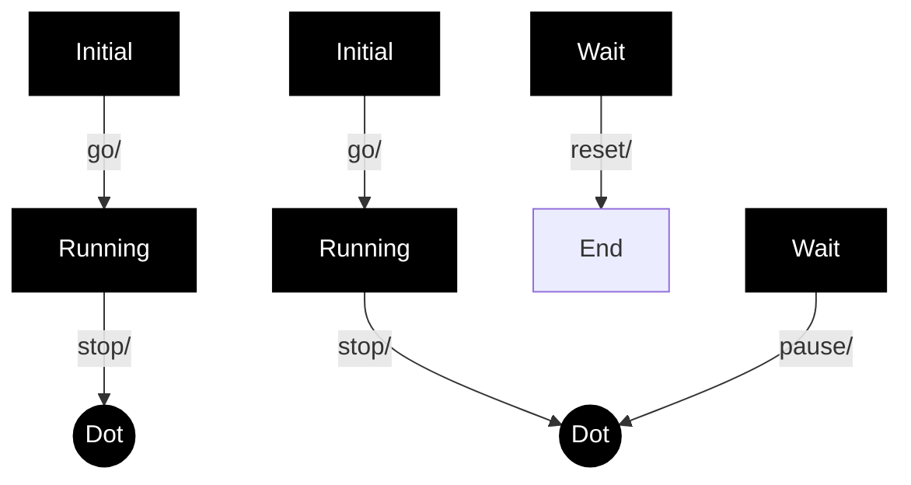
</details>

Figure 14.10 Composite State with two Regions and entry, exit, and do Behaviors

# 14.2.4.4.2 Submachine State

The submachine State is depicted as a normal State where the string in the name compartment has the following syntax:

```txt
<state-name> ‘:’ <name-of-referenced-StateMachine> 
```

The submachine State symbol may contain the references to one or more entry points and to one or more exit points. The notation for these connection point references comprises entry/exit Pseudostates on the border of the submachine State. The names are the names of the corresponding entry/exit points defined within the referenced StateMachine (see ConnectionPointReference).

If the submachine StateMachine is entered through its default initial Pseudostate or if it is exited as a result of the completion of the submachine, it is not necessary to use the entry/exit point notation. Similarly, an exit point is not required if the exit occurs through an explicit group Transition that originates from the boundary of the submachine State (implying that it applies to all the substates of the submachine).

Submachine States invoking the same submachine may occur multiple times in the same state diagram with the entry and exit points being part of different Transitions.

The diagram in Figure 14.11 shows a fragment from a StateMachine diagram in which a submachine State (the FailureSubmachine) is referenced. The actual submachine StateMachine is defined in some enclosing or imported namespace.


<details>
<summary>flowchart</summary>

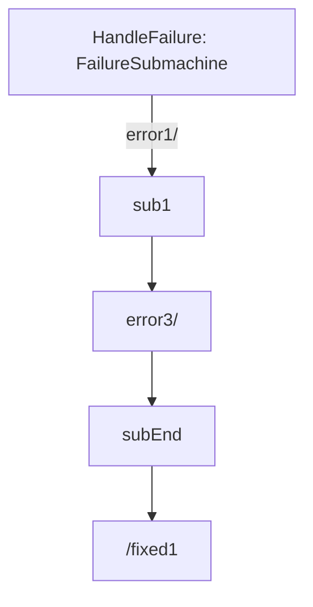
</details>

Figure 14.11 Submachine State example

In the above example, the Transition triggered by Event “error1” will terminate on entry point “sub1” of the FailureSubmachine StateMachine. The “error3” Transition implies taking the default Transition of the FailureSubmachine.

The Transition originating from the “subEnd” exit point of the submachine will execute the “fixed1” Behavior in addition to what is executed within the HandleFailure StateMachine. This Transition must have been triggered within the HandleFailure StateMachine. Finally, the Transition originating from the edge of the submachine State is taken as a result of the completion event generated when the FailureSubmachine reaches its FinalState.

NOTE. The same notation would apply to composite States with the exception that there would be no reference to a StateMachine in the State name.

Figure 14.12 is an example of a StateMachine defined with two exit points. Entry and exit points may be shown on the frame or within the state graph. Figure 14.12 is an example of a StateMachine defined with an exit point shown within the state graph. Figure 14.13 shows the same StateMachine using a notation shown on the frame of the StateMachine.


<details>
<summary>flowchart</summary>

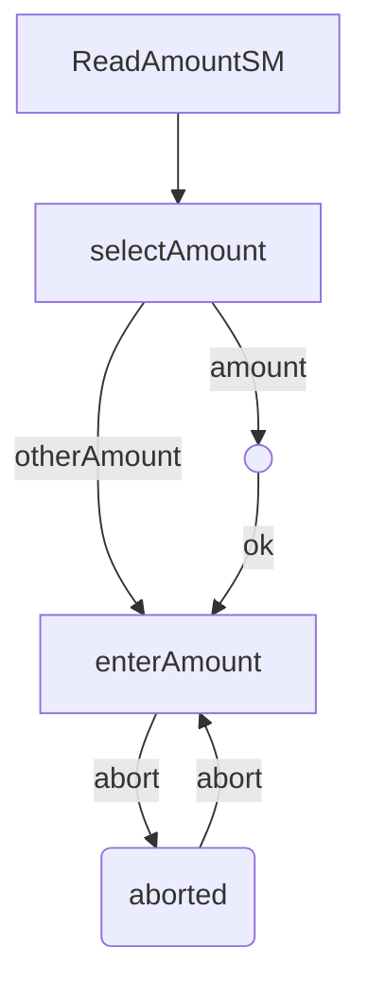
</details>

Figure 14.12 StateMachine with an exit point as part of the StateMachine graph


<details>
<summary>flowchart</summary>

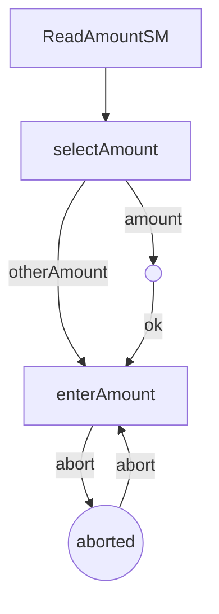
</details>

Figure 14.13 StateMachine with an exit point on the border

In Figure 14.14 the StateMachine shown in Figure 14.13 is referenced in a submachine State, and the presentation option with the exit points on the State symbol is shown.


<details>
<summary>flowchart</summary>

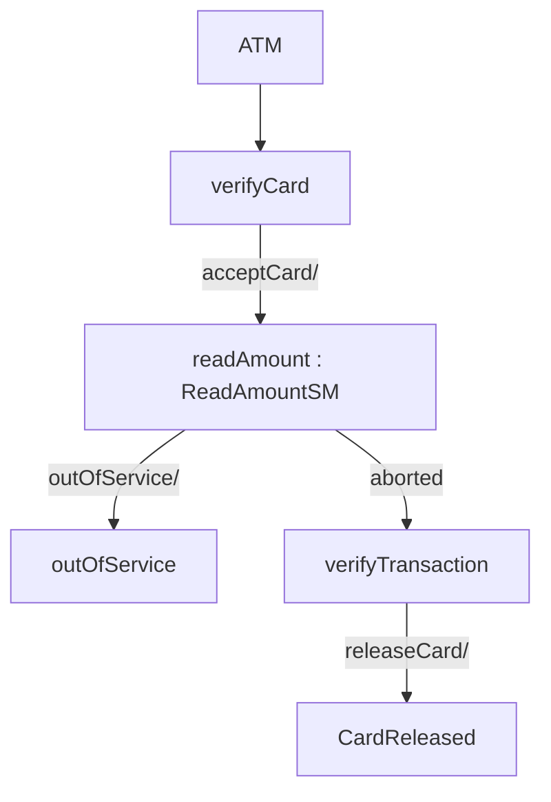
</details>

Figure 14.14 Submachine Sate that uses an exit point

An example of the notation for entry and exit points for composite States is shown in Figure 14.23.

# 14.2.4.4.3 State list notation

State lists provide a graphical shortcut for certain situations that sometimes occur in practice.

NOTE. These are purely notational forms with no corresponding abstract syntax representation. They are interchanged with UML DI, see Annex B.4.4.

Multiple effect-free Transitions with the same Trigger values originating on different States but all either (a) targeting a common junction Vertex with a single outgoing Transition or (b) terminating on the same target State, may be represented by a Single Transition-like arc originating from a State-like graphic element, labeled with a list of the names of the originating States. This arc terminates on the joint target State. Figure 14.15 shows both possibilities and Figure 14.16 shows the equivalent diagram without using statelists.


<details>
<summary>flowchart</summary>

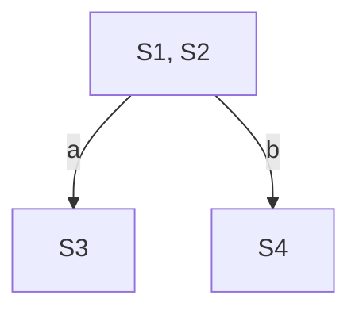
</details>

Figure 14.15 State list notation option


<details>
<summary>flowchart</summary>

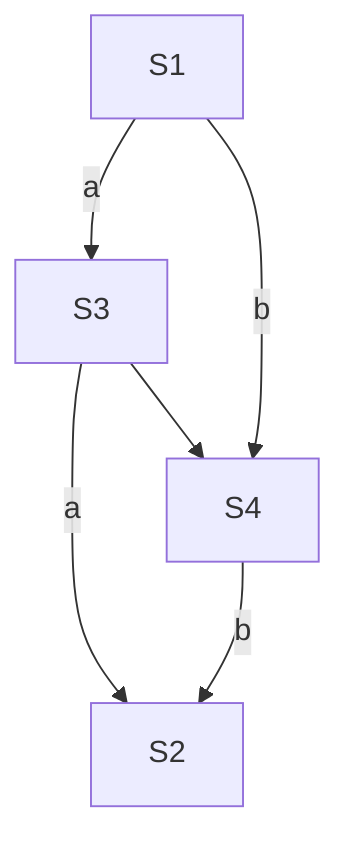
</details>


Figure 14.16 Diagram equivalent to Figure 14.15 without using statelists

# 14.2.4.5 FinalState

A FinalState is shown as a circle surrounding a small solid filled circle (see Figure 14.17). The corresponding completion Transition on the enclosing State has as notation an unlabeled Transition.

  
Figure 14.17 FinalState notation

Figure 14.7 has an example of a FinalState (the right-most of the States within the composite State).

# 14.2.4.6 Pseudostate

An initial Pseudostate is shown as a small solid filled circle (see Figure 14.18). In a Region of a ClassifierBehavior StateMachine, the Transition from an initial Pseudostate may be labeled with the Event type of the occurrence that creates the object; otherwise, it must be unlabeled. If it is unlabeled, it represents any Transition from the enclosing State.

  
Figure 14.18 initial Pseudostate

A shallowHistory Pseudostate is indicated by a small circle containing an ‘H’ (see Figure 14.19). It applies to the State Region that directly encloses it.

  
Figure 14.19 shallowHistory Pseudostate

A deepHistory Pseudostate is indicated by a small circle containing an ‘H\*’ (see Figure 14.20). It applies to the State Region that directly encloses it.

  
Figure 14.20 deepHistory Pseudostate

An entry point is shown as a small circle on the border of the StateMachine diagram or composite State, with the name associated with it (see Figure 14.21).

  
Figure 14.21 entryPoint Pseudostate

Optionally it may be placed both within the StateMachine diagram and outside the border of the StateMachine diagram or composite State.

An exit point is shown as a small circle with a cross on the border of the StateMachine diagram or composite State, with the name associated with it (see Figure 14.22).

aborted

  
Figure 14.22 exitPoint Pseudostate

Optionally, an exit point symbol may be placed both within the StateMachine diagram or composite State and outside the border of the StateMachine diagram or composite State. Figure 14.23 illustrates the notation for depicting entry and exit points of composite States.


<details>
<summary>flowchart</summary>

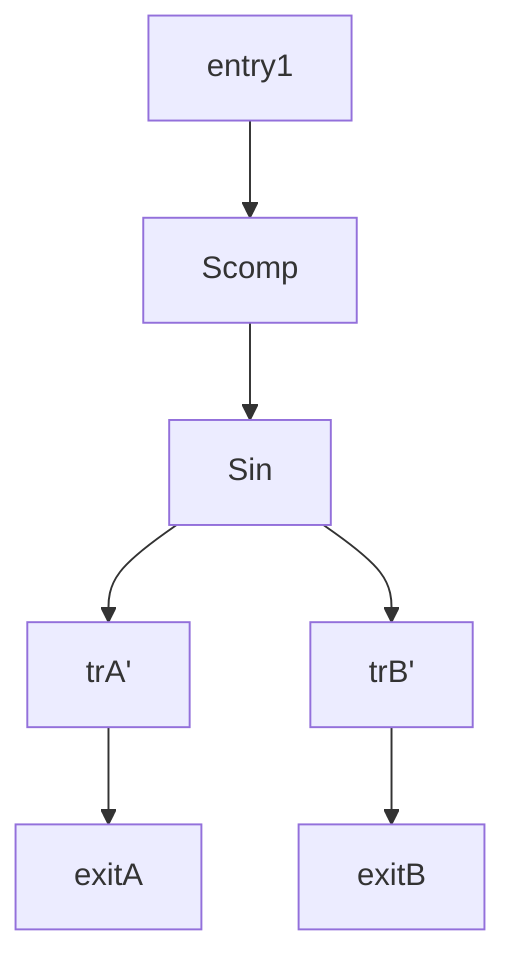
</details>

Figure 14.23 entryPoint and exitPoints on a composite State

Alternatively, the “bracket” notation shown in Figure 14.30 and Figure 14.31 can also be used for the transition-oriented notation.

A junction is represented by a small filled circle (see Figure 14.24).


<details>
<summary>flowchart</summary>

```mermaid
graph TD
    State0["State0\ne2[b < 0"]] --> A(( ))
    State1["State1\ne1[b < 0"]] --> A
    State2["State2"] --> A
    State3["State3\n[a = 5"]] --> A
    State4["State4"] --> A
    A -->|[a < 0]| A
    A -->|[a > 7]| A
```
</details>

Figure 14.24 junction Pseudostate with incoming and outgoing Transitions

A choice Pseudostate is shown as a diamond-shaped symbol as exemplified shown by the left-hand diagram in Figure 14.25.


<details>
<summary>flowchart</summary>

```mermaid
graph TD
    A["id"] --> B[">=10"]
    A --> C["<<10"]]
    D["id >= 10"] --> E[">=10"]
    D --> F["<<10"]]
    G["id < 10"] --> H[">=10"]
    G --> I["<<10"]]
```
</details>

Figure 14.25 choice Pseudostates

NOTE. In cases when all guards associated with triggers of Transitions leaving a choice Pseudostate are binary expressions that share a common left operand, then the notation for choice Pseudostate may be simplified. The left operand may be placed inside the diamond-shaped symbol and the rest of the Guard expressions placed on the outgoing Transitions. This is illustrated by the right-hand diagram in Figure 14.25.

A terminate Pseudostate is shown as a cross, see Figure 14.26.

  
Figure 14.26 terminate Pseudostate

The notation for a fork and join is a short heavy bar (Figure 14.27). The bar may have one or more arrows from source States to the bar (when representing a join). The bar may have one or more arrows from the bar to States (when representing a fork). A Transition string may be shown near the bar.


<details>
<summary>flowchart</summary>

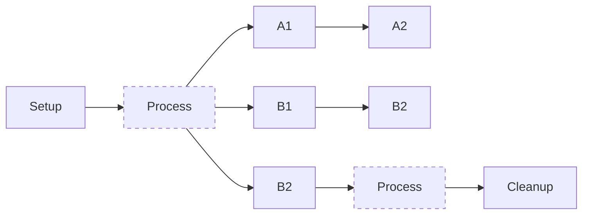
</details>

Figure 14.27 fork and join Pseudostates

# 14.2.4.7 ConnectionPointReference

A connection point reference to an entry point has the same notation as an entry Pseudostate. The circle is placed on the border of the State symbol of a submachine State.


<details>
<summary>flowchart</summary>

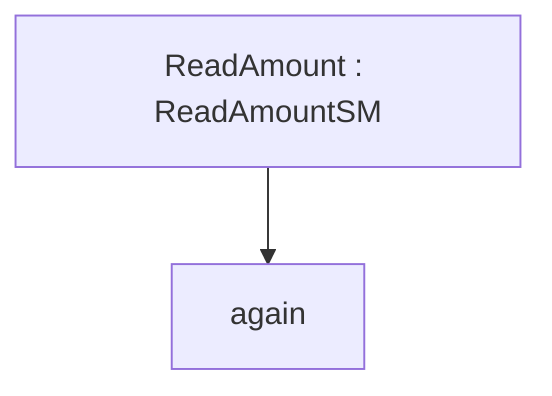
</details>

Figure 14.28 Entry point ConnectionPointReference notation

A connection point reference to an exit point has the same notation as an exit Pseudostate. The encircled cross is placed on the border of the State symbol of a submachine State.


<details>
<summary>flowchart</summary>

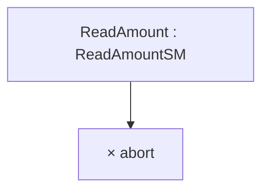
</details>

Figure 14.29 Exit point ConnectionPointReference notation

Alternatively, a connection point reference to an entry point can also be visualized using a “bracketed space” symbol as shown in Figure 14.30. The text inside the symbol shall contain ‘via’ followed by the name of the connection point. This notation may only be used if the Transition ending with the connection point is defined using the graphical Transition notation, such as the one shown in Figure 14.32.


<details>
<summary>flowchart</summary>

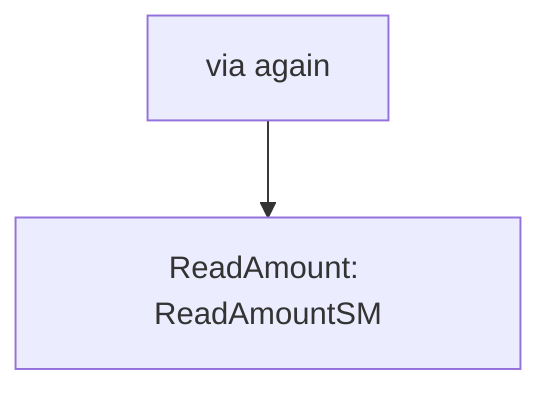
</details>

Figure 14.30 Alternative entry point ConnectionPointReference notation

A connection point reference to an exit point can also be visualized using a “bracketed space” symbol as shown in Figure 14.31. The text inside the symbol shall contain ‘via’ followed by the name of the connection point. This notation may only be used if the Transition associated with the connection point is defined using the graphical Transition notation such as the one shown in Figure 14.32.


<details>
<summary>flowchart</summary>

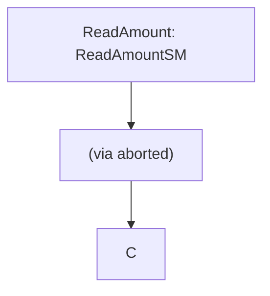
</details>

Figure 14.31 Alternative exit point ConnectionPointReference notation

# 14.2.4.8 Transition

The default textual notation for a Transition is defined by the following BNF expression:

$$
[ <   \text { trigger } > [ ^ {\prime}, ^ {\prime} <   \text { trigger } > ] * [ ^ {\prime} [ ^ {\prime} <   \text { guard } > ^ {\prime} ] ^ {\prime} ] [ ^ {\prime} / ^ {\prime} <   \text { behavior - expression } > ] ]
$$

Where <trigger> is the standard notation for Triggers (see sub clause 13.3.4), <guard> is a Boolean expression for a guard, and the optional <behavior-expression> is an expression specifying the effect Behavior written in some vendor-specific or standard textual surface language (see sub clause 16.1). The trigger may be any of the standard trigger types. SignalEvent triggers and CallEvent triggers are not distinguishable by syntax and must be discriminated by their declaration elsewhere.

As an alternative, in cases where the effect Behavior can be described as a control-flow based sequence of Actions, there is a graphical representation for Transitions and compound transitions which is similar to the notation used for Activities.

NOTE. Although this alternative notation contains graphical elements reminiscent of the notation used for Activities, it is a distinct form applicable only to StateMachines, and its elements map to appropriate StateMachine concepts.

This notation is in the form of a directed graph, which consists of one or more graphical symbols interconnected by directed arcs that represent control flow (see Figure 14.32). In all cases except for the Transition originating from the initial Pseudostate, the starting symbol, which has the form of the standard simple State notation, represents the source State of the Transition. If this Transition has a Signal-based Trigger, then the source state symbol is connected by an arc pointing to a special Signal receipt symbol described below. If there are multiple Triggers for the Transition, they are all listed in the same symbol as explained below.

If the Transition originates from the initial Pseudostate, the starting symbol is the initial symbol, which is the same as used for the initial Pseudostate: a filled black circle. In that case, there is no Signal receipt symbol immediately following the starting symbol.

Except for end symbols that terminate the paths, any of the following symbols can appear in the chain as appropriate:

- an action symbol   
- a choice point symbol   
• a Signal send symbol   
- a merge symbol

The terminating symbol in these directed graphs is always either a State-like symbol representing the target State of the transition or a final state symbol (which is the same as the symbol for a FinalState).

# 14.2.4.8.1 Action symbols

Each action symbol is represented by a rectangle with an optional textual specification of the action. It maps either to anOpaqueAction or to a SequenceNode containing one or more Actions executed in sequence (see sub clause 16.11.3) and which are part of the Activity specifying the effect Behavior of the appropriate Transition in the compound transition.

# 14.2.4.8.2 Signal receipt symbol

The Signal receipt symbol is shown as a five-pointed polygon that looks like a rectangle with a triangular notch in one of its sides (either one). It maps to the trigger of the Transition and does not map to an Action of the Activity that specifies the effect Behavior. The names of the Signals of the Trigger as well as any guard are contained within the symbol as follows:

$$
<   t r i g g e r > [ ^ {\prime}, ^ {\prime} <   t r i g g e r > ] ^ {*} [ ^ {\prime} [ ^ {\prime} <   g u a r d > ^ {\prime} ] ^ {\prime} ]
$$

Where $\langle trigger \rangle$ is specified as described in sub clause 13.3.4 with the restriction that only Signal and change Event types are allowed. The trigger symbol is always first in the path of symbols and a compound transition can only have at most one such symbol.

# 14.2.4.8.3 Signal send symbol

This represents the special action of sending a signal and maps directly to a SendSignalAction that is part of the Activity that describes the effect Behavior of the corresponding Transition. The notation corresponds to the notation for the SendSignalAction (see sub clause 16.3.4).

# 14.2.4.8.4 Choice point symbol

This symbol maps directly to a choice Pseudostate and uses the same notation.

NOTE. It is not part of any Activity.

# 14.2.4.8.5 Merge symbol

A merge symbol is used to join multiple control-flow arcs and maps directly to a junction Pseudostate and uses the same notation. It is not part of any Activity.

Figure 14.32 shows a compound transition consisting of four connected Transitions: one from the Idle State to the choice symbol, one for each of the branches of the choice through the junction symbol, and one from the junction Pseudostate to the Busy State.


<details>
<summary>flowchart</summary>

```mermaid
graph TD
    A["Idle"] --> B["Req(Id)"]
    B --> C{[Id > 10]}
    C -->|Yes| D["Minor(Id)"]
    C -->|No| E["Major(Id)"]
    D --> F["MinorReq := Id;"]
    E --> G["MajorReq := Id;"]
    F --> H(( ))
    G --> H
    H --> I["Busy"]
```
</details>

Figure 14.32 Symbols for Signal reception, Sending, and Actions on a Transition

# 14.2.4.8.6 Deferred triggers

A deferrable trigger is shown by listing it within the State followed by a slash and the label “defer”. An example of this notation is shown in Figure 14.33. In this example, handling of the “request” event occurrence is deferred in States “Initializing” and “Primed”. However, it will be handled once the “Operational” State is reached.


<details>
<summary>flowchart</summary>

```mermaid
graph TD
    A["Start"] --> B["Initializing request/defer"]
    B -->|initDone/| C["Primed request/defer"]
    C -->|start/| D["Operational"]
    D -->|request/handleReq()| D
```
</details>

Figure 14.33 Deferred Trigger notation

# 14.2.4.9 TransitionKind

• Transitions of the kind internal are not shown explicitly in diagrams.   
- Transitions of the kind local can originate from the border of the containing composite State, or one of its entry points, or from a Vertex within the composite State. (Alternatively, a Transition of kind local can be shown as a Transition leaving a State symbol containing the text “\*.”) The Transition is then considered to belong to the enclosing composite State.) Transitions of this kind can only terminate on the border of the composite State, or one of its exit points, or on a Vertex within the composite State. All of the Transitions in Figure 14.34 are local.   
- Transitions of kind external can target any Vertex contained within or external to the source Vertex. The part of the external Transition closest to the source must be drawn outside of the source Vertex border. In the case of an external self Transition where the source is a State or exit point on the State, it may target the State itself or an entry point on the State and it will be drawn completely outside of the State border. All of the Transitions in Figure 14.35 are external.


<details>
<summary>flowchart</summary>

```mermaid
graph TD
    A["s0"] --> B["s1"]
    B --> C[" "]
    B --> D[" "]
    B --> E[" "]
    B --> F[" "]
    style A fill:#fff,stroke:#000
    style B fill:#fff,stroke:#000
    style C fill:#fff,stroke:#000
    style D fill:#fff,stroke:#000
    style E fill:#fff,stroke:#000
    style F fill:#fff,stroke:#000
```
</details>

Figure 14.34 Local Transitions


<details>
<summary>flowchart</summary>

```mermaid
graph TD
    s0["State s0"] --> s1["State s1"]
    s0 --> s2["State s2"]
    s1 --> s2
    s2 --> s1
    s2 --> a{Decision}
    a --> b["●"]
    b --> s1
    s2 --> c{Decision}
    c --> d["◇"]
    d --> s2
```
</details>

Figure 14.35 External Transitions

