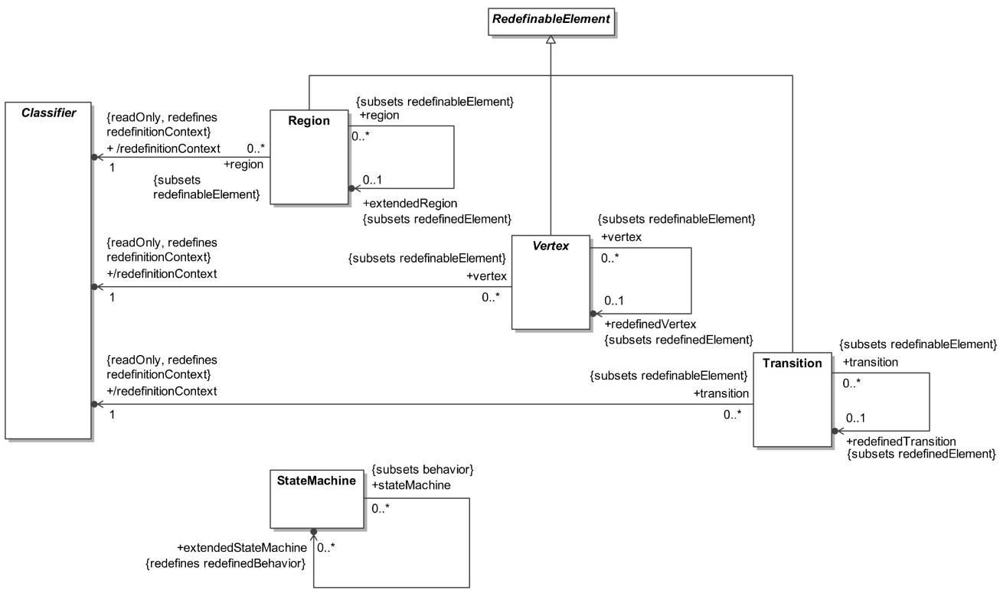
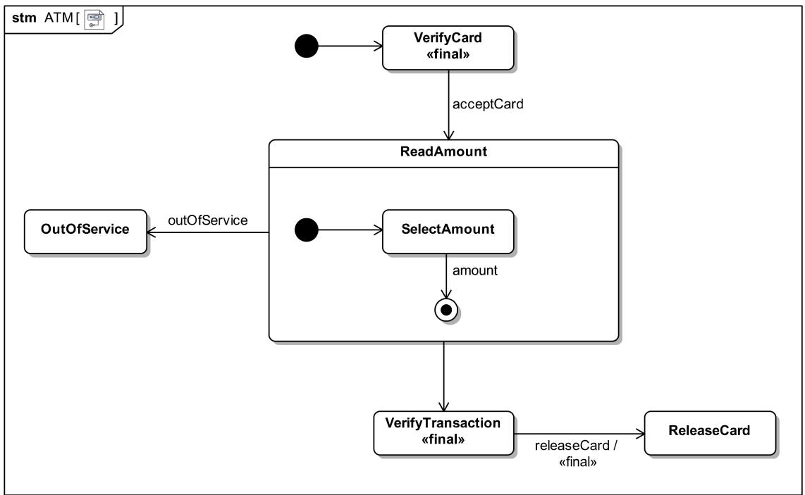
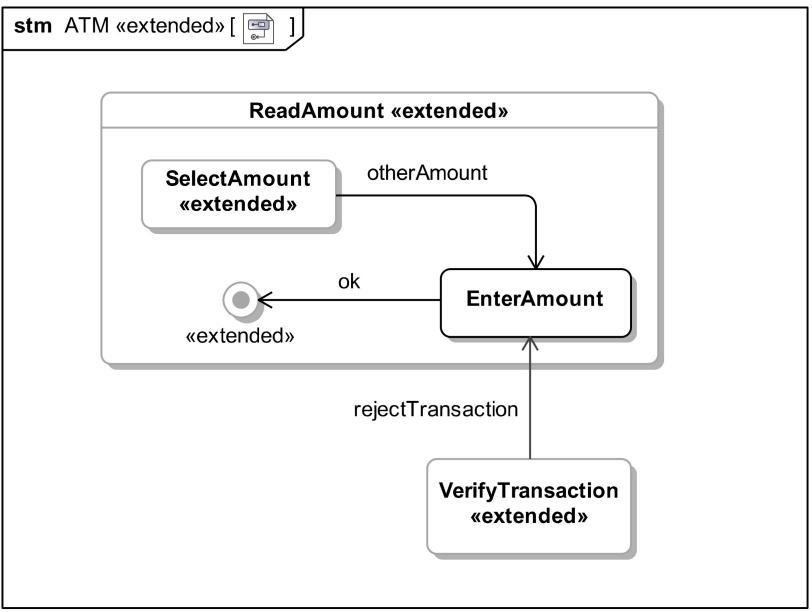
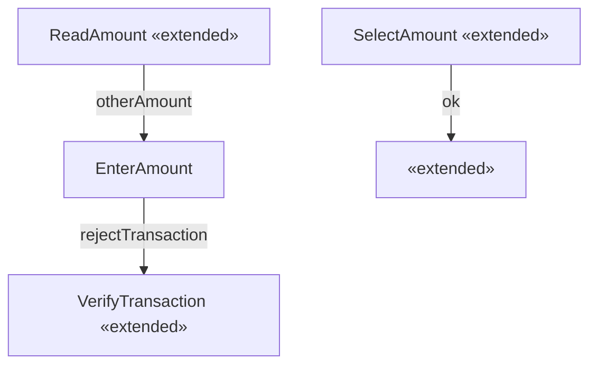
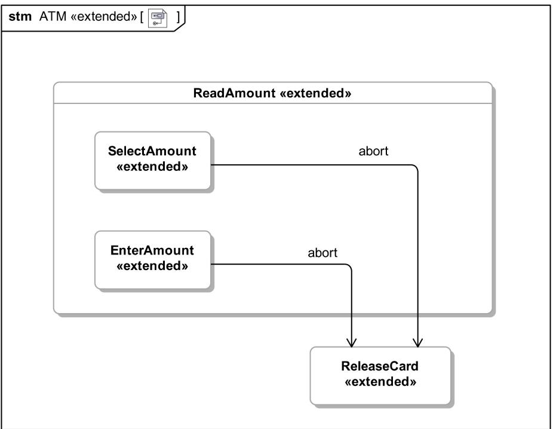
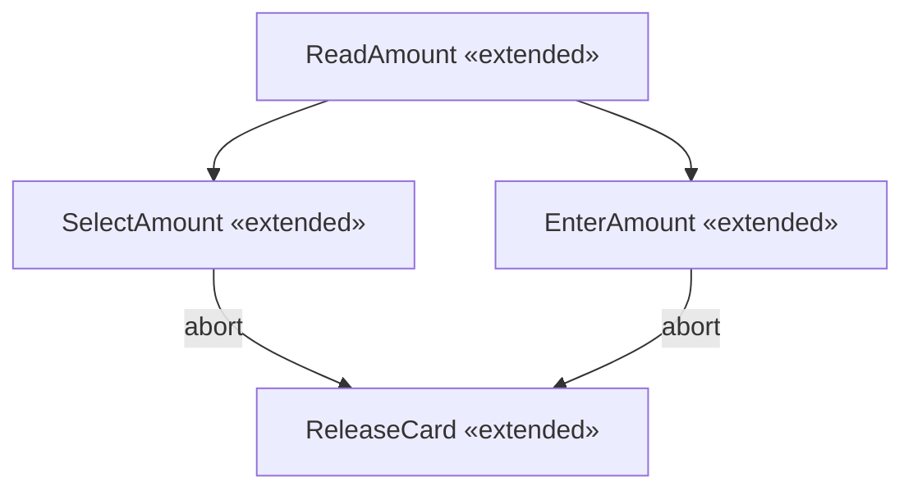

# 14.3 StateMachine Redefinition

# 14.3.1 Summary

StateMachines are used for the definition of Behavior (for example, Classes that are generalizable). As part of the specialization of a Class it may be required to specialize its Behavior definitions. This is achieved by defining the Behavior of the specialized Classifier as an extension of the Behavior of the general Classifier using redefinition.

# 14.3.2 Abstract Syntax



<details>
<summary>flowchart</summary>

```mermaid
graph TD
    A["Classifier"] -->|1 {readOnly, redefines redefinitionContext} +/redefinitionContext 0..*| B["Region"]
    B -->|0..*| C["Vertex"]
    C -->|0..*| D["Transition"]
    D -->|0..*| E["StateMachine"]
    E -->|0..*| F["+extendedStateMachine {redefines redefinedBehavior}"]
    B -->|0..1| G["+extendedRegion {subsets redefinedElement}"]
    C -->|0..1| H["+redefinedVertex {subsets redefinedElement}"]
    A -->|1 {readOnly, redefines redefinitionContext} +/redefinitionContext 1| I["Region"]
    I -->|0..*| J["Vertex"]
    J -->|0..*| K["Transition"]
    K -->|0..*| L["+extendedTransition {subsets redefinedElement}"]
    style A fill:#f9f,stroke:#333
    style B fill:#ccf,stroke:#333
    style C fill:#cfc,stroke:#333
    style D fill:#fcc,stroke:#333
    style E fill:#cff,stroke:#333
    style F fill:#ffc,stroke:#333
    style G fill:#fcc,stroke:#333
    style H fill:#fcc,stroke:#333
    style I fill:#ffc,stroke:#333
    style J fill:#fcc,stroke:#333
    style K fill:#fcc,stroke:#333
    style L fill:#fcc,stroke:#333
```
</details>

Figure 14.37 StateMachine redefinition

# 14.3.3 Semantics

# 14.3.3.1 StateMachine Extension

A StateMachine can redefine one or more other StateMachines, in which case it is an extension of the redefined StateMachines. A region of an extension StateMachine can redefine one or more regions of its extendedStateMachines. The baseline behavior of the extension StateMachine is as if it contained the union of the regions of the extension StateMachine and of all non-redefined regions of all its extendedStateMachines. An extension StateMachine may also add new connectionPoint Pseudostates or redefine connectionPoints from any of its extendedStateMachines.

If a StateMachine has a context BehavioredClassifier (see sub clause 13.2.3.4), then this BehavioredClassifier is also its redefinitionContext (see sub clause 9.2.3.3). This includes the cases of a StateMachine that is a classifierBehavior of the general BehavioredClassifier or a StateMachine used to specify a method of a BehavioralFeature of the general BehavioredClassifier. When the context BehavioredClassifier is specialized, an associated StateMachine can then be extended by a corresponding StateMachine in the context of the specialized BehavioredClassifier.

# 14.3.3.2 Region Redefinition

A Region that is a region of an extension StateMachine can redefine a Region that is a region of an extendedStateMachine of that StateMachine. A Region that is a region of a redefining State in an extension StateMachine (see sub clause 14.3.3.3) can redefine a Region that is a region of the redefined State in an extendedStateMachine of that StateMachine. In either case, the redefining Region is called an extension of the redefined Region. The baseline behavior of the extension Region is as if it contained the union of the Vertices and Transitions contained in the extension Region and of all the non-redefined Vertices and Transitions contained in its extended Region.

# 14.3.3.3 Vertex Redefinition

A Vertex defined in an extension Region can redefine a Vertex of the same kind in the extended Region of the extension Region.

A State can only be redefined by a State. If a redefining State specifies an entry, exit and/or doActivity Behavior, then that is what applies for the redefining State, regardless of whether the redefined State specifies a similar such Behavior. However, if the redefining State does not specify an entry, exit and/or doActivity Behavior, but there is a corresponding Behavior applicable to the redefined State, then the redefined State Behavior also applies to the redefining State. Any deferrableTriggers applicable to the redefined State also apply to the redefining State, and the redefining state can also add new deferrableTriggers.

If the redefined State is not a submachine State, then the redefining State can also

- Redefine Regions of the redefined State (if it is a composite State),   
- Add Regions to the redefined State,   
- Redefine connectionPoint Pseudostates of the redefined State (if it is a composite State),   
- Add connectionPoint Pseudostates to the redefined State.

A submachine State can only be redefined by a submachine State whose submachine is an extension of the submachine of the redefined State. The redefining State can:

- Redefine connection ConnectionPointReferences of the redefined State,   
- Add connection ConnectionPointReferences to the redefined State.

A FinalState can only be redefined by a FinalState.

A Pseudostate can only be redefined by a Pseudostate of the same kind. If the redefined Pseudostate is owned as a connectionPoint of a State, then the redefining Pseudostate must be a connectionPoint of a redefinition of the owning State of its redefined Pseudostate.

A ConnectionPointReference can only be redefined by a ConnectionPointReference whose state is a redefinition of the state of the redefined ConnectionPointReference.

# 14.3.3.4 Transition Redefinition

A Transition defined in an extension Region can redefine a Transition defined in the extended Region of the extension Region. The source Vertex of the redefining Transition must be a redefinition of the source Vertex of the redefined Transition. The target Vertex of the redefining Transition can be either a redefinition of the target Vertex of the redefined Transition or an added Vertex. Any triggers applicable to the redefined Transition also apply to the redefining Transition, and the redefining Transition can add new triggers. If a redefining Transition specifies a guard Constraint and/or effect Behavior, then that is what applies to the redefining Transition. However, if the redefining Transition does not specify a guard Constraint and/or effect behavior, but there is a guard Constraint and/or effect Behavior that applies to the redefined Transition, then the guard and/or effect from the redefined Transition also applies to the redefining Transition.

# 14.3.4 Notation

An extension StateMachine is shown with the keyword «extended» after the name of the StateMachine on a diagram for it (e.g., see Figure 14.39 and Figure 14.40). Similarly, the keyword «extended» can optionally be added after the name of an extension Region or a redefining Vertex or Transition. Redefining Vertices and Transitions are drawn with either dashed lines or light-toned lines (e.g., see Figure 14.39). Vertices and Transitions from an extendedStateMachine that are not redefined in an extension StateMachine may also be shown on a diagram of the extension StateMachine drawn with either dashed or light-toned lines. Finally, if a Region, Vertex or Transition has isLeaf = true, the keyword «final» may optionally be added following the name of the element.

# 14.3.5 Examples

As an example of StateMachine extension, the States VerifyCard and OutOfService in the ATM StateMachine in Figure 14.38 have been designated as final, which means that they cannot be redefined in extensions of ATM. All other States can be redefined. The VerifyTransaction to ReleaseCard Transition has also been specified as final, so it also cannot be redefined in extensions of ATM.



<details>
<summary>flowchart</summary>

```mermaid
graph TD
    A["stm ATM[ "]] --> B["VerifyCard «final»"]
    B -->|acceptCard| C["ReadAmount"]
    C --> D["SelectAmount"]
    D -->|amount| E["VerifyTransaction «final»"]
    E -->|releaseCard / «final»| F["ReleaseCard"]
    G["OutOfService"] -->|OutOfService| D
    H["●"] --> B
```
</details>

Figure 14.38 A general StateMachine

In Figure 14.39, an extended ATM is defined that redefines the composite State ReadAmount to add the State EnterAmount, so that users can enter a desired amount, along with two new Transitions, one into and one out of the new State. The State SelectedAmount and the FinalState from ReadAmount are redefined in order to act as the source or target for a new Transition. In addition, the State VerifyTransaction is redefined in order to act as the source of a new Transition with the new State EnterAmount as its target.



<details>
<summary>flowchart</summary>


</details>

Figure 14.39 An extended StateMachine

Figure 14.40 shows an example of further extending the StateMachine shown in Figure 14.39 by adding Transitions.



<details>
<summary>flowchart</summary>


</details>

Figure 14.40 Adding Transitions

