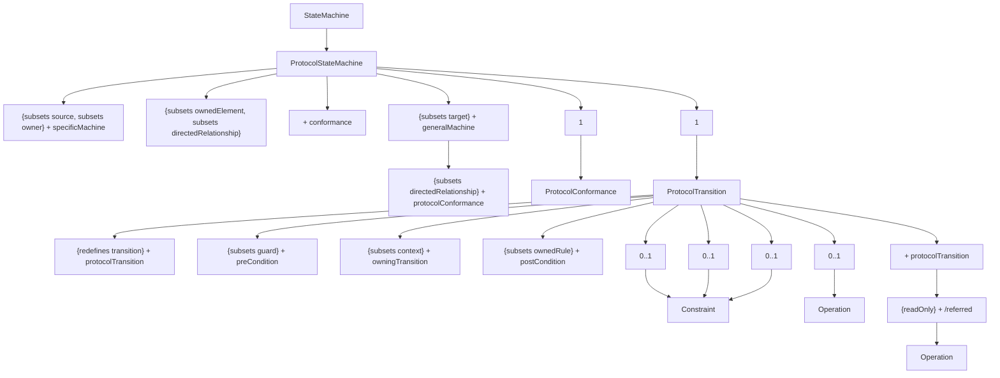

# 14.4 ProtocolStateMachines

# 14.4.1 Summary

ProtocolStateMachines are used to express usage protocols. ProtocolStateMachines express the legal sequences of Event occurrences to which the Behaviors of an associated BehavioredClassifier must conform. The StateMachine notation is a convenient way to define the order of invocations of the behavioral features of a Classifier. ProtocolStateMachines can be associated with Classifiers, Interfaces, and Ports.

# 14.4.2 Abstract Syntax


<details>
<summary>flowchart</summary>


</details>

Figure 14.41 ProtocolStateMachines

# 14.4.3 Semantics

# 14.4.3.1 ProtocolStateMachine

A ProtocolStateMachine is always defined in the context of a Classifier. It specifies which BehavioralFeatures of that Classifier can be invoked in a given protocol state and under what conditions, thereby specifying allowed invocation sequences. In this manner, a specification of the lifecycle of an instance of the Classifier is defined from an external perspective.

ProtocolStateMachines help define the order in which BehavioralFeatures of a Classifier are invoked by specifying:

- the behavioral context (i.e., which states and pre-conditions) in which they can be validly invoked,   
• the valid orderings of invocations,   
• the expected outcomes (post-conditions) of invocations.

ProtocolStateMachine present an external view of the owning Classifier as perceived by its collaborators. This extends beyond what can be captured via pre- and post-conditions on individual BehavioralFeatures, as ProtocolStateMachines also specify the valid orderings of invocations of the different features. This is achieved by a state machine specification in which the transition triggers are feature invocations and the guards of the transitions (ProtocolTransitions) specify the pre-condition that must apply for the invocation to be valid. The states (ProtocolStates) of this state machine, being a consequence of past invocation sequences, capture the state of the protocol and are also a form of pre-condition.

NOTE. Because ProtocolStateMachines provide a “black box” view of the behavior of a Classifier, their States may not necessarily correspond to the States of internal behavioral StateMachines.

ProtocolStateMachine interpretation can vary from:

1 Declarative ProtocolStateMachines, which specify the legal Transitions for BehavioralFeature invocations. The effects of a BehavioralFeature invocation is not specified. This type of specification only provides a contract for the user of the context Classifier.   
2 Executable (run time) ProtocolStateMachines, which specify all Event occurrences that an object may receive and handle, together with the Transitions that these trigger. In this case, the legal Transitions for BehavioralFeature invocations must match exactly the triggered Transitions or a run-time exception occurs. The invocation results in the execution of the method associated with the invoked BehavioralFeatures.

The specifications for both interpretations is the same, the only difference being the direct dynamic implication that the latter interpretation provides.

The more sophisticated forms of modeling encountered in behavioral StateMachines such as compound Transitions, submachine StateMachines, composite States, and concurrent orthogonal Regions, can also be used for ProtocolStateMachines. For example, concurrent Regions make it possible to express protocols where an instance can have several active States simultaneously. Submachine StateMachines and compound transitions can be used for factorizing complex ProtocolStateMachines.

A Classifier may have several ProtocolStateMachines. This can be used, for example, when a Classifier has multiple parents, each having its own ProtocolStateMachine, and the protocols are orthogonal. An alternative to this is to simply have one ProtocolStateMachine, with distinct StateMachines in concurrent Regions.

State in ProtocolStateMachines

The States of ProtocolStateMachines are exposed to the users of their context Classifiers. A protocol State represents an exposed stable situation of its context Classifier: When an instance of the Classifier classifier is not processing any BehavioralFeature invocation, users of this instance can always know its state configuration.

The States of a ProtocolStateMachine cannot have defined entry, exit, or doActivity Behaviors.

# 14.4.3.2 ProtocolTransition

A ProtocolTransition specifies a legal Transition for an invocation of a BehavioralFeature of the context Classifier. ProtocolTransitions have the following features:

- a pre-condition (preCondition), which specializes the guard attribute of Transition,   
- a trigger,   
• a post-condition (postCondition).

The protocol Transition specifies that (a) the associated (referred) feature can be invoked on an instance of the context Classifier, if it is in the origin State and the guard condition holds, and that (b) upon completion of the Transition, the instance will be in the target State in which the post-condition will hold.

ProtocolTransitions do not have an associated effect Behavior. The consequence of a ProtocolTransition executed as a result of a BehavioralFeature invocation is implicit: it is the execution of the method corresponding to the invoked BehavioralFeature. In case of other types of Triggers, the consequences are unspecified except that a Transition will lead to another State under a specific post-condition, regardless of any Behaviors associated with this Transition.

# 14.4.3.2.1 Unexpected trigger reception

The interpretation of the reception of an Event occurrence that does not match a valid trigger for the current State, state invariant, or pre-condition is not defined (e.g., it can be ignored, rejected, or deferred; an exception can be raised; or the application can stop on an error). It corresponds semantically to a pre-condition violation, for which no predefined Behavior is defined in UML.

# 14.4.3.2.2 Unexpected Behavior

The interpretation of an unexpected Behavior, that is an unexpected result of a Transition (wrong FinalState or FinalState invariant, or post-condition) is also not defined. However, this should be interpreted as an error of the implementation of the ProtocolStateMachine.

# 14.4.3.2.3 Equivalences to pre- and post-conditions of operations

A protocol Transition can be semantically interpreted in terms of pre- and post-conditions on the associated operation. For example, the Transition in Figure 14.42 can be interpreted in the following way:

1 The operation “m1” can be called on an instance when it is in the ProtocolState “S1” under the condition “C1.”   
2 When “m1” is called in the ProtocolState “S1” under the condition “C1,” then the ProtocolState “S2” must be reached under the condition “C2.”


<details>
<summary>flowchart</summary>

```mermaid
graph LR
    S1 -->|[ C1 ] m1 / [ C2 ] | S2
```
</details>

Figure 14.42 An example of a ProtocolTransition associated with the operation "m1"

Operations referred by several Transitions


<details>
<summary>flowchart</summary>

```mermaid
graph LR
    S1 -->|[C1] m1/ [C2]| S2
    S3 -->|[C3] m1/ [C4]| S4
```
</details>

Figure 14.43 Example of several ProtocolTransitions associated with the same operation (m1)

In a ProtocolStateMachine, several Transitions can refer to the same operation as illustrated in Figure 14.43. In that case, all pre-and post-conditions will be combined in the operation pre-condition as shown below.

```txt
Operation m1()
Pre:    in state S1 and condition C1
    or
    in state S3 and condition C3
Post:    if the initial condition was "in state S1 and condition C1"
    then in S2 and C2
    else
    if the initial condition was "in state S3 and condition C3"
    then in S4 and C4 
```

A ProtocolStateMachine specifies all the legal ProtocolTransition for each BehavioralFeature referred by its Transitions.

Unreferred Operations

If a BehavioralFeature is not referred by any ProtocolTransition, then the operation can be called for any State of the ProtocolStateMachine, and will not change the current State or pre- and post-conditions.

# 14.4.3.2.4 Using other types of Events in ProtocolStateMachines

Apart from invocations of BehavioralFeatures, other Events may be used for expressing the behavior of ProtocolStateMachines. A Trigger that is not a BehavioralFeature invocation can be specified for a protocol Transition. In that case, this specification is a requirement for the environment external to the ProtocolStateMachine. That is, it is legal to send an Event occurrence of this type to an instance of the context Classifier only under the conditions specified by the ProtocolStateMachine. The precise semantic interpretation of this is not defined.

# 14.4.3.3 ProtocolConformance

ProtocolStateMachines can be refined into more specific ProtocolStateMachines. Protocol conformance declares that the specific ProtocolStateMachine specifies a protocol that conforms to that specified by the general ProtocolStateMachine.

A ProtocolStateMachine is owned by a Classifier. The Classifiers owning a general StateMachine and an associated specific StateMachine are generally also connected by a Generalization or a Realization.

Protocol conformance represents a declaration that every rule and constraint specified for the general ProtocolStateMachine (state invariants, pre- and post-conditions for the operations referred by the ProtocolStateMachine) apply to the specific ProtocolStateMachine.

# 14.4.4 Notation

# 14.4.4.1 ProtocolStateMachine

The notation for ProtocolStateMachine is very similar to the one for behavioral StateMachines. The keyword «protocol» placed close to the name of the StateMachine differentiates graphically ProtocolStateMachine diagrams.


<details>
<summary>flowchart</summary>

```mermaid
graph TD
    A["Create"] --> B["opened"]
    B -->|open /| C["closed"]
    C -->|lock /| D["lock"]
    D -->|unlock /| C
    B -->|[doorway --> isEmpty()] close/|
```
</details>

Figure 14.44 ProtocolStateMachine example

The textual expression of an invariant associated with a State in a ProtocolStateMachine is represented by placing it after or under the name of the State, enclosed in square brackets (Figure 14.45).

# TypingPassword [invariant expr]


Figure 14.45 Notation for a State with an invariant

# 14.4.4.2 ProtocolTransition

The usual StateMachine notation applies. The difference is that no effect Behaviors are specified for ProtocolTransitions, and that post-conditions can exist. Post-conditions have the same syntax as guard conditions, but appear at the end of the Transition syntax.

[precondition] event / [postcondition]


Figure 14.46 ProtocolTransition notation

