# 14 StateMachines

# 14.1 Summary

The StateMachines package defines a set of concepts that can be used for modeling discrete event-driven Behaviors using a finite state-machine formalism. In addition to expressing the Behavior of parts of a system (e.g., the Behavior of Classifier instances), state machines can also be used to express the valid interaction sequences, called protocols, for parts of a system. These two kinds of StateMachines are referred to as behavior state machines and protocol state machines respectively.

The specific form of finite state automata used in UML is based on an object-oriented variant of David Harel's statecharts formalism. (However, readers who are familiar with that formalism should note that there is a small number of semantic differences that distinguish the UML version from the original.)

# 14.2 Behavior StateMachines

# 14.2.1 Summary

Behavior StateMachines can be used to specify any of the following:

• The classifierBehavior of an active Class.   
- An ownedBehavior of a BehavioredClassifier that is not the classifierBehavior of that BehavioredClassifier.   
- A stand-alone Behavior, that is, one that does not have a corresponding BehavioredClassifier.   
• A method corresponding to a BehavioralFeature (i.e., an Operation or a Reception).

# 14.2.2 Abstract Syntax


<details>
<summary>flowchart</summary>

```mermaid
graph TD
    A["Behavior"] -->|0..1| B["StateMachine"]
    B -->|0..1| C["Region"]
    C -->|1..*| D["Transition"]
    D -->|0..1| E["Behavior"]
    E -->|0..1| F["PseudostateKind"]
    F -->|0..1| G["State"]
    G -->|0..1| H["ConnectionPointReference"]
    H -->|0..1| I["Pseudostate"]
    I -->|0..1| J["FinalState"]
    J --> K["+ submachine"]
    K --> L["+ stateMachine"]
    L --> M["+ submachine"]
    M --> N["+ main point"]
    N --> O["+ main point"]
    O --> P["+ main point"]
    P --> Q["+ main point"]
    Q --> R["+ main point"]
    R --> S["+ main point"]
    S --> T["+ main point"]
    T --> U["+ main point"]
    U --> V["+ main point"]
    V --> W["+ main point"]
    W --> X["+ main point"]
    X --> Y["+ main point"]
    Y --> Z["+ main point"]
    Z --> A
    style A fill:#f9f,stroke:#333
    style B fill:#ccf,stroke:#333
    style C fill:#cfc,stroke:#333
    style D fill:#fcc,stroke:#333
    style E fill:#cff,stroke:#333
    style F fill:#ffc,stroke:#333
    style G fill:#cfc,stroke:#333
    style H fill:#cfc,stroke:#333
    style I fill:#cfc,stroke:#333
    style J fill:#cfc,stroke:#333
    style K fill:#cfc,stroke:#333
    style L fill:#cfc,stroke:#333
    style M fill:#cfc,stroke:#333
    style N fill:#cfc,stroke:#333
    style O fill:#cfc,stroke:#333
    style P fill:#cfc,stroke:#333
    style Q fill:#cfc,stroke:#333
    style R fill:#cfc,stroke:#333
    style S fill:#cfc,stroke:#333
    style T fill:#cfc,stroke:#333
    style U fill:#cfc,stroke:#333
    style V fill:#cfc,stroke:#333
    style W fill:#cfc,stroke:#333
```
</details>

Figure 14.1 Behavior StateMachines

# 14.2.3 Semantics

# 14.2.3.1 StateMachine

A behavior StateMachine comprises one or more Regions, each Region containing a graph (possibly hierarchical) comprising a set of Vertices interconnected by arcs representing Transitions. State machine execution is triggered by appropriate Event occurrences. A particular execution of a StateMachine is represented by a set of valid path traversals through one or more Region graphs, triggered by the dispatching of an Event occurrence that match active Triggers in these graphs. The rules for matching Triggers are described below. In the course of such a traversal, a StateMachine instance may execute a potentially complex sequence of Behaviors associated with the particular elements of the graphs that are being traversed (transition effects, state entry and state exit Behaviors, etc.)

If the StateMachine has a kind of BehavioredClassifier context, then that Classifier defines which Signal and CallEvent triggers are applicable to that StateMachine, and which Features are available to the Behaviors owned by the StateMachine. Signal Triggers and CallEvent Triggers for the StateMachine are defined according to the Receptions and Operations of this Classifier respectively. These Features may be used to define message event Triggers of the StateMachine.

If the StateMachine has no BehavioredClassifier context (i.e., it is a stand-alone Behavior), then its Triggers do not need to be tied to any Receptions or Operations of some Classifier. For example, such a StateMachine might be defined as a

Template with its Triggers defined as TemplateParameters. Such a StateMachine can then be reused with different context Classifiers by binding appropriate CallEvent or SignalEvent Triggers to these TemplateParameters.

In situations where a StateMachine specifies the method of a BehavioralFeature (Operation or Reception), the Parameters of the StateMachine shall match the Parameters of the BehavioralFeature (see sub clause 13.2.3). This is the means by which the StateMachine execution accesses the Parameters of the BehavioralFeature. Otherwise, the method by which an executing StateMachine instance accesses the dispatched Event occurrence and its associated data is not defined (see Clause 13).

By definition, invocations of StateMachine executions result in triggered effects (see sub clause 13.3.3) and, hence, there is an associated event pool with such an execution. The event pool for a StateMachine execution belongs to either its context Classifier object or, if the StateMachine defines a method of a BehavioralFeature, to the instance of the Classifier owning the BehavioralFeature.

Due to its event-driven nature, a StateMachine execution is either in transit or in state, alternating between the two. It is in transit when an event is dispatched that matches at least one of its associated Triggers. While in transit, it may execute a number of Behaviors associated with the paths it is taking.

NOTE. A StateMachine execution may be executing Behaviors even when it has settled in a stable state configuration, in cases where there are doActivity Behaviors associated with its active state configuration.

# 14.2.3.2 Regions

A Region denotes a behavior fragment that may execute concurrently with its orthogonal Regions. Two or more Regions are orthogonal to each other if they are either owned by the same State or, at the topmost level, by the same StateMachine. A Region becomes active (i.e., it begins executing) either when its owning State is entered or, if it is directly owned by a StateMachine (i.e., it is a top level Region), when its owning StateMachine starts executing. Each Region owns a set of Vertices and Transitions, which determine the behavioral flow within that Region. It may have its own initial Pseudostate as well as its own FinalState.

A default activation of a Region occurs if the Region is entered implicitly, that is, it is not entered through an incoming Transition that terminates on one of its component Vertices (e.g., a State or a history Pseudostate), but either

• through a (local or external) Transition that terminates on the containing State or,   
• in case of a top level Region, when the StateMachine starts executing.

Default activation means that execution starts with the Transition originating from the initial Pseudostate of the Region, if one is defined. However, no specific approach is defined if there is no initial Pseudostate that exists within the Region. One possible approach is to deem the model ill defined. An alternative is that the Region remains inactive, although the State that contains it is active. In other words, the containing composite State is treated as a simple (leaf) State.

Conversely, an explicit activation occurs when a Region is entered by a Transition terminating on one of the Region's contained Vertices. When one Region of an orthogonal State is activated explicitly, this will result in the default activation of all of its orthogonal Regions, unless those Regions are also entered explicitly (multiple orthogonal Regions can be entered explicitly in parallel through Transitions originating from the same fork Pseudostate).

# 14.2.3.3 Vertices

Vertex is an abstract class that captures the common characteristics for a variety of different concrete kinds of nodes in the StateMachine graph (States, Pseudostates, or ConnectionPointReferences). With certain exceptions described below, a Vertex can be the source and/or target of any number of Transitions. The semantics of a Vertex depend on the concrete kind of node it represents. In general, Pseudostates and ConnectionPointReferences are transitive, in the sense that a compound transition execution simply passes through them, arriving on an incoming Transition and leaving on an outgoing Transition without pause. State and FinalState, however, represent stable Vertices, such that, when a StateMachine execution enters them it remains in them until either some Event occurs that triggers a transition that moves it to a different State or the StateMachine is terminated.

The semantics of individual types of Vertices are described below.

# 14.2.3.4 States

A State models a situation in the execution of a StateMachine Behavior during which some invariant condition holds. In most cases this condition is not explicitly defined, but is implied, usually through the name associated with the State. For example, in Figure 14.36, which models the behavior of a telephone unit, the states “Idle” and “Active” represent situations where the telephone is and is not being used, respectively. This example also illustrates the fact that a State need not necessarily represent a fully static situation, as there is clearly some detailed activity occurring in the context of the “Active” state. However, throughout all that activity the telephone remains in use (i.e., “active”).

# 14.2.3.4.1 Kinds of States

The following kinds of States are distinguished:

- simple State (isSimple = true)   
• composite State (isComposite = true)   
- submachine State (isSubmachineState = true)

A simple State has no internal Vertices or Transitions. A composite State contains at least one Region, whereas a submachine State refers to an entire StateMachine, which is, conceptually, deemed to be “nested” within the State. A composite State can be either a simple composite State with exactly one Region or an orthogonal State with multiple Regions (isOrthogonal = true). For example, in Figure 14.9, State “CourseAttempt” is an example of a composite State with a single Region, whereas State “Studying” is a composite State that contains three Regions.

Any State enclosed within a Region of a composite State is called a substate of that composite State. It is called a direct substate when it is not contained in any other State; otherwise, it is referred to as an indirect substate.

# 14.2.3.4.2 State configurations

In general, a StateMachine can have multiple Regions, each of which may contain States of its own, some of which may be composites with their own multiple Regions, etc. Consequently, a particular “state” of an executing StateMachine instance is represented by one or more hierarchies of States, starting with the topmost Regions of the StateMachine and down through the composition hierarchy to the simple, or leaf, States. Similarly, we can talk about such a hierarchy of substates within a composite State. This complex hierarchy of States is referred to as a state configuration (of a State or a StateMachine). For example, one valid state configuration for an execution of the StateMachine depicted in Figure 14.9 is: <CourseAttempt - Studying – (Studying::Lab2, Studying::TermProject, Studying::FinalTest)>. An executing StateMachine instance can only be in exactly one state configuration at a time, which is referred to as its active state configuration. StateMachine execution is represented by transitions from one active state configuration to another in response to Event occurrences that match the Triggers of the StateMachine.

A State is said to be active if it is part of the active state configuration.

A state configuration is said to be stable when:

- no further Transitions from that state configuration are enabled and   
- all the entry Behaviors of that configuration, if present, have completed (but not necessarily the doActivity Behaviors of that configuration, which, if defined, may continue executing).

After it has been created and completed its initial Transition, a StateMachine is always “in” some state configuration. However, because States can be hierarchical and because there can be Behaviors associated with both Transitions and States, “entering” a hierarchical state configuration involves a dynamic process that terminates only after a stable state configuration (as defined above) is reached. This creates some potential ambiguity as to precisely when a StateMachine is “in” a particular state within a state configuration. The rules for when a StateMachine is deemed to be “in” a State and when it is deemed to have “left” a State are described below in the sections “Entering a State” and “Exiting a State respectively.

A configuration is deemed stable even if there are deferred, completion, or any other types of Event occurrences pending in the event pool of that StateMachine

# 14.2.3.4.3 State entry, exit, and doActivity Behaviors

A State may have an associated entry Behavior. This Behavior, if defined, is executed whenever the State is entered through an external Transition. In addition, a State may also have an associated exit Behavior, which, if defined, is executed whenever the State is exited.

A State may also have an associated doActivity Behavior. This Behavior commences execution when the State is entered (but only after the State entry Behavior has completed) and executes concurrently with any other Behaviors that may be associated with the State, until:

- it completes (in which case a completion event is generated) or   
- the State is exited, in which case execution of the doActivity Behavior is aborted.

The execution of a doActivity Behavior of a State is not affected by the firing of an internal Transition of that State.

# 14.2.3.4.4 State history

The concept of State history was introduced by David Harel in the original statechart formalism. It is a convenience concept associated with Regions of composite States whereby a Region keeps track of the state configuration it was in when it was last exited. This allows easy return to that same state configuration, if desired, the next time the Region becomes active (e.g., after returning from handling an interrupt), or if there is a local Transition that returns to its history. This is achieved simply by terminating a Transition on the desired type of history Pseudostate inside the Region. The advantage provided by this facility is that it eliminates the need for users to explicitly keep track of history in cases where this type of behavior is desired, which can result in significantly simpler state machine models.

Two types of history Pseudostates are provided. Deep history (deepHistory) represents the full state configuration of the most recent visit to the containing Region. The effect is the same as if the Transition terminating on the deepHistory Pseudostate had, instead, terminated on the innermost State of the preserved state configuration, including execution of all entry Behaviors encountered along the way. Shallow history (shallowHistory) represents a return to only the topmost substate of the most recent state configuration, which is entered using the default entry rule.

In cases where a Transition terminates on a history Pseudostate when the State has not been entered before (i.e., no prior history) or it had reached its FinalState, there is an option to force a transition to a specific substate, using the default history mechanism. This is a Transition that originates in the history Pseudostate and terminates on a specific Vertex (the default history state) of the Region containing the history Pseudostate. This Transition is only taken if execution leads to the history Pseudostate and the State had never been active before. Otherwise, the appropriate history entry into the Region is executed (see above). If no default history Transition is defined, then standard default entry of the Region is performed as explained below.

# Deferred Events

A State may specify a set of Event types that may be deferred in that State. This means that Event occurrences of those types will not be dispatched as long as that State remains active. Instead, these Event occurrences remain in the event pool until:

• a state configuration is reached where these Event types are no longer deferred or,   
- if a deferred Event type is used explicitly in a Trigger of a Transition whose source is the deferring State (i.e., a kind of override option).

An Event may be deferred by a composite State or submachine States, in which case it remains deferred as long as the composite State remains in the active configuration.

# 14.2.3.4.5 Entering a State

The semantics of entering a State depend on the type of State and the manner in which it is entered. However, in all cases, the entry Behavior of the State is executed (if defined) upon entry, but only after any effect Behavior associated with the incoming Transition is completed. Also, if a doActivity Behavior is defined for the State, this Behavior commences execution immediately after the entry Behavior is executed. It executes concurrently with any subsequent Behaviors associated with entering the State, such as the entry Behaviors of substates entered as part of the same compound transition.

The above description fully covers the case of simple States. For composite States with a single Region the following alternatives exist:

- Default entry: This situation occurs when the composite State is the direct target of a Transition (graphically, this is indicated by an incoming Transition that terminates on the outside edge of the composite State). After executing the entry Behavior and forking a possible doActivity Behavior execution, if an initial Pseudostate is defined, State entry continues from that Vertex via its outgoing Transition (known as the default Transition of the State). If no initial Pseudostate is defined, there is no single approach defined. One alternative is to treat such a model as ill formed. A second alternative is to treat the composite State as a simple State, terminating the traversal on that State despite its internal parts.   
- Explicit entry: If the incoming Transition or its continuations terminate on a directly contained substate of the composite State, then that substate becomes active and its entry Behavior is executed after the execution of the entry Behavior of the containing composite State. This rule applies recursively if the Transition terminates on an indirect (deeply nested) substate.   
- Shallow history entry: If the incoming Transition terminates on a shallowHistory Pseudostate of a Region of the composite State, the active substate becomes the substate that was most recently active prior to this entry, unless:

- the most recently active substate is the FinalState, or   
- this is the first entry into this State.   
☐ In the latter two cases, if a default shallow history Transition is defined originating from the shallowHistory Pseudostate, it will be taken. Otherwise, default State entry is applied.

- Deep history entry: The rule for this case is the same as for shallow history except that the target Pseudostate is of type deepHistory and the rule is applied recursively to all levels in the active state configuration below this one.   
- Entry point entry: If a Transition enters a composite State through an entryPoint Pseudostate, then the effect Behavior associated with the outgoing Transition originating from the entry point and penetrating into the State (but after the entry Behavior of the composite State has been executed).

If the composite State is also an orthogonal State with multiple Regions, each of its Regions is also entered, either by default or explicitly. If the Transition terminates on the edge of the composite State (i.e., without entering the State), then all the Regions are entered using the default entry rule above. If the Transition explicitly enters one or more Regions (in case of a fork), these Regions are entered explicitly and the others by default.

Regardless of how a State is entered, the StateMachine is deemed to be “in” that State even before any entry Behavior or effect Behavior (if defined) of that State start executing.

# 14.2.3.4.6 Exiting a State

When exiting a State, regardless of whether it is simple or composite, the final step involved in the exit, after all other Behaviors associated with the exit are completed, is the execution of the exit Behavior of that State. If the State has a doActivity Behavior that is still executing when the State is exited, that Behavior is aborted before the exit Behavior commences execution.

When exiting from a composite State, exit commences with the innermost State in the active state configuration. This means that exit Behaviors are executed in sequence starting with the innermost active State. If the exit occurs through an exitPoint Pseudostate, then the exit Behavior of the State is executed after the effect Behavior of the Transition terminating on the exit point.

When exiting from an orthogonal State, each of its Regions is exited. After that, the exit Behavior of the State is executed.

Regardless of how a State is exited, the StateMachine is deemed to have “left” that State only after the exit Behavior (if defined) of that State has completed execution.

# Encapsulated composite States

In some modeling situations, it is useful to encapsulate a composite State, by not allowing Transitions to penetrate directly into the State to terminate on one of its internal Vertices. (One common use case for this is when the internals of a State in an abstract Classifier are intended to be specified differently in different subtype refinements of the abstract Classifier.) Despite the encapsulation, it is often necessary to bind the internal elements of the composite State with incoming and outgoing Transitions. This is done by means of entry and exit points, which are realized via the entryPoint and exitPoint Pseudostates.

Entry points represent termination points (sources) for incoming Transitions and origination points (targets) for Transitions that terminate on some internal Vertex of the composite State. In effect, the latter is a continuation of the external incoming Transition, with the proviso that the execution of the entry Behavior of the composite State (if defined) occurs between the effect Behavior of the incoming Transition and the effect Behavior of the outgoing Transition. If there is no outgoing Transition inside the composite State, then the incoming Transition simply performs a default State entry.

Exit points are the inverse of entry points. That is, Transitions originating from a Vertex within the composite State can terminate on the exit point. In a well-formed model, such a Transition should have a corresponding external Transition outgoing from the same exit point, representing a continuation of the terminating Transition. If the composite State has an exit Behavior defined, it is executed after any effect Behavior of the incoming inside Transition and before any effect Behavior of the outgoing external Transition.

# 14.2.3.4.7 Submachine States and submachines

Submachines are a means by which a single StateMachine specification can be reused multiple times. They are similar to encapsulated composite States in that they need to bind incoming and outgoing Transitions to their internal Vertices. However, whereas encapsulated composite States and their internals are contained within the StateMachine in which they are defined, submachines are, like programming language macros, distinct Behavior specifications, which may be defined in a different context than the one where they are used (invoked). Consequently, they require a more complex binding. This is achieved through the concept of submachine State (i.e., States with isSubmachineState = true), which represent references to corresponding submachine StateMachines. The concept of ConnectionPointReference is provided to support binding between the submachine State and the referenced StateMachine. A

ConnectionPointReference represents a point on the submachine State at which a Transition either terminates or originates. That is, they serve as targets for incoming Transitions to submachine States, as well as sources for outgoing Transitions from submachine States. Each ConnectionPointReference is matched by a corresponding entry or exit point in the referenced submachine StateMachine. This provides the necessary binding mechanism between the submachine invocation and its specification.

A submachine State implies a macro-like insertion of the specification of the corresponding submachine StateMachine. It is, therefore, semantically equivalent to a composite State. The Regions of the submachine StateMachine are the Regions of the composite State. The entry, exit, and effect Behaviors and internal Transitions are defined as contained in the submachine State.

NOTE. Each submachine State represents a distinct instantiation of a submachine, even when two or more submachine States reference the same submachine.

A submachine StateMachine can be entered via its default (initial) Pseudostate or via any of its entry points (i.e., it may imply entering a non-orthogonal or an orthogonal composite State with Regions). Entering via the initial Pseudostate has the same meaning as for ordinary composite States. An entry point is equivalent to a junction Pseudostate (fork in cases where the composite State is orthogonal): Entering via an entry point implies that the entry Behavior of the composite state is executed, followed by the Transition from the entry point to the target Vertex within the composite State. Any guards associated with these entry point Transitions must evaluate to true in order for the specification to be well formed.

Similarly, a submachine Statemachine can be exited as a result of:

- reaching its FinalState,   
- triggering of a group Transition originating from a submachine State, or   
• via any of its exit points.

Exiting via a FinalState or by a group Transition has the same meaning as for ordinary composite States.

# 14.2.3.5 ConnectionPointReference

As noted above, a connection point reference represents a usage (as part of a submachine State) of an entry/exit point defined in the StateMachine referenced by the submachine State. Connection point references of a submachine State can be used as sources/targets of Transitions. They represent entries into or exits out of the submachine StateMachine referenced by the submachine State.

Connection point references are sources/targets of Transitions implying exits out of/entries into the submachine StateMachine referenced by a submachine State.

An entry point connection point reference as the target of a Transition implies that the target of the Transition is the entryPoint Pseudostate as defined in the submachine of the submachine State. As a result, the Regions of the submachine StateMachine are entered through the corresponding entryPoint Pseudostates.

An exit point connection point reference as the source of a Transition implies that the source of the Transition is the exit point Pseudostate as defined in the submachine of the submachine State that has the exit point connection point defined. When a Region of the submachine StateMachine reaches the corresponding exit point, the submachine state is exited via this exit point.

# 14.2.3.6 FinalState

FinalState is a special kind of State signifying that the enclosing Region has completed. Thus, a Transition to a FinalState represents the completion of the behaviors of the Region containing the FinalState.

# 14.2.3.7 Pseudostate and PseudostateKind

A Pseudostate is an abstraction that encompasses different types of transient Vertices in the StateMachine graph. Pseudostates are generally used to chain multiple Transitions into more complex compound transitions (see below). For example, by combining a Transition entering a fork Pseudostate with a set of Transitions exiting that Pseudostate, we get a compound Transition that can enter a set of orthogonal Regions.

The specific semantics of a Pseudostate depend on the kind of Pseudostate, which is defined by its kind attribute of type PseudostateKind. The following describes the different kinds and their semantics:

- initial - An initial Pseudostate represents a starting point for a Region; that is, it is the point from which execution of its contained behavior commences when the Region is entered via default activation. It is the source for at most one Transition, which may have an associated effect Behavior, but not an associated trigger or guard. There can be at most one initial Vertex in a Region.   
- deepHistory – This type of Pseudostate is a kind of variable that represents the most recent active state configuration of its owning Region. As explained above, a Transition terminating on this Pseudostate implies restoring the Region to that same state configuration, but with all the semantics of entering a State (see the subclause describing State entry). The entry Behaviors of all States in the restored state configuration are performed in the appropriate order starting with the outermost State. A deepHistory Pseudostate can only be defined for composite States and, at most one such Pseudostate can be contained in a Region of a composite State.   
- shallowHistory – As explained above, this type of Pseudostate is a kind of variable that represents the most recent active substate of its containing Region, but not the substates of that substate. A Transition terminating on this Pseudostate implies restoring the Region to that substate with all the semantics of entering a State. A

single outgoing Transition from this Pseudostate may be defined terminating on a substate of the composite State. This substate is the default shallow history state of the composite State. A shallowHistory Pseudostate can only be defined for composite States and, at most one such Pseudostate can be included in a Region of a composite State.

- join – This type of Pseudostate serves as a common target Vertex for two or more Transitions originating from Vertices in different orthogonal Regions. Transitions terminating on a join Pseudostate cannot have a guard or a trigger. Similar to junction points in Petri nets, join Pseudostates perform a synchronization function, whereby all incoming Transitions have to complete before execution can continue through an outgoing Transition.   
- fork – fork Pseudostates serve to split an incoming Transition into two or more Transitions terminating on Vertices in orthogonal Regions of a composite State. The Transitions outgoing from a fork Pseudostate cannot have a guard or a trigger.   
- junction – This type of Pseudostate is used to connect multiple Transitions into compound paths between States. For example, a junction Pseudostate can be used to merge multiple incoming Transitions into a single outgoing Transition representing a shared continuation path. Or, it can be used to split an incoming Transition into multiple outgoing Transition segments with different guard Constraints.

NOTE. Such guard Constraints are evaluated before any compound transition containing this Pseudostate is executed, which is why this is referred to as a static conditional branch.

It may happen that, for a particular compound transition, the configuration of Transition paths and guard values is such that the compound transition is prevented from reaching a valid state configuration. In those cases, the entire compound transition is disabled even though its Triggers are enabled. (As a way of avoiding this situation in some cases, it is possible to associate a predefined guard denoted as “else” with at most one outgoing Transition. This Transition is enabled if all the guards attached to the other Transitions evaluate to false). If more than one guard evaluates to true, one of these is chosen. The algorithm for making this selection is not defined.

- choice – This type of Pseudostate is similar to a junction Pseudostate (see above) and serves similar purposes, with the difference that the guard Constraints on all outgoing Transitions are evaluated dynamically, when the compound transition traversal reaches this Pseudostate. Consequently, choice is used to realize a dynamic conditional branch. It allows splitting of compound transitions into multiple alternative paths such that the decision on which path to take may depend on the results of Behavior executions performed in the same compound transition prior to reaching the choice point. If more than one guard evaluates to true, one of the corresponding Transitions is selected. The algorithm for making this selection is not defined. If none of the guards evaluates to true, then the model is considered ill formed. To avoid this, it is recommended to define one outgoing Transition with the predefined “else” guard for every choice Pseudostate.   
- entryPoint – An entryPoint Pseudostate represents an entry point for a StateMachine or a composite State that provides encapsulation of the insides of the State or StateMachine. In each Region of the StateMachine or composite State owning the entryPoint, there is at most a single Transition from the entry point to a Vertex within that Region.

NOTE. If the owning State has an associated entry Behavior, this Behavior is executed before any behavior associated with the outgoing Transition. If multiple Regions are involved, the entry point acts as a fork Pseudostate.

- exitPoint – An exitPoint Pseudostate is an exit point of a StateMachine or composite State that provides encapsulation of the insides of the State or StateMachine. Transitions terminating on an exit point within any Region of the composite State or a StateMachine referenced by a submachine State implies exiting of this composite State or submachine State (with execution of its associated exit Behavior). If multiple Transitions from orthogonal Regions within the State terminate on this Pseudostate, then it acts like a join Pseudostate.   
- terminate – Entering a terminate Pseudostate implies that the execution of the StateMachine is terminated immediately. The StateMachine does not exit any States nor does it perform any exit Behaviors. Any executing doActivity Behaviors are automatically aborted. Entering a terminate Pseudostate is equivalent to invoking a DestroyObjectAction.

# 14.2.3.8 Transitions

A Transition is a single directed arc originating from a single source Vertex and terminating on a single target Vertex (the source and target may be the same Vertex), which specifies a valid fragment of a StateMachine Behavior. It may have an associated effect Behavior, which is executed when the Transition is traversed (executed).

NOTE. The duration of a Transition traversal is undefined, allowing for different semantic interpretations, including both “zero” and non-“zero” time.

Transitions are executed as part of a more complex compound transition that takes a StateMachine execution from one stable state configuration to another. The semantics of compound transitions are described below.

In the course of execution, a Transition instance is said to be:

- reached, when execution of its StateMachine execution has reached its source Vertex (i.e., its source State is in the active state configuration);   
- traversed, when it is being executed (along with any associated effect Behavior); and   
• completed, after it has reached its target Vertex.

A Transition may own a set of Triggers, each of which specifies an Event whose occurrence, when dispatched, may trigger traversal of the Transition. A Transition trigger is said to be enabled if the dispatched Event occurrence matches its Event type. When multiple triggers are defined for a Transition, they are logically disjunctive, that is, if any of them are enabled, the Transition will be triggered.

# 14.2.3.8.1 Transition kinds relative to source

The semantics of a Transition depend on its relationship to its source Vertex. Three different possibilities are defined, depending on the value of the Transition's kind attribute:

- kind = external means that the Transition exits its source Vertex. If the Vertex is a State, then executing this Transition will result in the execution of any associated exit Behavior of that State.   
- kind = local is the opposite of external, meaning that the Transition does not exit its containing State (and, hence, the exit Behavior of the containing State will not be executed). However, for local Transitions the target Vertex must be different from its source Vertex. A local Transition can only exist within a composite State.   
- kind = internal is a special case of a local Transition that is a self-transition (i.e., with the same source and target States), such that the State is never exited (and, thus, not re-entered), which means that no exit or entry Behaviors are executed when this Transition is executed. This kind of Transition can only be defined if the source Vertex is a State.

# 14.2.3.8.2 High-level (group) Transitions

Transitions whose source Vertex is a composite States are called high-level or group Transitions. If they are external, group Transitions result in the exiting of all substates of the composite State, executing any defined exit Behaviors starting with the innermost States in the active state configuration. In case of local Transitions, the exit Behaviors of the source State and the entry Behaviors of the target State will be executed, but not those of the containing State.

# 14.2.3.8.3 Completion Transitions and completion events

A special kind of Transition is a completion Transition, which has an implicit trigger. The event that enables this trigger is called a completion event and it signifies that all Behaviors associated with the source State of the completion Transition have completed execution. In case of simple States, a completion event is generated when the associated entry and doActivity Behaviors have completed executing. If no such Behaviors are defined, the completion event is generated upon entry into the State. For composite or submachine States, a completion event is generated under the following circumstances:

• All internal activities (e.g., entry and doActivity Behaviors) have completed execution, and

- if the State is a composite State, all its orthogonal Regions have reached a FinalState, or   
- if the State is a submachine State, the submachine StateMachine execution has reached a FinalState.

Completion events have dispatching priority. That is, they are dispatched ahead of any pending Event occurrences in the event pool. If two or more completion events corresponding to multiple orthogonal Regions occur simultaneously (i.e., as a result of the same Event occurrence), the order in which such completion occurrences are processed is not defined. Completion of all top level Regions in a StateMachine corresponds to a completion of the Behavior of the StateMachine and results in its termination.

# Transition guards

A Transition may have an associated guard Constraint. Transitions that have a guard which evaluates to false are disabled. Guards are evaluated before the compound transition that contains them is enabled, unless they are on Transitions that originate from a choice Pseudostate. In the latter case, the guards are evaluated when the choice point is reached. A Transition that does not have an associated guard is treated as if it has a guard that is always true.

NOTE. A completion Transition may also have a guard.

A guard constraint may involve tests of orthogonal States of the current StateMachine, or explicitly designated States of some reachable object (for example, “in State1” or “not in State2”). State names may be fully qualified by the nested States and Regions that contain them, yielding pathnames of the form “RegionA::State1::Region1::State2::State3”. This may be used in case the same State name occurs in different composite State Regions.

# 14.2.3.8.4 Compound transitions

As noted earlier, when an Event occurrence triggers an enabled Transition or a StateMachine execution is created, this can initiate traversal of a set of connected and nested Transitions and Vertices until a stable state configuration is reached. In the general case, a trace of this traversal, known as a compound transition, can be represented by an acyclical directed graph. The root (source) of this graph can be one of the following:

• A Transition with one or more Triggers defined.   
• A completion Transition.   
- A set of Transitions (including, possibly, completion Transitions) originating from different orthogonal Regions that converge on a common join Pseudostate.   
- A Transition originating from an initial Pseudostate of the topmost Region (i.e., a Region owned by the StateMachine); this variant applies only to cases when the StateMachine instance is created.

Branching in a compound transition execution occurs whenever an executing Transition performs a default entry into a State with multiple orthogonal Regions, with a separate branch created for each Region, or when a fork Pseudostate is encountered. The overall behavior that results from the execution of a compound transition is a partially ordered set of executions of Behaviors associated with the traversed elements, determined by the order in which the elements (Vertices and Transitions) are encountered. For example, if a Transition entering a compound State terminates on a substate of that State, then the effect Behavior of the Transition would be executed before the execution of the entry Behavior of the compound State, followed by the entry Behavior of the substate. If a fork Pseudostate is encountered in the traversal, then the effect Behaviors of the individual outgoing branches are, at least conceptually, executed concurrently with each other.

If a choice or join point is reached with multiple outgoing Transitions with guards, a Transition whose guard evaluates to true will be taken. If more than one guard evaluates to true, one of these Transitions is chosen for continuing the traversal. The algorithm for making this selection is undefined. In case of Transitions originating from a choice Pseudostate, if no guards evaluate to true when the Pseudostate is reached, the model is ill formed.

# 14.2.3.8.5 Transition ownership

The owner of a Transition is not explicitly constrained, though the Region in which it is contained must be owned directly or indirectly by the owning StateMachine. A suggested owner of a Transition is the innermost Region that contains both its source and target Vertices.

# 14.2.3.9 Event Processing for StateMachines

# 14.2.3.9.1 The run-to-completion paradigm

The processing of Event occurrences by a StateMachine execution conforms to the general semantics defined in Clause 13. Upon creation, a StateMachine will perform its initialization during which it executes an initial compound transition prompted by the creation, after which it enters a wait point. In case of StateMachine Behaviors, a wait point is represented by a stable state configuration. It remains thus until an Event stored in its event pool is dispatched. This Event is evaluated and, if it matches a valid Trigger of the StateMachine and there is at least one enabled Transition that can be triggered by that Event occurrence, a single StateMachine step is executed. A step involves executing a compound transition and terminating on a stable state configuration (i.e., the next wait point). This cycle then repeats until either the StateMachine completes its Behavior or until it is asynchronously terminated by some external agent.

StateMachines can respond to any of the Event types described in Clause 13 as well as to completion events (see above).

NOTE. As explained above, completion events have priority and will be dispatched ahead of any pending Event occurrences in the event pool.

Event occurrences are detected, dispatched, and processed by the StateMachine execution, one at a time.

NOTE. The order of event dispatching is left undefined, allowing for varied scheduling algorithms.

This cycle is referred to as the run-to-completion paradigm, and the corresponding StateMachine step is called a run-to-completion step. Run-to-completion means that, in the absence of exceptions or asynchronous destruction of the context Classifier object or the StateMachine execution, a pending Event occurrence is dispatched only after the processing of the previous occurrence is completed and a stable state configuration has been reached. That is, an Event occurrence will never be dispatched while the StateMachine execution is busy processing the previous one. This behavioral paradigm was chosen to avoid complications arising from concurrency conflicts that may arise when a StateMachine tries to respond to multiple concurrent or overlapping events.

When an Event occurrence is detected and dispatched, it may result in one or more Transitions being enabled for firing. If no Transition is enabled and the corresponding Event type is not in any of the deferrable Triggers lists of the active state configuration, the dispatched Event occurrence is discarded and the run-to-completion step is completed trivially.

Due to the presence of orthogonal Regions, it is possible that multiple Transitions (in different Regions) can be triggered by the same Event occurrence. The order in which these Transitions are executed is left undefined. Each orthogonal Region in the active state configuration that does not contain nested orthogonal Regions (i.e., a “bottom-level” Region) can fire at most one Transition as a result of the current Event occurrence. When all orthogonal Regions have finished executing the Transition, the current Event occurrence is fully consumed, and the run-to-completion step is completed.

As mentioned above, it is possible for multiple mutually exclusive Transitions in a given Region to be enabled for firing by the same Event occurrence. In those cases, only one is selected and executed. Which of the enabled Transitions is chosen is determined by the Transition selection algorithm described below.

During a Transition, a number of actions Behaviors may be executed. If such a Behavior includes a synchronous invocation call on another object executing a StateMachine, then the Transition step is not completed until the invoked object method completes its run-to-completion step.

Run-to-completion may be implemented in various ways. For active Classes, it may be realized by an event-loop running in its own thread, and that reads event occurrences from a pool. For passive Classes it may be implemented using a monitor.

IMPLEMENTATION NOTE. Run-to-completion is often mistakenly interpreted as implying that an executing StateMachine cannot be interrupted, which, of course would lead to priority inversion issues in some time-sensitive systems. However, this is not the case; in a given implementation a thread executing a StateMachine step can be suspended, allowing higher-priority threads to run, and, once it is allocated processor time again by the underlying thread scheduler, it can safely resume its execution and complete its event processing.

# 14.2.3.9.2 Enabled Transitions

A Transition is enabled if and only if:

- All of its source States are in the active state configuration.   
- At least one of the triggers of the Transition has an Event that is matched by the Event type of the dispatched Event occurrence. In case of Signal Events, any occurrence of the same or compatible type as specified in the Trigger will match. If one of the Triggers is for an AnyReceiveEvent, then either a Signal or CallEvent satisfies this Trigger, provided that there is no other Signal or CallEvent Trigger for the same Transition or any other Transition having the same source Vertex as the Transition with the AnyReceiveEvent trigger (see also 13.3.1).   
- If there exists at least one full path from the source state configuration to either the target state configuration or to a dynamic choice Pseudostate in which all guard conditions are true (Transitions without guards are treated as if their guards are always true).

As more than one Transition may be enabled by the same Event occurrence, being enabled is a necessary but not sufficient condition for the firing of a Transition.

# 14.2.3.9.3 Conflicting Transitions

It is possible for more than one Transition to be enabled within a StateMachine. If that happens, then such Transitions may be in conflict with each other. For example, consider the case of two Transitions originating from the same State, triggered by the same event, but with different guards. If that event occurs and both guard conditions are true, then at most one of those Transitions can fire in a given run-to-completion step.

Two Transitions are said to conflict if they both exit the same State, or, more precisely, that the intersection of the set of States they exit is non-empty. Only Transitions that occur in mutually orthogonal Regions may be fired simultaneously. This constraint guarantees that the new active state configuration resulting from executing the set of Transitions is well formed.

An internal Transition in a State conflicts only with Transitions that cause an exit from that State.

# 14.2.3.9.4 Firing priorities

In situations where there are conflicting Transitions, the selection of which Transitions will fire is based in part on an implicit priority. These priorities resolve some but not all Transition conflicts, as they only define a partial ordering. The priorities of conflicting Transitions are based on their relative position in the state hierarchy. By definition, a Transition originating from a substate has higher priority than a conflicting Transition originating from any of its containing States.

The priority of a Transition is defined based on its source State. The priority of Transitions chained in a compound transition is based on the priority of the Transition with the most deeply nested source State.

In general, if t1 is a Transition whose source State is s1, and t2 has source s2, then:

- If s1 is a direct or indirectly nested substate of s2, then t1 has higher priority than t2.   
- If s1 and s2 are not in the same state configuration, then there is no priority difference between t1 and t2.

# 14.2.3.9.5 Transition selection algorithm

The set of Transitions that will fire are the Transitions in the Regions of the current state configuration that satisfy the following conditions:

• All Transitions in the set are enabled.

• There are no conflicting Transitions within the set.   
- There is no Transition outside the set that has higher priority than a Transition in the set (that is, enabled Transitions with highest priorities are in the set while conflicting Transitions with lower priorities are left out).

This can be implemented by a greedy selection algorithm, with a straightforward traversal of the active state configuration. States in the active state configuration are traversed starting with the innermost nested simple States and working outwards. For each State at a given level, all originating Transitions are evaluated to determine if they are enabled. This traversal guarantees that the priority principle is not violated. The only non-trivial issue is resolving Transition conflicts across orthogonal States on all levels. This is resolved by terminating the search in each orthogonal State once a Transition inside any one of its components is fired.

# 14.2.3.9.6 Transition execution sequence

Every Transition, except for internal and local Transitions, causes exiting of a source State, and entering of the target State. These two States, which may be composite, are designated as the main source and the main target of a Transition respectively.

The main source is a direct substate of the Region that contains the source States, and the main target is the substate of the Region that contains the target States.

NOTE. A Transition from one Region to another in the same immediate enclosing composite State is not allowed.

Once a Transition is enabled and is selected to fire, the following steps are carried out in order:

1 Starting with the main source State, the States that contain the main source State are exited according to the rules of State exit (or, composite State exit if the main source State is nested) as described earlier.   
2 The series of State exits continues until the first Region that contains, directly or indirectly, both the main source and main target states is reached. The Region that contains both the main source and main target states is called their least common ancestor. At that point, the effect Behavior of the Transition that connects the sub-configuration of source States to the sub-configuration of target States is executed. (A “sub-configuration” here refers to that subset of a full state configuration contained within the least common ancestor Region.)   
3 The configuration of States containing the main target State is entered, starting with the outermost State in the least common ancestor Region that contains the main target State. The execution of Behaviors follows the rules of State entry (or composite State entry) described earlier.

This transition execution algorithm is illustrated by the StateMachine example in Figure 14.2. In this case, when event “sig” is dispatched while the StateMachine is in State “S11” (the main source), the following sequence of actions will be executed:

xS11; t1; xS1; t2; eT1; eT11; t3; eT111


<details>
<summary>flowchart</summary>

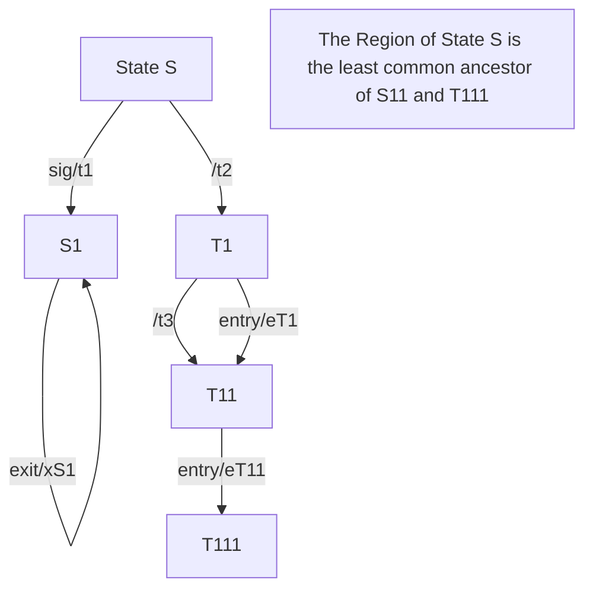
</details>

Figure 14.2 Compound transition example

# 14.2.4 Notation

# 14.2.4.1 StateMachine Diagrams

StateMachine diagrams specify StateMachines. This Clause outlines the graphic elements that may be shown in StateMachine diagrams, and provides cross references where detailed information about the semantics and concrete notation for each element can be found. It also furnishes examples that illustrate how the graphic elements can be assembled into diagrams.

A StateMachine diagram is a graph that represents a StateMachine. States and various other types of Vertices in the StateMachine graph are rendered by appropriate State and Pseudostate symbols, while Transitions are generally rendered by directed arcs that connect them, or by control symbols representing the actions of the Behavior on the Transition.

# 14.2.4.2 StateMachine

When depicting StateMachine redefinition in a class diagram, the default rectangle notation for Classifier can be used, with the keyword «statemachine» inside the name compartment above or before the name of the StateMachine.

The association between a StateMachine and its context Classifier or BehavioralFeatures does not have a special graphical representation.

# 14.2.4.3 Region

A composite State or StateMachine with Regions is shown by tiling the graph Region of the State/StateMachine using dashed lines to divide it into Regions (Figure 14.3). Each Region may have an optional name and contains the nested disjoint States and the Transitions between these. The text compartments of the entire State are separated from the orthogonal Regions by a solid line.

A composite State or StateMachine with just one Region is shown by showing a nested state diagram within the graph Region.


<details>
<summary>text_image</summary>

S
</details>

Figure 14.3 Notation for a composite State with Regions

# 14.2.4.4 State

State is shown as a rectangle with rounded corners, with the State name shown within (Figure 14.4).

  
Figure 14.4 State notation

Optionally, it may have an attached name tab (Figure 14.5). The name tab is a rectangle, usually resting on the outside of the top side of a State and it contains the name of that State. It is normally used to keep the name of a composite State that has orthogonal Regions, but may be used in other cases as well.

TypingPassword

# Figure 14.5 State with a name tab

A State may be subdivided into multiple compartments separated from each other by a horizontal line (Figure 14.6).

TypingPassword

```kotlin
entry/setEchoInvisible()
exit/setEchoNormal()
character/handleCharacter()
help/displayHelp() 
```

# Figure 14.6 State with compartments

The compartments of a State are:

- name compartment   
• internal Behaviors compartment   
• internal Transitions compartment.

A composite State also has a:

\- decomposition compartment.

Each of these compartments is described below.

\- Name compartment

This compartment holds the (optional) name of the State, as a string. States without names are anonymous and are all distinct. It is undesirable to show the same named State twice in the same diagram, as confusion may ensue, unless control icons are used to show a Transition-oriented view of the StateMachine. Name compartments should not be used if a name tab is used and vice versa.

In case of a submachine State, the name of the referenced StateMachine is shown as a string following ‘:’ after the name of the State.

• Internal activities Behaviors compartment

This compartment holds a list of internal Behaviors associated with a State. Each entry has the following format:

$$
<   \text { behavior - type - label } > [ ^ {\prime} / ^ {\prime} <   \text { behavior - expression } > ]
$$

The <behavior-type-label> identifies the circumstances under which the Behavior specified by the <behavior-expression> will be invoked and can be one of the following:

entry — This label identifies a Behavior, specified by the corresponding expression, which is performed upon entry to the State (entry Behavior).

- exit — This label identifies a Behavior, specified by the corresponding expression, that is performed upon exit from the State (exit Behavior).   
☐ do — This label identifies an ongoing Behavior (doActivity Behavior) that is performed as long as the modeled element is in the State or until the computation specified by the expression is completed.

The optional <behavior-expression> is an expression in some textual surface language, which may be either a vendor-specific or some standard language (see sub clause 16.1).

• Internal Transition compartment

This compartment contains a list of internal Transitions, where each item has the following syntax:

$$
\{<   \text { trigger } > \} ^ {*} [ ^ {\prime} [ ^ {\prime} <   \text { guard } > ^ {\prime} ] ^ {\prime} ] [ / <   \text { behavior - expression } > ]
$$

Where <trigger> is the notation for Triggers (see sub clause 13.3.4), <guard> is a Boolean expression for a guard, and the optional <behavior-expression> is the specification of the effect Behavior to be executed if the Event occurrence matches the trigger and guard of the internal Transition. It is an expression written in some textual surface language, which may be either a vendor-specific or some standard language (see sub clause 16.1).

Alternatively, in place of a textual behavior expression, the various Behaviors associated with a State or internal Transition can be expressed using the appropriate graphical representation in a separate diagram (e.g., an activity diagram).

# 14.2.4.4.1 Composite State

\- decomposition compartment

This compartment shows its composition structure in terms of Regions, States, and Transition. In addition to the (optional) name and internal Transition compartments, the State may have an additional compartment that contains a nested diagram. For convenience and appearance, the text compartments may be shrunk horizontally within the graphic Region.

In some cases, it is convenient to hide the decomposition of a composite State. For example, there may be a large number of States nested inside a composite State and they may simply not fit in the graphical space available for the diagram. In that case, the composite State may be represented by a simple State graphic with a special “composite” icon, usually in the lower right-hand corner (see Figure 14.8). This icon, consisting of two horizontally placed and connected States, is an optional visual cue that the State has a decomposition that is not shown in this particular diagram. Instead, the contents of the composite State are shown in a separate diagram.

NOTE. The “hiding” here is purely a matter of graphical convenience and has no semantic significance in terms of access restrictions.

A composite State may have one or more entry and exit points on its outside border or in close proximity of that border (inside or outside).


<details>
<summary>flowchart</summary>

```mermaid
graph LR
    Start["Start\nentry/ start dial tone\nexit/ stop dial tone"] -->|digit(n)| PartialDial["Partial Dial\nentry/number.append(n)"]
    PartialDial -->|[number.isValid()]| End((End))
    PartialDial -->|digit(n)| End
```
</details>

Figure 14.7 Composite State with two States


<details>
<summary>flowchart</summary>

```mermaid
graph TD
    A["HiddenComposite"] --> Bentry / start dial tone
    B --> Exit / stop dial tone
    B --> C["○○"]
```
</details>

Figure 14.8 Composite State with a hidden decomposition indicator icon


<details>
<summary>flowchart</summary>

```mermaid
graph TD
    A["CourseAttempt"] --> B["Studying"]
    B --> C["Lab1"]
    C --> D["Lab2"]
    D --> E["Final Test"]
    E --> F["Failed"]
    F --> G["Passed"]
    B --> H["Term Project"]
    H --> I projecting done]
    B --> J["Final Test"]
    J --> K pass
    style A fill:#000,stroke:#fff,color:#fff
    style B fill:#fff,stroke:#000
    style C fill:#fff,stroke:#000
    style D fill:#fff,stroke:#000
    style E fill:#fff,stroke:#000
    style F fill:#fff,stroke:#000
    style G fill:#fff,stroke:#000
    style H fill:#fff,stroke:#000
    style I fill:#fff,stroke:#000
    style J fill:#fff,stroke:#000
    style K fill:#fff,stroke:#000
    subgraph "studying"
        L["●"] --> M["Lab1"]
        M --> N["lab done"]
        N --> O["Lab2"]
        O --> P["lab done"]
        P --> Q["●"]
        R["●"] --> S["Term Project"]
        S --> T projecting done
        U["●"] --> V["Final Test"]
        V --> W["pass"]
        X["●"] --> Y["Passed"]
    end
    style L fill:#fff,stroke:#000
    style M fill:#fff,stroke:#000
    style N fill:#fff,stroke:#000
    style O fill:#fff,stroke:#000
    style P fill:#fff,stroke:#000
    style Q fill:#fff,stroke:#000
    style R fill:#fff,stroke:#000
    style S fill:#fff,stroke:#000
    style T fill:#fff,stroke:#000
    style V fill:#fff,stroke:#000
    style W fill:#fff,stroke:#000
    style Y fill:#fff,stroke:#000
    style Z fill:#fff,stroke:#000
    subgraph "studying"
        AA["●"] --> AB["Lab1"]
        AB --> AC["lab done"]
        AC --> AD["Lab2"]
        AD --> AE["lab done"]
        AE --> AF["●"]
        AG["●"] --> AH["Term Project"]
        AH --> AI projecting done
        AJ["●"] --> AK["Final Test"]
        AK --> AL["pass"]
        AM["●"] --> AN["Passed"]
    end
```
</details>

Figure 14.9 Composite State with Regions


<details>
<summary>flowchart</summary>

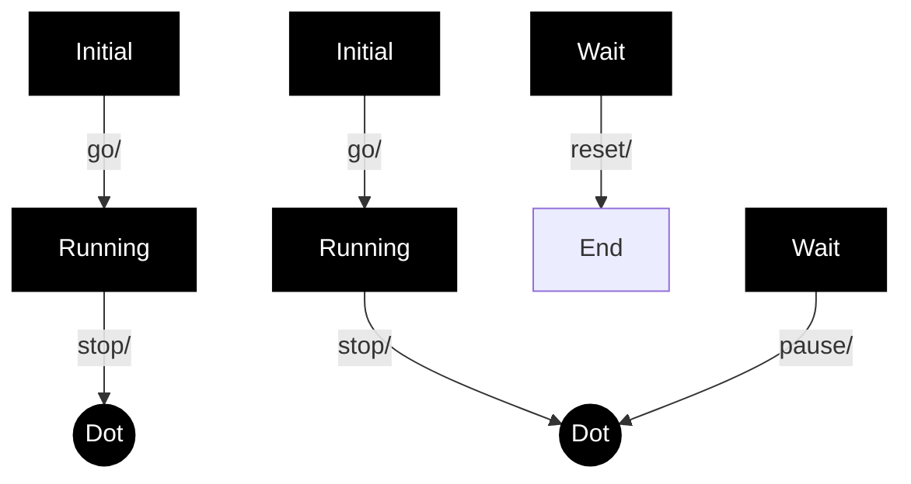
</details>

Figure 14.10 Composite State with two Regions and entry, exit, and do Behaviors

# 14.2.4.4.2 Submachine State

The submachine State is depicted as a normal State where the string in the name compartment has the following syntax:

```txt
<state-name> ‘:’ <name-of-referenced-StateMachine> 
```

The submachine State symbol may contain the references to one or more entry points and to one or more exit points. The notation for these connection point references comprises entry/exit Pseudostates on the border of the submachine State. The names are the names of the corresponding entry/exit points defined within the referenced StateMachine (see ConnectionPointReference).

If the submachine StateMachine is entered through its default initial Pseudostate or if it is exited as a result of the completion of the submachine, it is not necessary to use the entry/exit point notation. Similarly, an exit point is not required if the exit occurs through an explicit group Transition that originates from the boundary of the submachine State (implying that it applies to all the substates of the submachine).

Submachine States invoking the same submachine may occur multiple times in the same state diagram with the entry and exit points being part of different Transitions.

The diagram in Figure 14.11 shows a fragment from a StateMachine diagram in which a submachine State (the FailureSubmachine) is referenced. The actual submachine StateMachine is defined in some enclosing or imported namespace.


<details>
<summary>flowchart</summary>

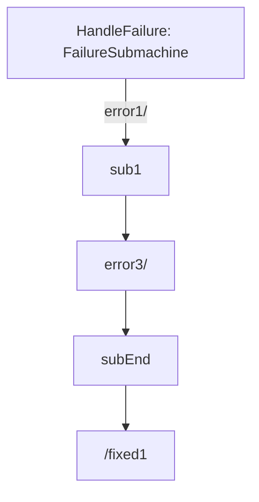
</details>

Figure 14.11 Submachine State example

In the above example, the Transition triggered by Event “error1” will terminate on entry point “sub1” of the FailureSubmachine StateMachine. The “error3” Transition implies taking the default Transition of the FailureSubmachine.

The Transition originating from the “subEnd” exit point of the submachine will execute the “fixed1” Behavior in addition to what is executed within the HandleFailure StateMachine. This Transition must have been triggered within the HandleFailure StateMachine. Finally, the Transition originating from the edge of the submachine State is taken as a result of the completion event generated when the FailureSubmachine reaches its FinalState.

NOTE. The same notation would apply to composite States with the exception that there would be no reference to a StateMachine in the State name.

Figure 14.12 is an example of a StateMachine defined with two exit points. Entry and exit points may be shown on the frame or within the state graph. Figure 14.12 is an example of a StateMachine defined with an exit point shown within the state graph. Figure 14.13 shows the same StateMachine using a notation shown on the frame of the StateMachine.


<details>
<summary>flowchart</summary>

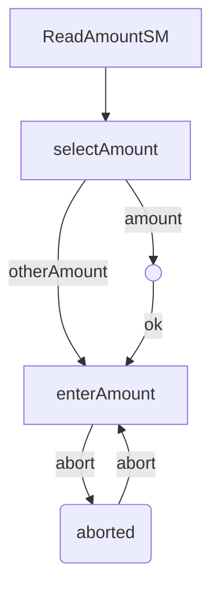
</details>

Figure 14.12 StateMachine with an exit point as part of the StateMachine graph


<details>
<summary>flowchart</summary>

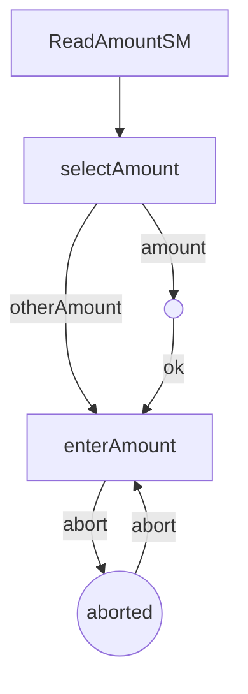
</details>

Figure 14.13 StateMachine with an exit point on the border

In Figure 14.14 the StateMachine shown in Figure 14.13 is referenced in a submachine State, and the presentation option with the exit points on the State symbol is shown.


<details>
<summary>flowchart</summary>

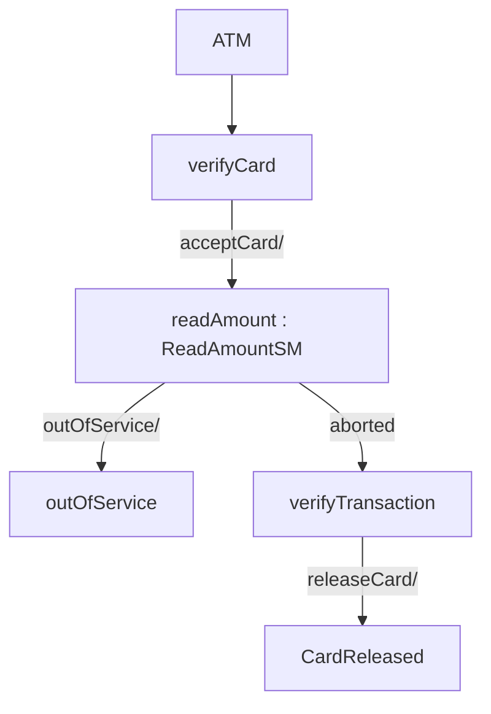
</details>

Figure 14.14 Submachine Sate that uses an exit point

An example of the notation for entry and exit points for composite States is shown in Figure 14.23.

# 14.2.4.4.3 State list notation

State lists provide a graphical shortcut for certain situations that sometimes occur in practice.

NOTE. These are purely notational forms with no corresponding abstract syntax representation. They are interchanged with UML DI, see Annex B.4.4.

Multiple effect-free Transitions with the same Trigger values originating on different States but all either (a) targeting a common junction Vertex with a single outgoing Transition or (b) terminating on the same target State, may be represented by a Single Transition-like arc originating from a State-like graphic element, labeled with a list of the names of the originating States. This arc terminates on the joint target State. Figure 14.15 shows both possibilities and Figure 14.16 shows the equivalent diagram without using statelists.


<details>
<summary>flowchart</summary>

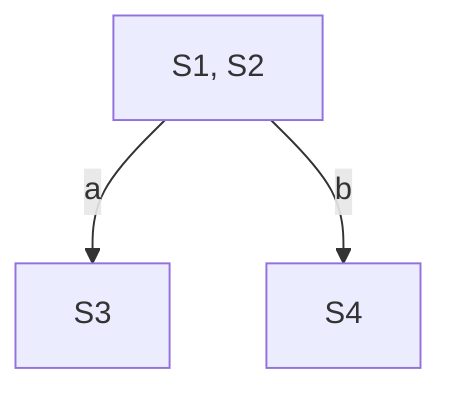
</details>

Figure 14.15 State list notation option


<details>
<summary>flowchart</summary>

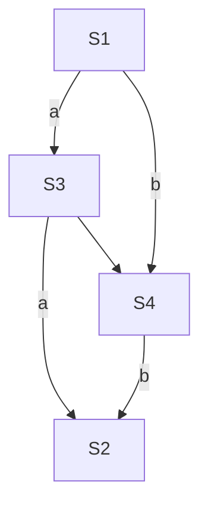
</details>


Figure 14.16 Diagram equivalent to Figure 14.15 without using statelists

# 14.2.4.5 FinalState

A FinalState is shown as a circle surrounding a small solid filled circle (see Figure 14.17). The corresponding completion Transition on the enclosing State has as notation an unlabeled Transition.

  
Figure 14.17 FinalState notation

Figure 14.7 has an example of a FinalState (the right-most of the States within the composite State).

# 14.2.4.6 Pseudostate

An initial Pseudostate is shown as a small solid filled circle (see Figure 14.18). In a Region of a ClassifierBehavior StateMachine, the Transition from an initial Pseudostate may be labeled with the Event type of the occurrence that creates the object; otherwise, it must be unlabeled. If it is unlabeled, it represents any Transition from the enclosing State.

  
Figure 14.18 initial Pseudostate

A shallowHistory Pseudostate is indicated by a small circle containing an ‘H’ (see Figure 14.19). It applies to the State Region that directly encloses it.

  
Figure 14.19 shallowHistory Pseudostate

A deepHistory Pseudostate is indicated by a small circle containing an ‘H\*’ (see Figure 14.20). It applies to the State Region that directly encloses it.

  
Figure 14.20 deepHistory Pseudostate

An entry point is shown as a small circle on the border of the StateMachine diagram or composite State, with the name associated with it (see Figure 14.21).

  
Figure 14.21 entryPoint Pseudostate

Optionally it may be placed both within the StateMachine diagram and outside the border of the StateMachine diagram or composite State.

An exit point is shown as a small circle with a cross on the border of the StateMachine diagram or composite State, with the name associated with it (see Figure 14.22).

aborted

  
Figure 14.22 exitPoint Pseudostate

Optionally, an exit point symbol may be placed both within the StateMachine diagram or composite State and outside the border of the StateMachine diagram or composite State. Figure 14.23 illustrates the notation for depicting entry and exit points of composite States.


<details>
<summary>flowchart</summary>

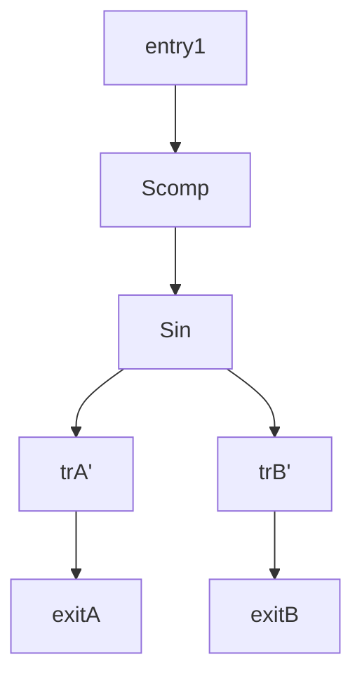
</details>

Figure 14.23 entryPoint and exitPoints on a composite State

Alternatively, the “bracket” notation shown in Figure 14.30 and Figure 14.31 can also be used for the transition-oriented notation.

A junction is represented by a small filled circle (see Figure 14.24).


<details>
<summary>flowchart</summary>

```mermaid
graph TD
    State0["State0\ne2[b < 0"]] --> A(( ))
    State1["State1\ne1[b < 0"]] --> A
    State2["State2"] --> A
    State3["State3\n[a = 5"]] --> A
    State4["State4"] --> A
    A -->|[a < 0]| A
    A -->|[a > 7]| A
```
</details>

Figure 14.24 junction Pseudostate with incoming and outgoing Transitions

A choice Pseudostate is shown as a diamond-shaped symbol as exemplified shown by the left-hand diagram in Figure 14.25.


<details>
<summary>flowchart</summary>

```mermaid
graph TD
    A["id"] --> B[">=10"]
    A --> C["<<10"]]
    D["id >= 10"] --> E[">=10"]
    D --> F["<<10"]]
    G["id < 10"] --> H[">=10"]
    G --> I["<<10"]]
```
</details>

Figure 14.25 choice Pseudostates

NOTE. In cases when all guards associated with triggers of Transitions leaving a choice Pseudostate are binary expressions that share a common left operand, then the notation for choice Pseudostate may be simplified. The left operand may be placed inside the diamond-shaped symbol and the rest of the Guard expressions placed on the outgoing Transitions. This is illustrated by the right-hand diagram in Figure 14.25.

A terminate Pseudostate is shown as a cross, see Figure 14.26.

  
Figure 14.26 terminate Pseudostate

The notation for a fork and join is a short heavy bar (Figure 14.27). The bar may have one or more arrows from source States to the bar (when representing a join). The bar may have one or more arrows from the bar to States (when representing a fork). A Transition string may be shown near the bar.


<details>
<summary>flowchart</summary>

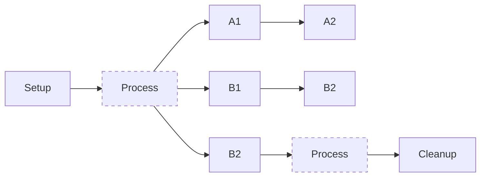
</details>

Figure 14.27 fork and join Pseudostates

# 14.2.4.7 ConnectionPointReference

A connection point reference to an entry point has the same notation as an entry Pseudostate. The circle is placed on the border of the State symbol of a submachine State.


<details>
<summary>flowchart</summary>

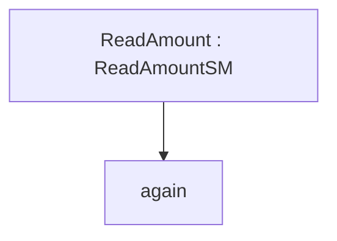
</details>

Figure 14.28 Entry point ConnectionPointReference notation

A connection point reference to an exit point has the same notation as an exit Pseudostate. The encircled cross is placed on the border of the State symbol of a submachine State.


<details>
<summary>flowchart</summary>

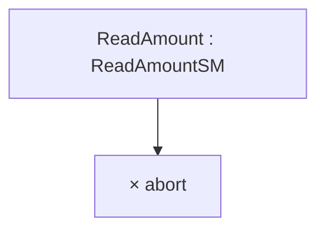
</details>

Figure 14.29 Exit point ConnectionPointReference notation

Alternatively, a connection point reference to an entry point can also be visualized using a “bracketed space” symbol as shown in Figure 14.30. The text inside the symbol shall contain ‘via’ followed by the name of the connection point. This notation may only be used if the Transition ending with the connection point is defined using the graphical Transition notation, such as the one shown in Figure 14.32.


<details>
<summary>flowchart</summary>

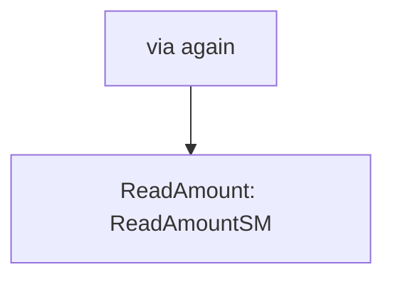
</details>

Figure 14.30 Alternative entry point ConnectionPointReference notation

A connection point reference to an exit point can also be visualized using a “bracketed space” symbol as shown in Figure 14.31. The text inside the symbol shall contain ‘via’ followed by the name of the connection point. This notation may only be used if the Transition associated with the connection point is defined using the graphical Transition notation such as the one shown in Figure 14.32.


<details>
<summary>flowchart</summary>

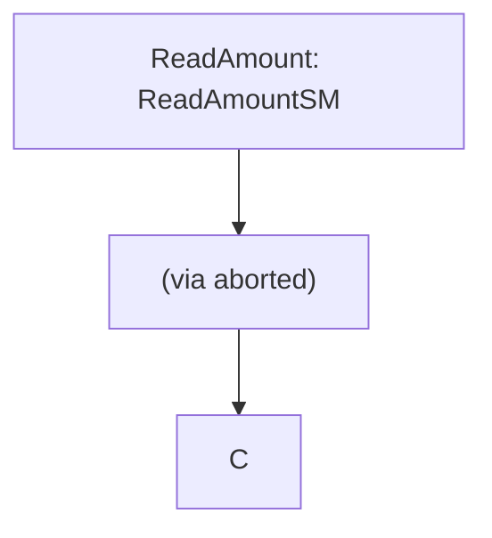
</details>

Figure 14.31 Alternative exit point ConnectionPointReference notation

# 14.2.4.8 Transition

The default textual notation for a Transition is defined by the following BNF expression:

$$
[ <   \text { trigger } > [ ^ {\prime}, ^ {\prime} <   \text { trigger } > ] * [ ^ {\prime} [ ^ {\prime} <   \text { guard } > ^ {\prime} ] ^ {\prime} ] [ ^ {\prime} / ^ {\prime} <   \text { behavior - expression } > ] ]
$$

Where <trigger> is the standard notation for Triggers (see sub clause 13.3.4), <guard> is a Boolean expression for a guard, and the optional <behavior-expression> is an expression specifying the effect Behavior written in some vendor-specific or standard textual surface language (see sub clause 16.1). The trigger may be any of the standard trigger types. SignalEvent triggers and CallEvent triggers are not distinguishable by syntax and must be discriminated by their declaration elsewhere.

As an alternative, in cases where the effect Behavior can be described as a control-flow based sequence of Actions, there is a graphical representation for Transitions and compound transitions which is similar to the notation used for Activities.

NOTE. Although this alternative notation contains graphical elements reminiscent of the notation used for Activities, it is a distinct form applicable only to StateMachines, and its elements map to appropriate StateMachine concepts.

This notation is in the form of a directed graph, which consists of one or more graphical symbols interconnected by directed arcs that represent control flow (see Figure 14.32). In all cases except for the Transition originating from the initial Pseudostate, the starting symbol, which has the form of the standard simple State notation, represents the source State of the Transition. If this Transition has a Signal-based Trigger, then the source state symbol is connected by an arc pointing to a special Signal receipt symbol described below. If there are multiple Triggers for the Transition, they are all listed in the same symbol as explained below.

If the Transition originates from the initial Pseudostate, the starting symbol is the initial symbol, which is the same as used for the initial Pseudostate: a filled black circle. In that case, there is no Signal receipt symbol immediately following the starting symbol.

Except for end symbols that terminate the paths, any of the following symbols can appear in the chain as appropriate:

- an action symbol   
- a choice point symbol   
• a Signal send symbol   
- a merge symbol

The terminating symbol in these directed graphs is always either a State-like symbol representing the target State of the transition or a final state symbol (which is the same as the symbol for a FinalState).

# 14.2.4.8.1 Action symbols

Each action symbol is represented by a rectangle with an optional textual specification of the action. It maps either to anOpaqueAction or to a SequenceNode containing one or more Actions executed in sequence (see sub clause 16.11.3) and which are part of the Activity specifying the effect Behavior of the appropriate Transition in the compound transition.

# 14.2.4.8.2 Signal receipt symbol

The Signal receipt symbol is shown as a five-pointed polygon that looks like a rectangle with a triangular notch in one of its sides (either one). It maps to the trigger of the Transition and does not map to an Action of the Activity that specifies the effect Behavior. The names of the Signals of the Trigger as well as any guard are contained within the symbol as follows:

$$
<   t r i g g e r > [ ^ {\prime}, ^ {\prime} <   t r i g g e r > ] ^ {*} [ ^ {\prime} [ ^ {\prime} <   g u a r d > ^ {\prime} ] ^ {\prime} ]
$$

Where $\langle trigger \rangle$ is specified as described in sub clause 13.3.4 with the restriction that only Signal and change Event types are allowed. The trigger symbol is always first in the path of symbols and a compound transition can only have at most one such symbol.

# 14.2.4.8.3 Signal send symbol

This represents the special action of sending a signal and maps directly to a SendSignalAction that is part of the Activity that describes the effect Behavior of the corresponding Transition. The notation corresponds to the notation for the SendSignalAction (see sub clause 16.3.4).

# 14.2.4.8.4 Choice point symbol

This symbol maps directly to a choice Pseudostate and uses the same notation.

NOTE. It is not part of any Activity.

# 14.2.4.8.5 Merge symbol

A merge symbol is used to join multiple control-flow arcs and maps directly to a junction Pseudostate and uses the same notation. It is not part of any Activity.

Figure 14.32 shows a compound transition consisting of four connected Transitions: one from the Idle State to the choice symbol, one for each of the branches of the choice through the junction symbol, and one from the junction Pseudostate to the Busy State.


<details>
<summary>flowchart</summary>

```mermaid
graph TD
    A["Idle"] --> B["Req(Id)"]
    B --> C{[Id > 10]}
    C -->|Yes| D["Minor(Id)"]
    C -->|No| E["Major(Id)"]
    D --> F["MinorReq := Id;"]
    E --> G["MajorReq := Id;"]
    F --> H(( ))
    G --> H
    H --> I["Busy"]
```
</details>

Figure 14.32 Symbols for Signal reception, Sending, and Actions on a Transition

# 14.2.4.8.6 Deferred triggers

A deferrable trigger is shown by listing it within the State followed by a slash and the label “defer”. An example of this notation is shown in Figure 14.33. In this example, handling of the “request” event occurrence is deferred in States “Initializing” and “Primed”. However, it will be handled once the “Operational” State is reached.


<details>
<summary>flowchart</summary>

```mermaid
graph TD
    A["Start"] --> B["Initializing request/defer"]
    B -->|initDone/| C["Primed request/defer"]
    C -->|start/| D["Operational"]
    D -->|request/handleReq()| D
```
</details>

Figure 14.33 Deferred Trigger notation

# 14.2.4.9 TransitionKind

• Transitions of the kind internal are not shown explicitly in diagrams.   
- Transitions of the kind local can originate from the border of the containing composite State, or one of its entry points, or from a Vertex within the composite State. (Alternatively, a Transition of kind local can be shown as a Transition leaving a State symbol containing the text “\*.”) The Transition is then considered to belong to the enclosing composite State.) Transitions of this kind can only terminate on the border of the composite State, or one of its exit points, or on a Vertex within the composite State. All of the Transitions in Figure 14.34 are local.   
- Transitions of kind external can target any Vertex contained within or external to the source Vertex. The part of the external Transition closest to the source must be drawn outside of the source Vertex border. In the case of an external self Transition where the source is a State or exit point on the State, it may target the State itself or an entry point on the State and it will be drawn completely outside of the State border. All of the Transitions in Figure 14.35 are external.


<details>
<summary>flowchart</summary>

```mermaid
graph TD
    A["s0"] --> B["s1"]
    B --> C[" "]
    B --> D[" "]
    B --> E[" "]
    B --> F[" "]
    style A fill:#fff,stroke:#000
    style B fill:#fff,stroke:#000
    style C fill:#fff,stroke:#000
    style D fill:#fff,stroke:#000
    style E fill:#fff,stroke:#000
    style F fill:#fff,stroke:#000
```
</details>

Figure 14.34 Local Transitions


<details>
<summary>flowchart</summary>

```mermaid
graph TD
    s0["State s0"] --> s1["State s1"]
    s0 --> s2["State s2"]
    s1 --> s2
    s2 --> s1
    s2 --> a{Decision}
    a --> b["●"]
    b --> s1
    s2 --> c{Decision}
    c --> d["◇"]
    d --> s2
```
</details>

Figure 14.35 External Transitions

# 14.2.5 Examples

Figure 14.36 is an example StateMachine diagram for the StateMachine for simple telephone. In addition to an initial Pseudostate, the StateMachine has an entry point called “activeEntry”. Also, in addition to the FinalState, it has an exit point called “aborted.”


<details>
<summary>flowchart</summary>

```mermaid
graph TD
    A["activeEntry"] --> B["Active"]
    B --> C["DialTone<br>do/ play dial tone"]
    C --> D["Dialing"]
    D --> E["Connecting"]
    E --> F["Ringing<br>do/ play ringing tone"]
    F --> G["Talking"]
    G --> H["Pinned"]
    H --> I["callee answers"]
    I --> J["callee hangs up /disconnect"]
    J --> K["Idle"]
    K --> L["lift receiver /get dial tone"]
    L --> M["activeEntry"]
    D --> N["Time-out<br>do/ play message"]
    N --> O["after (15 sec.)"]
    O --> P["dial digit(n)"]
    P --> Q["dial digit(n)[invalid"]]
    Q --> R["Invalid<br>do/ play message"]
    R --> S["DialTone<br>do/ play dial tone"]
    S --> T["Caller hangs up /disconnect"]
    T --> U["Idle"]
    U --> V["Lift Receiver /get dial tone"]
    V --> W["Caller hangs up /disconnect"]
    W --> X["Idle"]
    X --> Y["Idle"]
    Y --> Z["Caller hangs up /disconnect"]
    Z --> AA["Lift Receiver /get dial tone"]
    AA --> AB["Lift Receiver /get dial tone"]
    AB --> AC["Lift Receiver /get dial tone"]
    AC --> AD["Lift Receiver /get dial tone"]
    AD --> AE["Lift Receiver /get dial tone"]
    AE --> AF["Lift Receiver /get dial tone"]
    AF --> AG["Lift Receiver /get dial tone"]
    AG --> AH["Lift Receiver /get dial tone"]
    AH --> AI["Lift Receiver /get dial tone"]
    AI --> AJ["Lift Receiver /get dial tone"]
    AJ --> AK["Lift Receiver /get dial tone"]
    AK --> AL["Lift Receiver /get dial tone"]
    AL --> AM["Lift Receiver /get dial tone"]
    AM --> AN["Lift Receiver /get dial tone"]
    AN --> AO["Lift Receiver /get dial tone"]
    AO --> AP["Lift Receiver /get dial tone"]
    AP --> AQ["Lift Receiver /get dial tone"]
    AQ --> AR["Lift Receiver /get dial tone"]
    AR --> AS["Lift Receiver /get dial tone"]
    AS --> AT["Lift Receiver /get dial tone"]
    AT --> AU["Lift Receiver /get dial tone"]
    AU --> AV["Lift Receiver /get dial tone"]
    AV --> AW["Lift Receiver /get dial tone"]
    AW --> AX["Lift Receiver /get dial tone"]
    AX --> AY["Lift Receiver /get dial tone"]
    AY --> AZ["Lift Receiver /get dial tone"]
    AZ --> BA["Lift Receiver /get dial tone"]
    BA --> BB["Lift Receiver /get dial tone"]
    BB --> BC["Lift Receiver /get dial tone"]
    BC --> BD["Lift Receiver /get dial tone"]
    BD --> BE["Lift Receiver /get dial tone"]
    BE --> BF["Lift Receiver /get dial tone"]
    BF --> BG["Lift Receiver /get dial tone"]
    BG --> BH["Lift Receiver /get dial tone"]
    BH --> BI["Lift Receiver /get dial tone"]
    BI --> BJ["Lift Receiver /get dial tone"]
    BJ --> BK["Lift Receiver /get dial tone"]
    BK --> BL["Lift Receiver /get dial tone"]
    BL --> BM["Lift Receiver /get dial tone"]
    BM --> BN["Lift Receiver /get dial tone"]
    BN --> BO["Lift Receiver /get dial tone"]
    BO --> BP["Lift Receiver /get dial tone"]
    BP --> BQ["Lift Receiver /get dial tone"]
    BQ --> BR["Lift Receiver /get dial tone"]
    BR --> BS["Lift Receiver /get dial tone"]
    BS --> BT["Lift Receiver /get dial tone"]
    BT --> BU["Lift Receiver /get dial tone"]
    BU --> BV["Lift Receiver /get dial tone"]
    BV --> BW["Lift Receiver /get dial tone"]
    BW --> BX["Lift Receiver /get dial tone"]
    BX --> BY["Lift Receiver /get dial tone"]
    BY --> BZ["Lift Receiver /get dial tone"]
    BZ --> CA["Lift Receiver /get dial tone"]
    CA --> CB["Lift Receiver /get dial tone"]
    CB --> CC["Lift Receiver /get dial tone"]
    CC --> CD["Lift Receiver /get dial tone"]
    CD --> CE["Lift Receiver /get dial tone"]
    CE --> CF["Lift Receiver /get dial tone"]
    CF --> CG["Lift Receiver /get dial tone"]
    CG --> CH["Lift Receiver /get dial tone"]
    CH --> CI["Lift Receiver /get dial tone"]
    CI --> CJ["Lift Receiver /get dial tone"]
    CJ --> CK["Lift Receiver /get dial tone"]
    CK --> CR["Lift Receiver /get dial tone"]
    CR --> CS["Lift Receiver /get dial tone"]
    CS --> CT["Lift Receiver /get dial tone"]
    CT --> CU["Lift Receiver /get dial tone"]
    CU --> CV["Lift Receiver /get dial tone"]
    CV --> CW["Lift Receiver /get dial tone"]
    CW --> CX["Lift Receiver /get dial tone"]
    CX --> CY["Lift Receiver /get dial tone"]
    CY --> CZ["Lift Receiver /get dial tone"]
```
</details>

Figure 14.36 StateMachine diagram representing a telephone

An example of submachine usage is shown in Figure 14.12 and Figure 14.13.

# 14.3 StateMachine Redefinition

# 14.3.1 Summary

StateMachines are used for the definition of Behavior (for example, Classes that are generalizable). As part of the specialization of a Class it may be required to specialize its Behavior definitions. This is achieved by defining the Behavior of the specialized Classifier as an extension of the Behavior of the general Classifier using redefinition.

# 14.3.2 Abstract Syntax


<details>
<summary>flowchart</summary>

```mermaid
graph TD
    A["Classifier"] -->|1 {readOnly, redefines redefinitionContext} +/redefinitionContext 0..*| B["Region"]
    B -->|0..*| C["Vertex"]
    C -->|0..*| D["Transition"]
    D -->|0..*| E["StateMachine"]
    E -->|0..*| F["+extendedStateMachine {redefines redefinedBehavior}"]
    B -->|0..1| G["+extendedRegion {subsets redefinedElement}"]
    C -->|0..1| H["+redefinedVertex {subsets redefinedElement}"]
    A -->|1 {readOnly, redefines redefinitionContext} +/redefinitionContext 1| I["Region"]
    I -->|0..*| J["Vertex"]
    J -->|0..*| K["Transition"]
    K -->|0..*| L["+extendedTransition {subsets redefinedElement}"]
    style A fill:#f9f,stroke:#333
    style B fill:#ccf,stroke:#333
    style C fill:#cfc,stroke:#333
    style D fill:#fcc,stroke:#333
    style E fill:#cff,stroke:#333
    style F fill:#ffc,stroke:#333
    style G fill:#fcc,stroke:#333
    style H fill:#fcc,stroke:#333
    style I fill:#ffc,stroke:#333
    style J fill:#fcc,stroke:#333
    style K fill:#fcc,stroke:#333
    style L fill:#fcc,stroke:#333
```
</details>

Figure 14.37 StateMachine redefinition

# 14.3.3 Semantics

# 14.3.3.1 StateMachine Extension

A StateMachine can redefine one or more other StateMachines, in which case it is an extension of the redefined StateMachines. A region of an extension StateMachine can redefine one or more regions of its extendedStateMachines. The baseline behavior of the extension StateMachine is as if it contained the union of the regions of the extension StateMachine and of all non-redefined regions of all its extendedStateMachines. An extension StateMachine may also add new connectionPoint Pseudostates or redefine connectionPoints from any of its extendedStateMachines.

If a StateMachine has a context BehavioredClassifier (see sub clause 13.2.3.4), then this BehavioredClassifier is also its redefinitionContext (see sub clause 9.2.3.3). This includes the cases of a StateMachine that is a classifierBehavior of the general BehavioredClassifier or a StateMachine used to specify a method of a BehavioralFeature of the general BehavioredClassifier. When the context BehavioredClassifier is specialized, an associated StateMachine can then be extended by a corresponding StateMachine in the context of the specialized BehavioredClassifier.

# 14.3.3.2 Region Redefinition

A Region that is a region of an extension StateMachine can redefine a Region that is a region of an extendedStateMachine of that StateMachine. A Region that is a region of a redefining State in an extension StateMachine (see sub clause 14.3.3.3) can redefine a Region that is a region of the redefined State in an extendedStateMachine of that StateMachine. In either case, the redefining Region is called an extension of the redefined Region. The baseline behavior of the extension Region is as if it contained the union of the Vertices and Transitions contained in the extension Region and of all the non-redefined Vertices and Transitions contained in its extended Region.

# 14.3.3.3 Vertex Redefinition

A Vertex defined in an extension Region can redefine a Vertex of the same kind in the extended Region of the extension Region.

A State can only be redefined by a State. If a redefining State specifies an entry, exit and/or doActivity Behavior, then that is what applies for the redefining State, regardless of whether the redefined State specifies a similar such Behavior. However, if the redefining State does not specify an entry, exit and/or doActivity Behavior, but there is a corresponding Behavior applicable to the redefined State, then the redefined State Behavior also applies to the redefining State. Any deferrableTriggers applicable to the redefined State also apply to the redefining State, and the redefining state can also add new deferrableTriggers.

If the redefined State is not a submachine State, then the redefining State can also

- Redefine Regions of the redefined State (if it is a composite State),   
- Add Regions to the redefined State,   
- Redefine connectionPoint Pseudostates of the redefined State (if it is a composite State),   
- Add connectionPoint Pseudostates to the redefined State.

A submachine State can only be redefined by a submachine State whose submachine is an extension of the submachine of the redefined State. The redefining State can:

- Redefine connection ConnectionPointReferences of the redefined State,   
- Add connection ConnectionPointReferences to the redefined State.

A FinalState can only be redefined by a FinalState.

A Pseudostate can only be redefined by a Pseudostate of the same kind. If the redefined Pseudostate is owned as a connectionPoint of a State, then the redefining Pseudostate must be a connectionPoint of a redefinition of the owning State of its redefined Pseudostate.

A ConnectionPointReference can only be redefined by a ConnectionPointReference whose state is a redefinition of the state of the redefined ConnectionPointReference.

# 14.3.3.4 Transition Redefinition

A Transition defined in an extension Region can redefine a Transition defined in the extended Region of the extension Region. The source Vertex of the redefining Transition must be a redefinition of the source Vertex of the redefined Transition. The target Vertex of the redefining Transition can be either a redefinition of the target Vertex of the redefined Transition or an added Vertex. Any triggers applicable to the redefined Transition also apply to the redefining Transition, and the redefining Transition can add new triggers. If a redefining Transition specifies a guard Constraint and/or effect Behavior, then that is what applies to the redefining Transition. However, if the redefining Transition does not specify a guard Constraint and/or effect behavior, but there is a guard Constraint and/or effect Behavior that applies to the redefined Transition, then the guard and/or effect from the redefined Transition also applies to the redefining Transition.

# 14.3.4 Notation

An extension StateMachine is shown with the keyword «extended» after the name of the StateMachine on a diagram for it (e.g., see Figure 14.39 and Figure 14.40). Similarly, the keyword «extended» can optionally be added after the name of an extension Region or a redefining Vertex or Transition. Redefining Vertices and Transitions are drawn with either dashed lines or light-toned lines (e.g., see Figure 14.39). Vertices and Transitions from an extendedStateMachine that are not redefined in an extension StateMachine may also be shown on a diagram of the extension StateMachine drawn with either dashed or light-toned lines. Finally, if a Region, Vertex or Transition has isLeaf = true, the keyword «final» may optionally be added following the name of the element.

# 14.3.5 Examples

As an example of StateMachine extension, the States VerifyCard and OutOfService in the ATM StateMachine in Figure 14.38 have been designated as final, which means that they cannot be redefined in extensions of ATM. All other States can be redefined. The VerifyTransaction to ReleaseCard Transition has also been specified as final, so it also cannot be redefined in extensions of ATM.


<details>
<summary>flowchart</summary>

```mermaid
graph TD
    A["stm ATM[ "]] --> B["VerifyCard «final»"]
    B -->|acceptCard| C["ReadAmount"]
    C --> D["SelectAmount"]
    D -->|amount| E["VerifyTransaction «final»"]
    E -->|releaseCard / «final»| F["ReleaseCard"]
    G["OutOfService"] -->|OutOfService| D
    H["●"] --> B
```
</details>

Figure 14.38 A general StateMachine

In Figure 14.39, an extended ATM is defined that redefines the composite State ReadAmount to add the State EnterAmount, so that users can enter a desired amount, along with two new Transitions, one into and one out of the new State. The State SelectedAmount and the FinalState from ReadAmount are redefined in order to act as the source or target for a new Transition. In addition, the State VerifyTransaction is redefined in order to act as the source of a new Transition with the new State EnterAmount as its target.


<details>
<summary>flowchart</summary>

```mermaid
graph TD
    A["ReadAmount «extended»"] -->|otherAmount| B["EnterAmount"]
    C["SelectAmount «extended»"] -->|ok| D["«extended»"]
    B -->|rejectTransaction| E["VerifyTransaction «extended»"]
```
</details>

Figure 14.39 An extended StateMachine

Figure 14.40 shows an example of further extending the StateMachine shown in Figure 14.39 by adding Transitions.


<details>
<summary>flowchart</summary>

```mermaid
graph TD
    A["ReadAmount «extended»"] --> B["SelectAmount «extended»"]
    A --> C["EnterAmount «extended»"]
    B -->|abort| D["ReleaseCard «extended»"]
    C -->|abort| D
```
</details>

Figure 14.40 Adding Transitions

# 14.4 ProtocolStateMachines

# 14.4.1 Summary

ProtocolStateMachines are used to express usage protocols. ProtocolStateMachines express the legal sequences of Event occurrences to which the Behaviors of an associated BehavioredClassifier must conform. The StateMachine notation is a convenient way to define the order of invocations of the behavioral features of a Classifier. ProtocolStateMachines can be associated with Classifiers, Interfaces, and Ports.

# 14.4.2 Abstract Syntax


<details>
<summary>flowchart</summary>

```mermaid
graph TD
    A["StateMachine"] --> B["ProtocolStateMachine"]
    B --> C["{subsets source, subsets owner} + specificMachine"]
    B --> D["{subsets ownedElement, subsets directedRelationship}"]
    B --> E["+ conformance"]
    B --> F["{subsets target} + generalMachine"]
    F --> G["{subsets directedRelationship} + protocolConformance"]
    B --> H["1"]
    H --> I["ProtocolConformance"]
    B --> J["1"]
    J --> K["ProtocolTransition"]
    K --> L["{redefines transition} + protocolTransition"]
    K --> M["{subsets guard} + preCondition"]
    K --> N["{subsets context} + owningTransition"]
    K --> O["{subsets ownedRule} + postCondition"]
    K --> P["0..1"]
    P --> Q["Constraint"]
    K --> R["0..1"]
    R --> Q
    K --> S["0..1"]
    S --> Q
    K --> T["0..1"]
    T --> U["Operation"]
    K --> V["+ protocolTransition"]
    V --> W["{readOnly} + /referred"]
    W --> X["Operation"]
```
</details>

Figure 14.41 ProtocolStateMachines

# 14.4.3 Semantics

# 14.4.3.1 ProtocolStateMachine

A ProtocolStateMachine is always defined in the context of a Classifier. It specifies which BehavioralFeatures of that Classifier can be invoked in a given protocol state and under what conditions, thereby specifying allowed invocation sequences. In this manner, a specification of the lifecycle of an instance of the Classifier is defined from an external perspective.

ProtocolStateMachines help define the order in which BehavioralFeatures of a Classifier are invoked by specifying:

- the behavioral context (i.e., which states and pre-conditions) in which they can be validly invoked,   
• the valid orderings of invocations,   
• the expected outcomes (post-conditions) of invocations.

ProtocolStateMachine present an external view of the owning Classifier as perceived by its collaborators. This extends beyond what can be captured via pre- and post-conditions on individual BehavioralFeatures, as ProtocolStateMachines also specify the valid orderings of invocations of the different features. This is achieved by a state machine specification in which the transition triggers are feature invocations and the guards of the transitions (ProtocolTransitions) specify the pre-condition that must apply for the invocation to be valid. The states (ProtocolStates) of this state machine, being a consequence of past invocation sequences, capture the state of the protocol and are also a form of pre-condition.

NOTE. Because ProtocolStateMachines provide a “black box” view of the behavior of a Classifier, their States may not necessarily correspond to the States of internal behavioral StateMachines.

ProtocolStateMachine interpretation can vary from:

1 Declarative ProtocolStateMachines, which specify the legal Transitions for BehavioralFeature invocations. The effects of a BehavioralFeature invocation is not specified. This type of specification only provides a contract for the user of the context Classifier.   
2 Executable (run time) ProtocolStateMachines, which specify all Event occurrences that an object may receive and handle, together with the Transitions that these trigger. In this case, the legal Transitions for BehavioralFeature invocations must match exactly the triggered Transitions or a run-time exception occurs. The invocation results in the execution of the method associated with the invoked BehavioralFeatures.

The specifications for both interpretations is the same, the only difference being the direct dynamic implication that the latter interpretation provides.

The more sophisticated forms of modeling encountered in behavioral StateMachines such as compound Transitions, submachine StateMachines, composite States, and concurrent orthogonal Regions, can also be used for ProtocolStateMachines. For example, concurrent Regions make it possible to express protocols where an instance can have several active States simultaneously. Submachine StateMachines and compound transitions can be used for factorizing complex ProtocolStateMachines.

A Classifier may have several ProtocolStateMachines. This can be used, for example, when a Classifier has multiple parents, each having its own ProtocolStateMachine, and the protocols are orthogonal. An alternative to this is to simply have one ProtocolStateMachine, with distinct StateMachines in concurrent Regions.

State in ProtocolStateMachines

The States of ProtocolStateMachines are exposed to the users of their context Classifiers. A protocol State represents an exposed stable situation of its context Classifier: When an instance of the Classifier classifier is not processing any BehavioralFeature invocation, users of this instance can always know its state configuration.

The States of a ProtocolStateMachine cannot have defined entry, exit, or doActivity Behaviors.

# 14.4.3.2 ProtocolTransition

A ProtocolTransition specifies a legal Transition for an invocation of a BehavioralFeature of the context Classifier. ProtocolTransitions have the following features:

- a pre-condition (preCondition), which specializes the guard attribute of Transition,   
- a trigger,   
• a post-condition (postCondition).

The protocol Transition specifies that (a) the associated (referred) feature can be invoked on an instance of the context Classifier, if it is in the origin State and the guard condition holds, and that (b) upon completion of the Transition, the instance will be in the target State in which the post-condition will hold.

ProtocolTransitions do not have an associated effect Behavior. The consequence of a ProtocolTransition executed as a result of a BehavioralFeature invocation is implicit: it is the execution of the method corresponding to the invoked BehavioralFeature. In case of other types of Triggers, the consequences are unspecified except that a Transition will lead to another State under a specific post-condition, regardless of any Behaviors associated with this Transition.

# 14.4.3.2.1 Unexpected trigger reception

The interpretation of the reception of an Event occurrence that does not match a valid trigger for the current State, state invariant, or pre-condition is not defined (e.g., it can be ignored, rejected, or deferred; an exception can be raised; or the application can stop on an error). It corresponds semantically to a pre-condition violation, for which no predefined Behavior is defined in UML.

# 14.4.3.2.2 Unexpected Behavior

The interpretation of an unexpected Behavior, that is an unexpected result of a Transition (wrong FinalState or FinalState invariant, or post-condition) is also not defined. However, this should be interpreted as an error of the implementation of the ProtocolStateMachine.

# 14.4.3.2.3 Equivalences to pre- and post-conditions of operations

A protocol Transition can be semantically interpreted in terms of pre- and post-conditions on the associated operation. For example, the Transition in Figure 14.42 can be interpreted in the following way:

1 The operation “m1” can be called on an instance when it is in the ProtocolState “S1” under the condition “C1.”   
2 When “m1” is called in the ProtocolState “S1” under the condition “C1,” then the ProtocolState “S2” must be reached under the condition “C2.”


<details>
<summary>flowchart</summary>

```mermaid
graph LR
    S1 -->|[ C1 ] m1 / [ C2 ] | S2
```
</details>

Figure 14.42 An example of a ProtocolTransition associated with the operation "m1"

Operations referred by several Transitions


<details>
<summary>flowchart</summary>

```mermaid
graph LR
    S1 -->|[C1] m1/ [C2]| S2
    S3 -->|[C3] m1/ [C4]| S4
```
</details>

Figure 14.43 Example of several ProtocolTransitions associated with the same operation (m1)

In a ProtocolStateMachine, several Transitions can refer to the same operation as illustrated in Figure 14.43. In that case, all pre-and post-conditions will be combined in the operation pre-condition as shown below.

```txt
Operation m1()
Pre:    in state S1 and condition C1
    or
    in state S3 and condition C3
Post:    if the initial condition was "in state S1 and condition C1"
    then in S2 and C2
    else
    if the initial condition was "in state S3 and condition C3"
    then in S4 and C4 
```

A ProtocolStateMachine specifies all the legal ProtocolTransition for each BehavioralFeature referred by its Transitions.

Unreferred Operations

If a BehavioralFeature is not referred by any ProtocolTransition, then the operation can be called for any State of the ProtocolStateMachine, and will not change the current State or pre- and post-conditions.

# 14.4.3.2.4 Using other types of Events in ProtocolStateMachines

Apart from invocations of BehavioralFeatures, other Events may be used for expressing the behavior of ProtocolStateMachines. A Trigger that is not a BehavioralFeature invocation can be specified for a protocol Transition. In that case, this specification is a requirement for the environment external to the ProtocolStateMachine. That is, it is legal to send an Event occurrence of this type to an instance of the context Classifier only under the conditions specified by the ProtocolStateMachine. The precise semantic interpretation of this is not defined.

# 14.4.3.3 ProtocolConformance

ProtocolStateMachines can be refined into more specific ProtocolStateMachines. Protocol conformance declares that the specific ProtocolStateMachine specifies a protocol that conforms to that specified by the general ProtocolStateMachine.

A ProtocolStateMachine is owned by a Classifier. The Classifiers owning a general StateMachine and an associated specific StateMachine are generally also connected by a Generalization or a Realization.

Protocol conformance represents a declaration that every rule and constraint specified for the general ProtocolStateMachine (state invariants, pre- and post-conditions for the operations referred by the ProtocolStateMachine) apply to the specific ProtocolStateMachine.

# 14.4.4 Notation

# 14.4.4.1 ProtocolStateMachine

The notation for ProtocolStateMachine is very similar to the one for behavioral StateMachines. The keyword «protocol» placed close to the name of the StateMachine differentiates graphically ProtocolStateMachine diagrams.


<details>
<summary>flowchart</summary>

```mermaid
graph TD
    A["Create"] --> B["opened"]
    B -->|open /| C["closed"]
    C -->|lock /| D["lock"]
    D -->|unlock /| C
    B -->|[doorway --> isEmpty()] close/|
```
</details>

Figure 14.44 ProtocolStateMachine example

The textual expression of an invariant associated with a State in a ProtocolStateMachine is represented by placing it after or under the name of the State, enclosed in square brackets (Figure 14.45).

# TypingPassword [invariant expr]


Figure 14.45 Notation for a State with an invariant

# 14.4.4.2 ProtocolTransition

The usual StateMachine notation applies. The difference is that no effect Behaviors are specified for ProtocolTransitions, and that post-conditions can exist. Post-conditions have the same syntax as guard conditions, but appear at the end of the Transition syntax.

[precondition] event / [postcondition]


Figure 14.46 ProtocolTransition notation

# 14.5 Classifier Descriptions

# 14.5.1 ConnectionPointReference [Class]

# 14.5.1.1 Description

A ConnectionPointReference represents a usage (as part of a submachine State) of an entry/exit point Pseudostate defined in the StateMachine referenced by the submachine State.

# 14.5.1.2 Diagrams

Behavior State Machines

# 14.5.1.3 Generalizations

Vertex

# 14.5.1.4 Association Ends

- entry : Pseudostate [0..\*] (opposite A\_entry\_connectionPointReference::connectionPointReference) The entryPoint Pseudostates corresponding to this connection point.   
- exit : Pseudostate [0..\*] (opposite A\_exit\_connectionPointReference::connectionPointReference) The exitPoints kind Pseudostates corresponding to this connection point.   
- state : State [0..1]{subsets NamedElement::namespace} (opposite State::connection) The State in which the ConnectionPointReference is defined.

# 14.5.1.5 Operations

\- isConsistentWith(redefiningElement: RedefinableElement) : Boolean {redefines RedefinableElement::isConsistentWith}
The query isConsistentWith() specifies a ConnectionPointReference can only be redefined by a ConnectionPointReference.

```javascript
pre: redefiningElement.isRedefinitionContextValid(self)
body: redefiningElement.oclIsKindOf(ConnectionPointReference) 
```

# 14.5.1.6 Constraints

- exit\_pseudostates
The exit Pseudostates must be Pseudostates with kind exitPoint.   
- entry\_pseudostates
The entry Pseudostates must be Pseudostates with kind entryPoint.

```txt
inv: exit->forAll(kind = PseudostateKind::exitPoint) 
```

```txt
inv: entry->forAll(kind = PseudostateKind::entryPoint) 
```

# 14.5.2 FinalState [Class]

# 14.5.2.1 Description

A special kind of State, which, when entered, signifies that the enclosing Region has completed. If the enclosing Region is directly contained in a StateMachine and all other Regions in that StateMachine also are completed, then it means that the entire StateMachine behavior is completed.

# 14.5.2.2 Diagrams

Behavior State Machines

# 14.5.2.3 Generalizations

State

# 14.5.2.4 Operations

- isConsistentWith(redefiningElement: RedefinableElement) : Boolean {redefines RedefinableElement::isConsistentWith}
The query isConsistentWith() specifies that a FinalState can only be redefined by a FinalState.

```txt
pre: redefiningElement.isRedefinitionContextValid(self)
body: redefiningElement.oclIsKindOf(FinalState) 
```

# 14.5.2.5 Constraints

- no\_exit\_behavior
A FinalState has no exit Behavior.   
- no\_outgoing\_transitions
A FinalState cannot have any outgoing Transitions.   
- no\_regions
A FinalState cannot have Regions.

```txt
inv: exit->isEmpty()
```

```typescript
inv: outgoing->size() = 0 
```

```txt
inv: region->size() = 0 
```

\- cannot\_reference\_submachine
A FinalState cannot reference a submachine.
inv: submachine->isEmpty()

\- no\_entry\_behavior
A FinalState has no entry Behavior.

```txt
inv: entry->isEmpty()
```

\- no\_state\_behavior
A FinalState has no state (doActivity) Behavior.

```txt
inv: doActivity->isEmpty() 
```

# 14.5.3 ProtocolConformance [Class]

# 14.5.3.1 Description

A ProtocolStateMachine can be redefined into a more specific ProtocolStateMachine or into behavioral StateMachine. ProtocolConformance declares that the specific ProtocolStateMachine specifies a protocol that conforms to the general ProtocolStateMachine or that the specific behavioral StateMachine abides by the protocol of the general ProtocolStateMachine.

# 14.5.3.2 Diagrams

Protocol State Machines

# 14.5.3.3 Generalizations

DirectedRelationship

# 14.5.3.4 Association Ends

\- generalMachine : ProtocolStateMachine [1..1]{subsets DirectedRelationship::target} (opposite A\_generalMachine\_protocolConformance::protocolConformance)
Specifies the ProtocolStateMachine to which the specific ProtocolStateMachine conforms.

\- specificMachine : ProtocolStateMachine [1..1]{subsets DirectedRelationship::source, subsets Element::owner}
(opposite ProtocolStateMachine::conformance)
Specifies the ProtocolStateMachine which conforms to the general ProtocolStateMachine.

# 14.5.4 ProtocolStateMachine [Class]

# 14.5.4.1 Description

A ProtocolStateMachine is always defined in the context of a Classifier. It specifies which BehavioralFeatures of the Classifier can be called in which State and under which conditions, thus specifying the allowed invocation sequences on the Classifier's BehavioralFeatures. A ProtocolStateMachine specifies the possible and permitted Transitions on the instances of its context Classifier, together with the BehavioralFeatures that carry the Transitions. In this manner, an instance lifecycle can be specified for a Classifier, by defining the order in which the BehavioralFeatures can be activated and the States through which an instance progresses during its existence.

# 14.5.4.2 Diagrams

Protocol State Machines, Encapsulated Classifiers, Interfaces

# 14.5.4.3 Generalizations

StateMachine

# 14.5.4.4 Association Ends

\- conformance : ProtocolConformance [0..\*]{subsets Element::ownedElement, subsets A\_source\_directedRelationship::directedRelationship} (opposite ProtocolConformance::specificMachine) Conformance between ProtocolStateMachine

# 14.5.4.5 Constraints

\- classifier\_context
A ProtocolStateMachine must only have a Classifier context, not a BehavioralFeature context.

```typescript
inv:_'context' <> null and specification = null 
```

\- deep\_or\_shallow\_history
ProtocolStateMachines cannot have deep or shallow history Pseudostates.

```txt
inv: region->forAll (r | r.subvertex->forAll (v | v.oclIsKindOf(Pseudostate) implies ((v.oclAsType(Pseudostate).kind <> PseudostateKind::deepHistory) and (v.oclAsType(Pseudostate).kind <> PseudostateKind::shallowHistory)))) 
```

\- entry\_exit\_do
The states of a ProtocolStateMachine cannot have entry, exit, or do activity Behaviors.

```txt
inv: region->forAll(r | r.subvertex->forAll(v | v.oclIsKindOf(State) implies (v.oclAsType(State).entry->isEmpty() and v.oclAsType(State).exit->isEmpty() and v.oclAsType(State).doActivity->isEmpty())) 
```

\- protocol\_transitions
All Transitions of a ProtocolStateMachine must be ProtocolTransitions.

```txt
inv: region->forAll(r | r.transition->forAll(t | t.oclIsTypeOf(ProtocolTransition))) 
```

# 14.5.5 ProtocolTransition [Class]

# 14.5.5.1 Description

A ProtocolTransition specifies a legal Transition for an Operation. Transitions of ProtocolStateMachines have the following information: a pre-condition (guard), a Trigger, and a post-condition. Every ProtocolTransition is associated with at most one BehavioralFeature belonging to the context Classifier of the ProtocolStateMachine.

# 14.5.5.2 Diagrams

Protocol State Machines

# 14.5.5.3 Generalizations

Transition

# 14.5.5.4 Association Ends

\- postCondition : Constraint [0..1]{subsets Namespace::ownedRule} (opposite A\_postCondition\_owningTransition::owningTransition)
Specifies the post condition of the Transition which is the Condition that should be obtained once the

Transition is triggered. This post condition is part of the post condition of the Operation connected to the Transition.

\- preCondition : Constraint [0..1]{subsets Transition::guard} (opposite A\_preCondition\_protocolTransition::protocolTransition)

Specifies the precondition of the Transition. It specifies the Condition that should be verified before triggering the Transition. This guard condition added to the source State will be evaluated as part of the precondition of the Operation referred by the Transition if any.

• /referred : Operation [0..\*]{} (opposite A\_referred\_protocolTransition::protocolTransition)

This association refers to the associated Operation. It is derived from the Operation of the CallEvent Trigger when applicable.

# 14.5.5.5 Operations

• referred(): Operation [0..\*]

Derivation for ProtocolTransition::/referred

```txt
body: trigger->collect(event)->select(oclIsKindOf(CallEvent))->collect(oclAsType(CallEvent).operation)->asSet() 
```

# 14.5.5.6 Constraints

\- refers\_to\_operation
If a ProtocolTransition refers to an Operation (i.e., has a CallEvent trigger corresponding to an Operation), then that Operation should apply to the context Classifier of the StateMachine of the ProtocolTransition.

```txt
inv: if (referred()->notEmpty() and containingStateMachine().__context'->notEmpty()) then containingStateMachine().__context'.oclAsType(BehavioredClassifier).allFeatures()->includesAll(referred())
else true endif 
```

\- associated\_actions
A ProtocolTransition never has associated Behaviors.

```typescript
inv: effect = null 
```

\- belongs\_to\_psm
A ProtocolTransition always belongs to a ProtocolStateMachine.

```javascript
inv: container.belongsToPSM() 
```

# 14.5.6 Pseudostate [Class]

# 14.5.6.1 Description

A Pseudostate is an abstraction that encompasses different types of transient Vertices in the StateMachine graph. A StateMachine instance never comes to rest in a Pseudostate, instead, it will exit and enter the Pseudostate within a single run-to-completion step.

# 14.5.6.2 Diagrams

Behavior State Machines

# 14.5.6.3 Generalizations

Vertex

# 14.5.6.4 Attributes

\- kind : PseudostateKind [1..1] = initial
  Determines the precise type of the Pseudostate and can be one of: entryPoint, exitPoint, initial, deepHistory, shallowHistory, join, fork, junction, terminate or choice.

# 14.5.6.5 Association Ends

- state : State [0..1]{subsets NamedElement::namespace} (opposite State::connectionPoint) The State that owns this Pseudostate and in which it appears.   
- stateMachine : StateMachine [0..1]{subsets NamedElement::namespace} (opposite StateMachine::connectionPoint)
The StateMachine in which this Pseudostate is defined. This only applies to Pseudostates of the kind entryPoint or exitPoint.

# 14.5.6.6 Operations

\- isConsistentWith(redefiningElement: RedefinableElement) : Boolean {redefines RedefinableElement::isConsistentWith}
The query isConsistentWith() specifies that a Pseudostate can only be redefined by a Pseudostate of the same kind.
pre: redefiningElement.isRedefinitionContextValid(self)
body: redefiningElement.oclIsKindOf(Pseudostate) and redefiningElement.oclAsType(Pseudostate).kind = kind

# 14.5.6.7 Constraints

\- transitions\_outgoing
All transitions outgoing a fork vertex must target states in different regions of an orthogonal state.

```txt
inv: (kind = PseudostateKind::fork) implies
-- for any pair of outgoing transitions there exists an orthogonal state which contains the targets of these transitions
-- such that these targets belong to different regions of that orthogonal state
outgoing->forAll(t1:Transition, t2:Transition | let contState:State = containingStateMachine().LCAState(t1.target, t2.target) in ((contState <> null) and (contState.region ->exists(r1:Region, r2:Region | (r1 <> r2) and t1.target.isContainedInRegion(r1) and t2.target.isContainedInRegion(r2)))) 
```

\- choice\_vertex
In a complete statemachine, a choice Vertex must have at least one incoming and one outgoing Transition.

```cpp
inv: (kind = PseudostateKind::choice) implies (incoming->size() >= 1 and outgoing->size() >= 1) 
```

\- outgoing\_from\_initial
The outgoing Transition from an initial vertex may have a behavior, but not a trigger or a guard.

```txt
inv: (kind = PseudostateKind::initial) implies (outgoing.guard = null and outgoing trigger->isEmpty()) 
```

\- join vertex
In a complete StateMachine, a join Vertex must have at least two incoming Transitions and exactly one outgoing Transition.

inv: (kind = PseudostateKind::join) implies (outgoing->size() = 1 and incoming->size() >= 2)

\- junction vertex
In a complete StateMachine, a junction Vertex must have at least one incoming and one outgoing Transition.
inv: (kind = PseudostateKind::junction) implies (incoming->size() >= 1 and outgoing->size(>= 1))

\- history\_vertices
History Vertices can have at most one outgoing Transition.

```julia
inv: ((kind = PseudostateKind::deepHistory) or (kind = PseudostateKind::shallowHistory)) implies (outgoing->size() <= 1) 
```

\- initial vertex
An initial Vertex can have at most one outgoing Transition.

```cpp
inv: (kind = PseudostateKind::initial) implies (outgoing->size() <= 1) 
```

\- fork vertex
In a complete StateMachine, a fork Vertex must have at least two outgoing Transitions and exactly one incoming Transition.

```txt
inv: (kind = PseudostateKind::fork) implies (incoming->size() = 1 and outgoing->size() >= 2) 
```

\- transitions\_incoming
All Transitions incoming a join Vertex must originate in different Regions of an orthogonal State.

```haskell
inv: (kind = PseudostateKind::join) implies
-- for any pair of incoming transitions there exists an orthogonal state which contains the source vetices of these transitions
-- such that these source vertices belong to different regions of that orthogonal state
incoming->forAll(t1:Transition, t2:Transition | let contState:State = containingStateMachine().LCAState(t1.source, t2.source) in ((contState <> null) and (contState.region ->exists(r1:Region, r2:Region | (r1 <> r2) and t1.source.isContainedInRegion(r1) and t2.source.isContainedInRegion(r2)))) 
```

# 14.5.7 PseudostateKind [Enumeration]

# 14.5.7.1 Description

PseudostateKind is an Enumeration type that is used to differentiate various kinds of Pseudostates.

# 14.5.7.2 Diagrams

• Behavior State Machines

# 14.5.7.3 Literals

\- initial

- deepHistory   
- shallowHistory   
- join   
- fork   
- junction   
- choice   
- entryPoint   
- exitPoint   
- terminate

# 14.5.8 Region [Class]

# 14.5.8.1 Description

A Region is a top-level part of a StateMachine or a composite State, that serves as a container for the Vertices and Transitions of the StateMachine. A StateMachine or composite State may contain multiple Regions representing behaviors that may occur in parallel.

# 14.5.8.2 Diagrams

Behavior State Machines, State Machine Redefinition

# 14.5.8.3 Generalizations

Namespace, RedefinableElement

# 14.5.8.4 Association Ends

- extendedRegion : Region [0..1]{subsets RedefinableElement::redefinedElement} (opposite A\_extendedRegion\_region::region)   
The region of which this region is an extension.   
- /redefinitionContext : Classifier [1..1]{redefines RedefinableElement::redefinitionContext} (opposite A\_redefinitionContext\_region::region)   
References the Classifier in which context this element may be redefined.   
- state : State [0..1]{subsets NamedElement::namespace} (opposite State::region)   
The State that owns the Region. If a Region is owned by a State, then it cannot also be owned by a StateMachine.   
stateMachine : StateMachine [0..1]{subsets NamedElement::namespace} (opposite StateMachine::region)   
The StateMachine that owns the Region. If a Region is owned by a StateMachine, then it cannot also be owned by a State.

- subvertex : Vertex [0..\*]{subsets Namespace::ownedMember} (opposite Vertex::container) The set of Vertices that are owned by this Region.   
- $\spadesuit$ transition: Transition [0..\*]{subsets Namespace::ownedMember} (opposite Transition::container) The set of Transitions owned by the Region.

# 14.5.8.5 Operations

\- belongsToPSM(): Boolean

The operation belongsToPSM () checks if the Region belongs to a ProtocolStateMachine.

```txt
body: if stateMachine <> null
then
    stateMachine.oclIsKindOf(ProtocolStateMachine)
else
    state <> null implies state.container.belongsToPSM()
endif 
```

\- containingStateMachine(): StateMachine

The operation containingStateMachine() returns the StateMachine in which this Region is defined.

```txt
body: if stateMachine = null
then
    state.containingStateMachine()
else
    stateMachine
endif 
```

\- isConsistentWith(redefiningElement : RedefinableElement) : Boolean {redefines RedefinableElement::isConsistentWith()}

The query isConsistentWith specifies that a Region can be redefined by any Region for which the redefinition context is valid (see the isRedefinitionContextValid operation). Note that consistency requirements for the redefinition of Vertices and Transitions within a redefining Region are specified by the isConsistentWith and isRedefinitionContextValid operations for Vertex (and its subclasses) and Transition.

```yaml
pre: redefiningElement.isRedefinitionContextValid(self)
body: true 
```

\- isRedefinitionContextValid(redefinedElement : RedefinableElement) : Boolean {redefines RedefinableElement::isRedefinitionContextValid()}

The query is RedefinitionContextValid() specifies whether the redefinition contexts of a Region are properly related to the redefinition contexts of the specified Region to allow this element to redefine the other. The containing StateMachine or State of a redefining Region must Redefine the containing StateMachine or State of the redefined Region.

```txt
body: if redefinedElement.oclIsKindOf(Region) then
    let redefinedRegion : Region = redefinedElement.oclAsType(Region) in
    if stateMachine->isEmpty() then
    -- the Region is owned by a State
    (state.redefinedState->notEmpty() and state.redefinedState.region->includes(redefinedRegion))
    else -- the region is owned by a StateMachine
    (stateMachine.extendedStateMachine->notEmpty() and
    stateMachine.extendedStateMachine->exists(sm : StateMachine |
    sm.region->includes(redefinedRegion)))
    endif
else
    false
endif 
```

\- redefinitionContext():Classifier

The redefinition context of a Region is the nearest containing StateMachine.

body: containingStateMachine()

# 14.5.8.6 Constraints

```txt
- deep_history_vertex
A Region can have at most one deep history Vertex.

inv: self.subvertex->select (oclIsKindOf(Pseudostate))->collect(oclAsType(Pseudostate))->select(kind = PseudostateKind::deepHistory)->size() <= 1

- shallow_history_vertex
A Region can have at most one shallow history Vertex.

inv: subvertex->select(oclIsKindOf(Pseudostate))->collect(oclAsType(Pseudostate))->select(kind = PseudostateKind::shallowHistory)->size() <= 1

- owned
If a Region is owned by a StateMachine, then it cannot also be owned by a State and vice versa.

inv: (stateMachine <> null implies state = null) and (state <> null implies stateMachine = null)

- initial_vertex
A Region can have at most one initial Vertex.

inv: self.subvertex->select (oclIsKindOf(Pseudostate))->collect(oclAsType(Pseudostate))->select(kind = PseudostateKind::initial)->size() <= 1 
```

# 14.5.9 State [Class]

# 14.5.9.1 Description

A State models a situation during which some (usually implicit) invariant condition holds.

# 14.5.9.2 Diagrams

Behavior State Machines, State Machine Redefinition, Object Nodes

# 14.5.9.3 Generalizations

Namespace, Vertex

# 14.5.9.4 Specializations

FinalState

# 14.5.9.5 Attributes

• /isComposite : Boolean [1..1]   
A state with isComposite=true is said to be a composite State. A composite State is a State that contains at least one Region.   
• /isOrthogonal : Boolean [1..1]   
A State with isOrthogonal=true is said to be an orthogonal composite State. An orthogonal composite State contains two or more Regions.

\- /isSimple : Boolean [1..1]

A State with isSimple=true is said to be a simple State. A simple State does not have any Regions and it does not refer to any submachine StateMachine.

• /isSubmachineState : Boolean [1..1]

A State with isSubmachineState=true is said to be a submachine State. Such a State refers to another StateMachine(submachine).

# 14.5.9.6 Association Ends

\- connection : ConnectionPointReference [0..\*]{subsets Namespace::ownedMember} (opposite ConnectionPointReference::state)

The entry and exit connection points used in conjunction with this (submachine) State, i.e., as targets and sources, respectively, in the Region with the submachine State. A connection point reference references the corresponding definition of a connection point Pseudostate in the StateMachine referenced by the submachine State.

\- connectionPoint : Pseudostate [0..\*]{subsets Namespace::ownedMember} (opposite Pseudostate::state)

The entry and exit Pseudostates of a composite State. These can only be entry or exit Pseudostates, and they must have different names. They can only be defined for composite States.

\- deferrableTrigger : Trigger [0..\*]{subsets Element::ownedElement} (opposite A\_deferrableTrigger\_state::state)

A list of Triggers that are candidates to be retained by the StateMachine if they trigger no Transitions out of the State (not consumed). A deferred Trigger is retained until the StateMachine reaches a State configuration where it is no longer deferred.

\- doActivity : Behavior [0..1]{subsets Element::ownedElement} (opposite A\_doActivity\_state::state)

An optional Behavior that is executed while being in the State. The execution starts when this State is entered, and ceases either by itself when done, or when the State is exited, whichever comes first.

\- $\spadesuit$ entry: Behavior [0..1]{subsets Element::ownedElement} (opposite A\_entry\_state::state)

An optional Behavior that is executed whenever this State is entered regardless of the Transition taken to reach the State. If defined, entry Behaviors are always executed to completion prior to any internal Behavior or Transitions performed within the State.

\- exit: Behavior [0..1]{subsets Element::ownedElement} (opposite A\_exit\_state::state)

An optional Behavior that is executed whenever this State is exited regardless of which Transition was taken out of the State. If defined, exit Behaviors are always executed to completion only after all internal and transition Behaviors have completed execution.

\- region : Region [0..\*]{subsets Namespace::ownedMember} (opposite Region::state)

The Regions owned directly by the State.

\- stateInvariant : Constraint [0..1]{subsets Namespace::ownedRule} (opposite A\_stateInvariant\_owningState::owningState)

Specifies conditions that are always true when this State is the current State. In ProtocolStateMachines state invariants are additional conditions to the preconditions of the outgoing Transitions, and to the postcondition of the incoming Transitions.

\- submachine : StateMachine [0..1] (opposite StateMachine::submachineState)

The StateMachine that is to be inserted in place of the (submachine) State.

# 14.5.9.7 Operations

\- containingStateMachine(): StateMachine {redefines Vertex::containingStateMachine()}
The query containingStateMachine() returns the StateMachine that contains the State either directly or transitively.

body: container.containingStateMachine()

\- isComposite(): Boolean
A composite State is a State with at least one Region.

body: region->notEmpty()

\- isConsistentWith(redefiningElement : RedefinableElement) : Boolean {redefines RedefinableElement::isConsistentWith()}

The query isConsistentWith specifies that a non-final State can only be redefined by a non-final State (this is overridden by FinalState to allow a FinalState to be redefined by a FinalState) and, if the redefined State is a submachine State, then the redefining State must be a submachine state whose submachine is a redefinition of the submachine of the redefined State. Note that consistency requirements for the redefinition of Regions and connectionPoint Pseudostates within a composite State and connection ConnectionPoints of a submachine State are specified by the isConsistentWith and isRedefinitionContextValid operations for Region and Vertex (and its subclasses, Pseudostate and ConnectionPointReference).

```txt
pre: redefiningElement.isRedefinitionContextValid(self)
body: redefiningElement.oclIsTypeOf(State) and
    let redefiningState : State = redefiningElement.oclAsType(State) in submachine <> null implies (redefiningState.submachine <> null and redefiningState.submachine.extendedStateMachine->includes(submachine)) 
```

\- isOrthogonal(): Boolean
An orthogonal State is a composite state with at least 2 regions.

body: region->size () > 1

\- isSimple(): Boolean
A simple State is a State without any regions.

body: (region->isEmpty()) and not isSubmachineState()

\- isSubmachineState(): Boolean
Only submachine State references another StateMachine.

body: submachine <> null

# 14.5.9.8 Constraints

\- entry\_or\_exit
Only entry or exit Pseudostates can serve as connection points.

inv: connectionPoint->forAll(kind = PseudostateKind::entryPoint or kind = PseudostateKind::exitPoint)

\- submachine\_states
Only submachine States can have connection point references.

inv: isSubmachineState implies connection->notEmpty()

\- composite\_states
Only composite States can have entry or exit Pseudostates defined.

inv: connectionPoint->notEmpty() implies isComposite

\- destinations\_or\_sources\_of\_transitions
The connection point references used as destinations/sources of Transitions associated with a submachine State must be defined as entry/exit points in the submachine StateMachine.

```txt
inv: self.isSubmachineState implies (self.connection->forAll (cp | cp.entry->forAll (ps | ps.stateMachine = self.submachine) and cp.exit->forAll (ps | ps.stateMachine = self.submachine))) 
```

\- submachine\_or\_regions
A State is not allowed to have both a submachine and Regions.

inv: isComposite implies not isSubmachineState

# 14.5.10 StateMachine [Class]

# 14.5.10.1 Description

StateMachines can be used to express event-driven behaviors of parts of a system. Behavior is modeled as a traversal of a graph of Vertices interconnected by one or more joined Transition arcs that are triggered by the dispatching of successive Event occurrences. During this traversal, the StateMachine may execute a sequence of Behaviors associated with various elements of the StateMachine.

# 14.5.10.2 Diagrams

Behavior State Machines, State Machine Redefinition, Protocol State Machines

# 14.5.10.3 Generalizations

Behavior

# 14.5.10.4 Specializations

ProtocolStateMachine

# 14.5.10.5 Association Ends

- connectionPoint : Pseudostate [0..\*]{subsets Namespace::ownedMember} (opposite Pseudostate::stateMachine)   
The connection points defined for this StateMachine. They represent the interface of the StateMachine when used as part of submachine State.   
- extendedStateMachine : StateMachine [0..\*]{redefines Behavior::redefinedBehavior} (opposite A\_extendedStateMachine\_stateMachine::stateMachine)   
The StateMachines of which this is an extension.   
- region : Region [1..\*]{subsets Namespace::ownedMember} (opposite Region::stateMachine)   
The Regions owned directly by the StateMachine.   
- submachineState : State [0..\*] (opposite State::submachine)   
References the submachine(s) in case of a submachine State. Multiple machines are referenced in case of a concurrent State.

• LCA(s1 : Vertex, s2 : Vertex) : Region

The operation LCA(s1,s2) returns the Region that is the least common ancestor of Vertices s1 and s2, based on the StateMachine containment hierarchy.

```txt
body: if ancestor(s1, s2) then
    s2.container
else
    if ancestor(s2, s1) then
    s1.container
    else
    LCA(s1.container.state, s2.container.state)
    endif
endif 
```

\- ancestor(s1 : Vertex, s2 : Vertex) : Boolean

The query ancestor(s1, s2) checks whether Vertex s2 is an ancestor of Vertex s1.

```ruby
body: if (s2 = s1) then
    true
else
    if s1.container.stateMachine->notEmpty() then
    true
    else
    if s2.container.stateMachine->notEmpty() then
    false
    else
    ancestor(s1, s2.container.state)
    endif
    endif
endif 
```

\- isConsistentWith(redefiningElement : RedefinableElement) : Boolean {redefines RedefinableElement::isConsistentWith()}

The query isConsistentWith specifies that a StateMachine can be redefined by any other StateMachine for which the redefinition context is valid (see the isRedefinitionContextValid operation). Note that consistency requirements for the redefinition of Regions and connectionPoint Pseudostates owned by a StateMachine are specified by the isConsistentWith and isRedefinitionContextValid operations for Region and Vertex (and its subclass Pseudostate).

```yaml
pre: redefiningElement.isRedefinitionContextValid(self)
body: true 
```

\- isRedefinitionContextValid(redefinedElement : RedefinableElement) : Boolean {redefines RedefinableElement::isRedefinitionContextValid()}

The query is RedefinitionContextValid specifies whether the redefinition context of a StateMachine is properly related to the redefinition contexts of a StateMachine it redefines. The requirement is that the context BehavioredClassifier of a redefining StateMachine must specialize the context Classifier of the redefined StateMachine. If the redefining StateMachine does not have a context BehavioredClassifier, then then the redefining StateMachine also must not have a context BehavioredClassifier but must, instead, specialize the redefining StateMachine.

```txt
body: redefinedElement.oclIsKindOf(StateMachine) and
    let parentContext : BehavioredClassifier =
    redefinedElement.oclAsType(StateMachine).context in
    if context = null then
    parentContext = null and self.allParents()->includes(redefinedElement)
    else
    parentContext <> null and context.allParents()->includes(parentContext)
endif 
```

• LCAState(v1 : Vertex, v2 : Vertex) : State

This utility function is like the LCA, except that it returns the nearest composite State that contains both input Vertices.

```txt
body: if v2.oclIsTypeOf(State) and ancestor(v1, v2) then
    v2.oclAsType(State)
else if v1.oclIsTypeOf(State) and ancestor(v2, v1) then
    v1.oclAsType(State)
else if (v1.container.state->isEmpty() or v2.container.state->isEmpty()) then
    null.oclAsType(State)
else LCAState(v1.container.state, v2.container.state)
endif endif endif 
```

# 14.5.10.7 Constraints

\- connection\_points

The connection points of a StateMachine are Pseudostates of kind entry point or exit point.

```cpp
inv: connectionPoint->forAll (kind = PseudostateKind::entryPoint or kind = PseudostateKind::exitPoint) 
```

\- classifier context

The Classifier context of a StateMachine cannot be an Interface.

```ruby
inv:_'context' <> null implies not_'context'.oclIsKindOf(Interface) 
```

\- method

A StateMachine as the method for a BehavioralFeature cannot have entry/exit connection points.

```txt
inv: specification <> null implies connectionPoint->isEmpty() 
```

\- context classifier

The context Classifier of the method StateMachine of a BehavioralFeature must be the Classifier that owns the BehavioralFeature.

```txt
inv: specification <> null implies ( 'context' <> null and specification.featuringClassifier->exists(c | c = 'context')) 
```

# 14.5.11 Transition [Class]

# 14.5.11.1 Description

A Transition represents an arc between exactly one source Vertex and exactly one Target vertex (the source and targets may be the same Vertex). It may form part of a compound transition, which takes the StateMachine from one steady State configuration to another, representing the full response of the StateMachine to an occurrence of an Event that triggered it.

# 14.5.11.2 Diagrams

Behavior State Machines, State Machine Redefinition, Protocol State Machines

# 14.5.11.3 Generalizations

Namespace, RedefinableElement

# 14.5.11.4 Specializations

ProtocolTransition

# 14.5.11.5 Attributes

\- kind : TransitionKind [1..1] = external
Indicates the precise type of the Transition.

# 14.5.11.6 Association Ends

- container : Region [1..1]{subsets NamedElement::namespace} (opposite Region::transition) Designates the Region that owns this Transition.   
- $\spadesuit$ effect: Behavior [0..1]{subsets Element::ownedElement} (opposite A\_effect\_transition::transition) Specifies an optional behavior to be performed when the Transition fires.   
- guard : Constraint [0..1]{subsets Namespace::ownedRule} (opposite A\_guard\_transition::transition) A guard is a Constraint that provides a fine-grained control over the firing of the Transition. The guard is evaluated when an Event occurrence is dispatched by the StateMachine. If the guard is true at that time, the Transition may be enabled, otherwise, it is disabled. Guards should be pure expressions without side effects. Guard expressions with side effects are ill formed.   
- redefinedTransition : Transition [0..1]{subsets RedefinableElement::redefinedElement} (opposite A\_redefinedTransition\_transition::transition)
The Transition that is redefined by this Transition.   
- /redefinitionContext : Classifier [1..1]{redefines RedefinableElement::redefinitionContext} (opposite A\_redefinitionContext\_transition::transition)
References the Classifier in which context this element may be redefined.   
- source : Vertex [1..1] (opposite Vertex::outgoing)
Designates the originating Vertex (State or Pseudostate) of the Transition.   
- target : Vertex [1..1] (opposite Vertex::incoming)
Designates the target Vertex that is reached when the Transition is taken.   
- trigger : Trigger [0..\*]{subsets Element::ownedElement} (opposite A\_trigger\_transition::transition) Specifies the Triggers that may fire the transition.

# 14.5.11.7 Operations

\- containingStateMachine(): StateMachine
The query containingStateMachine() returns the StateMachine that contains the Transition either directly or transitively.

body: container.containingStateMachine()

\- isConsistentWith(redefiningElement : RedefinableElement) : Boolean {redefines RedefinableElement::isConsistentWith()}
The query isConsistentWith specifies that a redefining Transition is consistent with a redefined Transition provided that the source Vertex of the redefining Transition redefines the source Vertex of the redefined Transition.

pre: redefiningElement.isRedefinitionContextValid(self)
body: redefiningElement.oclIsKindOf(Transition) and
    redefiningElement.oclAsType(Transition).source.redefinedTransition = source

\- redefinitionContext():Classifier

The redefinition context of a Transition is the nearest containing StateMachine.

body: containingStateMachine()

# 14.5.11.8 Constraints

\- state\_is\_external

A Transition with kind external can source any Vertex except entry points.

```txt
inv: (kind = TransitionKind::external) implies
    not (source.oclIsKindOf(Pseudostate) and source.oclAsType(Pseudostate).kind = PseudostateKind::entryPoint) 
```

\- join\_segment\_guards

A join segment must not have Guards or Triggers.

```julia
inv: (target.oclIsKindOf(Pseudostate) and target.oclAsType(Pseudostate).kind = PseudostateKind::join) implies (guard = null and trigger->isEmpty()) 
```

\- state is internal

A Transition with kind internal must have a State as its source, and its source and target must be equal.

```txt
inv: (kind = TransitionKind::internal) implies
(source.oclIsKindOf (State) and source = target) 
```

\- outgoing\_pseudostates

Transitions outgoing Pseudostates may not have a Trigger.

```txt
inv: source.oclIsKindOf(Pseudostate) and (source.oclAsType(Pseudostate).kind <> PseudostateKind::initial) implies trigger->isEmpty() 
```

\- join\_segment\_state

A join segment must always originate from a State.

```txt
inv: (target.oclIsKindOf(Pseudostate) and target.oclAsType(Pseudostate).kind = PseudostateKind::join) implies (source.oclIsKindOf(State)) 
```

\- fork\_segment\_state

A fork segment must always target a State.

```txt
inv: (source.oclIsKindOf(Pseudostate) and source.oclAsType(Pseudostate).kind = PseudostateKind::fork) implies (target.oclIsKindOf(State)) 
```

\- state\_is\_local

A Transition with kind local must have a composite State or an entry point as its source.

```txt
inv: (kind = TransitionKind::local) implies
((source.oclIsKindOf (State) and source.oclAsType(State).isComposite) or
(source.oclIsKindOf (Pseudostate) and source.oclAsType(Pseudostate).kind = PseudostateKind::entryPoint)) 
```

\- initial transition

An initial Transition at the topmost level Region of a StateMachine that has no Trigger.

```txt
inv: (source.oclIsKindOf(Pseudostate) and container.stateMachine->notEmpty()) implies 
```

```txt
trigger->isEmpty() 
```

\- fork\_segment\_guards
A fork segment must not have Guards or Triggers.

```julia
inv: (source.oclIsKindOf(Pseudostate) and source.oclAsType(Pseudostate).kind = PseudostateKind::fork) implies (guard = null and trigger->isEmpty()) 
```

\- transition\_vertices
The source and target Vertices of a Transition must be contained in the same StateMachine as the Transition.

```txt
inv: let stateMachine = self.containingStateMachine() in source.containingStateMachine() = stateMachine and target.containingStateMachine() = stateMachine 
```

# 14.5.12 TransitionKind [Enumeration]

# 14.5.12.1 Description

TransitionKind is an Enumeration type used to differentiate the various kinds of Transitions.

# 14.5.12.2 Diagrams

• Behavior State Machines

# 14.5.12.3 Literals

\- internal
Implies that the Transition, if triggered, occurs without exiting or entering the source State (i.e., it does not cause a state change). This means that the entry or exit condition of the source State will not be invoked. An internal Transition can be taken even if the SateMachine is in one or more Regions nested within the associated State.

\- local
  Implies that the Transition, if triggered, will not exit the composite (source) State, but it will exit and re-enter any state within the composite State that is in the current state configuration.

\- external
Implies that the Transition, if triggered, will exit the composite (source) State.

# 14.5.13 Vertex [Abstract Class]

# 14.5.13.1 Description

A Vertex is an abstraction of a node in a StateMachine graph. It can be the source or destination of any number of Transitions.

# 14.5.13.2 Diagrams

Behavior State Machines

# 14.5.13.3 Generalizations

NamedElement, RedefinableElement

# 14.5.13.4 Specializations

ConnectionPointReference, Pseudostate, State

# 14.5.13.5 Association Ends

- container : Region [0..1]{subsets NamedElement::namespace} (opposite Region::subvertex) The Region that contains this Vertex.   
- /incoming : Transition [0..\*]{} (opposite Transition::target) Specifies the Transitions entering this Vertex.   
- /outgoing : Transition [0..\*]{} (opposite Transition::source) Specifies the Transitions departing from this Vertex.   
- redefinedVertex : Vertex [0..1]{subsets RedefinableElement::redefinedElement} (opposite A\_redefinedVertex vertex::vertex)
The Vertex of which this Vertex is a redefinition.   
- /redefinitionContext : Classifier [1..1]{redefines RedefinableElement::redefinitionContext} (opposite A\_redefinitionContext\_vertex::vertex)
References the Classifier in which context this element may be redefined.

# 14.5.13.6 Operations

\- containingStateMachine(): StateMachine
The operation containingStateMachine() returns the StateMachine in which this Vertex is defined.

```lua
body: if container <> null
then
-- the container is a region
    container.containingStateMachine()
else
    if (self.oclIsKindOf(Pseudostate)) and ((self.oclAsType(Pseudostate).kind = PseudostateKind::entryPoint) or (self.oclAsType(Pseudostate).kind = PseudostateKind::exitPoint)) then
    self.oclAsType(Pseudostate).stateMachine
    else
    if (self.oclIsKindOf(ConnectionPointReference)) then
    self.oclAsType(ConnectionPointReference).state.containingStateMachine() -- no other valid cases possible
    else
    null
    endif
    endif
endif 
```

\- incoming(): Transition [0..\*]
Derivation for Vertex::/incoming.
body: Transition.allInstances()->select(target=self)

\- outgoing(): Transition [0..\*]
Derivation for Vertex::/outgoing
body: Transition.allInstances()->select(source=self)

\- isContainedInState(s : State) : Boolean
This utility operation returns true if the Vertex is contained in the State s (input argument).

```txt
body: if not s.isComposite() or container->isEmpty() then
    false
else
    if container.state = s then
    true
    else
    container.state.isContainedInState(s)
endif
endif 
```

\- isContainedInRegion(r : Region) : Boolean

This utility query returns true if the Vertex is contained in the Region r (input argument).

```txt
body: if (container = r) then
    true
else
    if (r.state->isEmpty()) then
    false
    else
    container.state.isContainedInRegion(r)
endif
endif 
```

\- isConsistentWith(redefiningElement: RedefinableElement) : Boolean {redefines RedefinableElement::isConsistentWith}

The query is RedefinitionContextValid specifies that the redefinition context of a redefining Vertex is properly related to the redefinition context of the redefined Vertex if the owner of the redefining Vertex is a redefinition of the owner of the redefined Vertex. Note that the owner of a Vertex may be a Region, a StateMachine (for a connectionPoint Pseudostate), or a State (for a connectionPoint Pseudostate or a connection ConnectionPointReference), all of which are RedefinableElements.

```coffeescript
body: redefinedElement.oclIsKindOf(Vertex) and owner.oclAsType(RedefinableElement).redefinedElement->includes(redefinedElement.owner) 
```

\- redefinitionContext():Classifier

The redefinition context of a Vertex is the nearest containing StateMachine.

```javascript
body: containingStateMachine() 
```

# 14.6 Association Descriptions

# 14.6.1 A\_conformance\_specificMachine [Association]

14.6.1.1 Diagrams

Protocol State Machines

14.6.1.2 Member Ends

- ProtocolStateMachine::conformance   
- ProtocolConformance::specificMachine

# 14.6.2 A\_connectionPoint\_state [Association]

14.6.2.1 Diagrams

Behavior State Machines

# 14.6.2.2 Member Ends

• State::connectionPoint   
- Pseudostate::state

# 14.6.3 A\_connectionPoint\_stateMachine [Association]

# 14.6.3.1 Diagrams

Behavior State Machines

# 14.6.3.2 Member Ends

• StateMachine::connectionPoint   
- Pseudostate::stateMachine

# 14.6.4 A\_connection\_state [Association]

# 14.6.4.1 Diagrams

Behavior State Machines

# 14.6.4.2 Member Ends

- State::connection   
- ConnectionPointReference::state

# 14.6.5 A\_deferrableTrigger\_state [Association]

# 14.6.5.1 Diagrams

Behavior State Machines

# 14.6.5.2 Owned Ends

\- state: State [0..1]{subsets Element::owner} (opposite State::deferrableTrigger)

# 14.6.6 A\_doActivity\_state [Association]

# 14.6.6.1 Diagrams

Behavior State Machines

# 14.6.6.2 Owned Ends

\- state : State [0..1]{subsets Element::owner} (opposite State::doActivity)

# 14.6.7 A\_effect\_transition [Association]

# 14.6.7.1 Diagrams

Behavior State Machines

# 14.6.7.2 Owned Ends

• transition : Transition [0..1]{subsets Element::owner} (opposite Transition::effect)

# 14.6.8 A\_entry\_connectionPointReference [Association]

# 14.6.8.1 Diagrams

Behavior State Machines

# 14.6.8.2 Owned Ends

\- connectionPointReference : ConnectionPointReference [0..1] (opposite ConnectionPointReference::entry)

# 14.6.9 A\_entry\_state [Association]

# 14.6.9.1 Diagrams

Behavior State Machines

# 14.6.9.2 Owned Ends

\- state: State [0..1]{subsets Element::owner} (opposite State::entry)

# 14.6.10 A\_exit\_connectionPointReference [Association]

# 14.6.10.1 Diagrams

Behavior State Machines

# 14.6.10.2 Owned Ends

\- connectionPointReference : ConnectionPointReference [0..1] (opposite ConnectionPointReference::exit)

# 14.6.11 A\_exit\_state [Association]

# 14.6.11.1 Diagrams

Behavior State Machines

# 14.6.11.2 Owned Ends

\- state: State [0..1]{subsets Element::owner} (opposite State::exit)

# 14.6.12 A\_extendedRegion\_region [Association]

# 14.6.12.1 Diagrams

State Machine Redefinition

# 14.6.12.2 Owned Ends

\- region : Region [0..\*]{subsets A\_redefinedElement\_redefinableElement::redefinableElement} (opposite Region::extendedRegion)

# 14.6.13 A\_extendedStateMachine\_stateMachine [Association]

# 14.6.13.1 Diagrams

State Machine Redefinition

# 14.6.13.2 Owned Ends

\- stateMachine : StateMachine [0..\*]{subsets A\_redefinedBehavior\_behavior::behavior} (opposite StateMachine::extendedStateMachine)

# 14.6.14 A\_generalMachine\_protocolConformance [Association]

# 14.6.14.1 Diagrams

Protocol State Machines

# 14.6.14.2 Owned Ends

\- protocolConformance : ProtocolConformance [0..\*]{subsets A\_target\_directedRelationship::directedRelationship} (opposite ProtocolConformance::generalMachine)

# 14.6.15 A\_guard\_transition [Association]

# 14.6.15.1 Diagrams

Behavior State Machines

# 14.6.15.2 Specializations

A\_preCondition\_protocolTransition

# 14.6.15.3 Owned Ends

\- transition: Transition [0..1]{subsets Constraint::context} (opposite Transition::guard)

# 14.6.16 A\_incoming\_target\_vertex [Association]

# 14.6.16.1 Diagrams

Behavior State Machines

# 14.6.16.2 Member Ends

- Vertex::incoming   
- Transition::target

# 14.6.17 A\_outgoing\_source\_vertex [Association]

# 14.6.17.1 Diagrams

Behavior State Machines

# 14.6.17.2 Member Ends

- Vertex::outgoing   
- Transition::source

# 14.6.18 A\_postCondition\_owningTransition [Association]

# 14.6.18.1 Diagrams

Protocol State Machines

# 14.6.18.2 Owned Ends

\- owningTransition : ProtocolTransition [0..1]{subsets Constraint::context} (opposite ProtocolTransition::postCondition)

# 14.6.19 A\_preCondition\_protocolTransition [Association]

# 14.6.19.1 Diagrams

Protocol State Machines

# 14.6.19.2 Generalizations

A guard transition

# 14.6.19.3 Owned Ends

\- protocolTransition : ProtocolTransition [0..1]{redefines A\_guard\_transition::transition} (opposite ProtocolTransition::preCondition)

# 14.6.20 A\_redefinedTransition\_transition [Association]

# 14.6.20.1 Diagrams

State Machine Redefinition

# 14.6.20.2 Owned Ends

\- transition : Transition [0..\*]{subsets A\_redefinedElement\_redefinableElement::redefinableElement} (opposite Transition::redefinedTransition)

# 14.6.21 A\_redefinedVertex vertex [Association]

# 14.6.21.1 Diagrams

State Machine Redefinition

# 14.6.21.2 Owned Ends

\- vertex : Vertex [0..\*] {subsets A\_redefinedElement\_redefinableElement::redefinableElement} (opposite Vertex::redefinedVertex)

# 14.6.22 A\_redefinitionContext\_region [Association]

# 14.6.22.1 Diagrams

State Machine Redefinition

# 14.6.22.2 Generalizations

A redefinitionContext redefinableElement

# 14.6.22.3 Owned Ends

\- region : Region [0..\*]{subsets A\_redefinitionContext\_redefinableElement::redefinableElement} (opposite Region::redefinitionContext)

# 14.6.23 A\_redefinitionContext\_transition [Association]

# 14.6.23.1 Diagrams

State Machine Redefinition

# 14.6.23.2 Generalizations

A redefinitionContext redefinableElement

# 14.6.23.3 Owned Ends

\- transition : Transition [0..\*]{subsets A\_redefinitionContext\_redefinableElement::redefinableElement} (opposite Transition::redefinitionContext)

# 14.6.24 A\_redefinitionContext\_vertex [Association]

# 14.6.24.1 Diagrams

State Machine Redefinition

# 14.6.24.2 Generalizations

A redefinitionContext redefinableElement

# 14.6.24.3 Owned Ends

\- vertex : Vertex [0..\*]{subsets A\_redefinitionContext\_redefinableElement::redefinableElement} (opposite Vertex::redefinitionContext)

# 14.6.25 A\_referred\_protocolTransition [Association]

14.6.25.1 Diagrams

Protocol State Machines

14.6.25.2 Owned Ends

\- protocolTransition : ProtocolTransition [0..\*] (opposite ProtocolTransition::referred)

# 14.6.26 A\_region\_state [Association]

14.6.26.1 Diagrams

Behavior State Machines

14.6.26.2 Member Ends

- State::region   
- Region::state

# 14.6.27 A\_region\_stateMachine [Association]

14.6.27.1 Diagrams

Behavior State Machines

14.6.27.2 Member Ends

• StateMachine::region   
- Region::stateMachine

# 14.6.28 A\_stateInvariant\_owningState [Association]

14.6.28.1 Diagrams

Behavior State Machines

14.6.28.2 Owned Ends

\- owningState: State [0..1]{subsets Constraint::context} (opposite State::stateInvariant)

# 14.6.29 A\_submachineState\_submachine [Association]

14.6.29.1 Diagrams

Behavior State Machines

14.6.29.2 Member Ends

• StateMachine::submachineState

\- State::submachine

# 14.6.30 A\_subvertex\_container [Association]

# 14.6.30.1 Diagrams

Behavior State Machines

# 14.6.30.2 Member Ends

\- Region::subvertex

\- Vertex::container

# 14.6.31 A\_transition\_container [Association]

# 14.6.31.1 Diagrams

Behavior State Machines

# 14.6.31.2 Member Ends

\- Region::transition

\- Transition::container

# 14.6.32 A\_trigger\_transition [Association]

# 14.6.32.1 Diagrams

Behavior State Machines

# 14.6.32.2 Owned Ends

• transition : Transition [0..1]{subsets Element::owner} (opposite Transition::trigger)