## 14.2 Behavior StateMachines（行为状态机）

---

### 14.2.1 Summary（概述）

Behavior StateMachines can be used to specify any of the following:

行为状态机(Behavior StateMachine)可用于指定以下任一内容：

• The classifierBehavior of an active Class.

• 活跃类的分类器行为(classifierBehavior)。

- An ownedBehavior of a BehavioredClassifier that is not the classifierBehavior of that BehavioredClassifier.

- 行为分类器(BehavioredClassifier)的一个拥有行为(ownedBehavior)，但不是该行为分类器的分类器行为。

- A stand-alone Behavior, that is, one that does not have a corresponding BehavioredClassifier.

- 独立行为(Behavior)，即没有对应行为分类器的行为。

• A method corresponding to a BehavioralFeature (i.e., an Operation or a Reception).

• 对应于行为特征(BehavioralFeature)的方法（即操作(Operation)或接收(Reception)）。

---

### 14.2.2 Abstract Syntax（抽象语法）

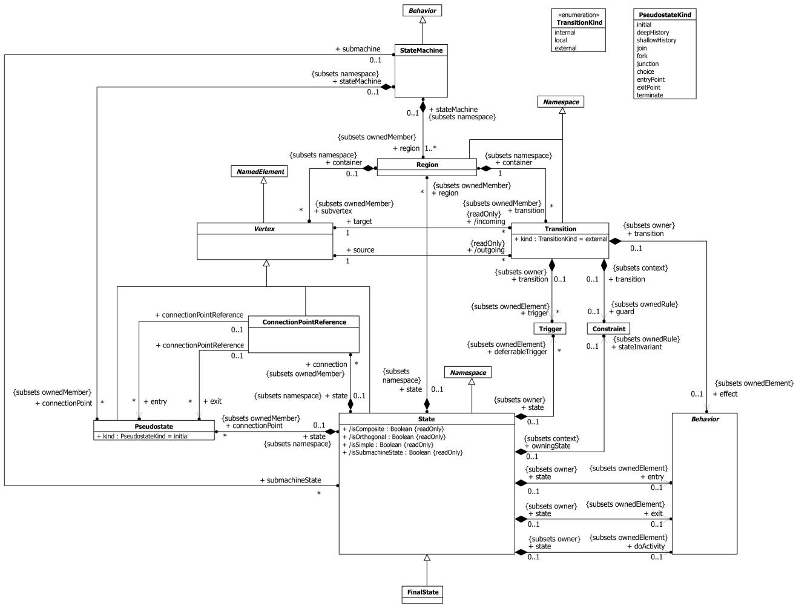

Figure 14.1 Behavior StateMachines（行为状态机）

---

### 14.2.3 Semantics（语义）

#### 14.2.3.1 StateMachine（状态机）

A behavior StateMachine comprises one or more Regions, each Region containing a graph (possibly hierarchical) comprising a set of Vertices interconnected by arcs representing Transitions. State machine execution is triggered by appropriate Event occurrences. A particular execution of a StateMachine is represented by a set of valid path traversals through one or more Region graphs, triggered by the dispatching of an Event occurrence that match active Triggers in these graphs. The rules for matching Triggers are described below. In the course of such a traversal, a StateMachine instance may execute a potentially complex sequence of Behaviors associated with the particular elements of the graphs that are being traversed (transition effects, state entry and state exit Behaviors, etc.)

行为状态机由一个或多个区域(Region)组成，每个区域包含一个图（可能是层次结构的），由一组通过表示转换(Transition)的弧相互连接的顶点(Vertex)组成。状态机执行由适当的事件(Event)发生触发。状态机的特定执行由通过一个或多个区域图的有效路径遍历集合表示，由与这些图中活跃触发器(Trigger)匹配的事件发生的派遣(dispatching)触发。触发器匹配规则如下所述。在此类遍历过程中，状态机实例可能执行与所遍历图的特定元素相关联的潜在复杂行为序列（转换效果、状态入口和状态出口行为等）。

If the StateMachine has a kind of BehavioredClassifier context, then that Classifier defines which Signal and CallEvent triggers are applicable to that StateMachine, and which Features are available to the Behaviors owned by the StateMachine. Signal Triggers and CallEvent Triggers for the StateMachine are defined according to the Receptions and Operations of this Classifier respectively. These Features may be used to define message event Triggers of the StateMachine.

如果状态机具有某种行为分类器上下文，则该分类器定义哪些信号(Signal)和调用事件(CallEvent)触发器适用于该状态机，以及哪些特征(Feature)可用于该状态机拥有的行为。状态机的信号触发器和调用事件触发器分别根据该分类器的接收和操作定义。这些特征可用于定义状态机的消息事件触发器。

If the StateMachine has no BehavioredClassifier context (i.e., it is a stand-alone Behavior), then its Triggers do not need to be tied to any Receptions or Operations of some Classifier. For example, such a StateMachine might be defined as a

如果状态机没有行为分类器上下文（即它是独立行为），则其触发器不需要绑定到某个分类器的任何接收或操作。例如，这样的状态机可以定义为

Template with its Triggers defined as TemplateParameters. Such a StateMachine can then be reused with different context Classifiers by binding appropriate CallEvent or SignalEvent Triggers to these TemplateParameters.

模板(Template)，其触发器定义为模板参数(TemplateParameter)。然后，通过将适当的调用事件或信号事件(SignalEvent)触发器绑定到这些模板参数，该状态机可以在不同的上下文分类器中复用。

In situations where a StateMachine specifies the method of a BehavioralFeature (Operation or Reception), the Parameters of the StateMachine shall match the Parameters of the BehavioralFeature (see sub clause 13.2.3). This is the means by which the StateMachine execution accesses the Parameters of the BehavioralFeature. Otherwise, the method by which an executing StateMachine instance accesses the dispatched Event occurrence and its associated data is not defined (see Clause 13).

当状态机指定行为特征（操作或接收）的方法时，状态机的参数应与行为特征的参数匹配（参见第 13.2.3 小节）。这是状态机执行访问行为特征参数的方式。否则，执行中的状态机实例访问已派遣的事件发生及其关联数据的方式未定义（参见第 13 章）。

By definition, invocations of StateMachine executions result in triggered effects (see sub clause 13.3.3) and, hence, there is an associated event pool with such an execution. The event pool for a StateMachine execution belongs to either its context Classifier object or, if the StateMachine defines a method of a BehavioralFeature, to the instance of the Classifier owning the BehavioralFeature.

根据定义，状态机执行的调用会产生触发的效果（参见第 13.3.3 小节），因此，此类执行具有关联的事件池(event pool)。状态机执行的事件池属于其上下文分类器对象，或者如果状态机定义了行为特征的方法，则属于拥有该行为特征的分类器实例。

Due to its event-driven nature, a StateMachine execution is either in transit or in state, alternating between the two. It is in transit when an event is dispatched that matches at least one of its associated Triggers. While in transit, it may execute a number of Behaviors associated with the paths it is taking.

由于其事件驱动的特性，状态机执行要么处于转换中(in transit)，要么处于状态中(in state)，在两者之间交替。当派遣的事件至少匹配其一个关联触发器时，它处于转换中。在转换过程中，它可能执行与其所走路径关联的多个行为。

NOTE. A StateMachine execution may be executing Behaviors even when it has settled in a stable state configuration, in cases where there are doActivity Behaviors associated with its active state configuration.

注：当状态机执行已稳定在某个稳定状态配置时，如果与其活跃状态配置关联了活动(doActivity)行为，它可能仍在执行行为。

---

#### 14.2.3.2 Regions（区域）

A Region denotes a behavior fragment that may execute concurrently with its orthogonal Regions. Two or more Regions are orthogonal to each other if they are either owned by the same State or, at the topmost level, by the same StateMachine. A Region becomes active (i.e., it begins executing) either when its owning State is entered or, if it is directly owned by a StateMachine (i.e., it is a top level Region), when its owning StateMachine starts executing. Each Region owns a set of Vertices and Transitions, which determine the behavioral flow within that Region. It may have its own initial Pseudostate as well as its own FinalState.

区域表示一个行为片段，可以与其正交区域并发执行。如果两个或多个区域由同一个状态拥有，或在最顶层由同一个状态机拥有，则它们彼此正交。当其所属状态被进入时，或者如果它直接由状态机拥有（即它是顶层区域），当其所属状态机开始执行时，区域变为活跃（即开始执行）。每个区域拥有一组顶点和转换，决定了该区域内的行为流。它可以有自己的初始伪状态(Pseudostate)以及自己的终态(FinalState)。

A default activation of a Region occurs if the Region is entered implicitly, that is, it is not entered through an incoming Transition that terminates on one of its component Vertices (e.g., a State or a history Pseudostate), but either

区域的默认激活发生在区域被隐式进入时，即它不是通过终止于其组成顶点之一（如状态或历史伪状态）的传入转换进入的，而是

• through a (local or external) Transition that terminates on the containing State or,

• 通过终止于包含状态的（局部或外部）转换，或

- in case of a top level Region, when the StateMachine starts executing.

- 对于顶层区域，当状态机开始执行时。

Default activation means that execution starts with the Transition originating from the initial Pseudostate of the Region, if one is defined. However, no specific approach is defined if there is no initial Pseudostate that exists within the Region. One possible approach is to deem the model ill defined. An alternative is that the Region remains inactive, although the State that contains it is active. In other words, the containing composite State is treated as a simple (leaf) State.

默认激活意味着执行从区域的初始伪状态出发的转换开始（如果定义了的话）。但是，如果区域内不存在初始伪状态，则没有定义具体的方法。一种可能的方法是认为模型定义不良。另一种方法是区域保持非活跃状态，尽管包含它的状态是活跃的。换句话说，包含它的组合状态(Composite State)被视为简单（叶子）状态。

Conversely, an explicit activation occurs when a Region is entered by a Transition terminating on one of the Region's contained Vertices. When one Region of an orthogonal State is activated explicitly, this will result in the default activation of all of its orthogonal Regions, unless those Regions are also entered explicitly (multiple orthogonal Regions can be entered explicitly in parallel through Transitions originating from the same fork Pseudostate).

相反，当区域通过终止于该区域所含顶点之一的转换进入时，发生显式激活。当正交状态的一个区域被显式激活时，将导致其所有正交区域的默认激活，除非这些区域也被显式进入（多个正交区域可以通过源自同一分支伪状态的转换并行显式进入）。

---

#### 14.2.3.3 Vertices（顶点）

Vertex is an abstract class that captures the common characteristics for a variety of different concrete kinds of nodes in the StateMachine graph (States, Pseudostates, or ConnectionPointReferences). With certain exceptions described below, a Vertex can be the source and/or target of any number of Transitions. The semantics of a Vertex depend on the concrete kind of node it represents. In general, Pseudostates and ConnectionPointReferences are transitive, in the sense that a compound transition execution simply passes through them, arriving on an incoming Transition and leaving on an outgoing Transition without pause. State and FinalState, however, represent stable Vertices, such that, when a StateMachine execution enters them it remains in them until either some Event occurs that triggers a transition that moves it to a different State or the StateMachine is terminated.

顶点(Vertex)是一个抽象类，捕获了状态机图中各种不同具体节点类型（状态、伪状态或连接点引用(ConnectionPointReference)）的共同特征。除下文描述的某些例外情况外，顶点可以是任意数量转换的源和/或目标。顶点的语义取决于它所代表的具体节点类型。一般来说，伪状态和连接点引用是传递性的，即复合转换执行只是经过它们，通过传入转换到达，通过传出转换离开，没有停顿。然而，状态和终态代表稳定顶点，因此当状态机执行进入它们时，它会保持在其中，直到某个事件发生触发将其移动到不同状态的转换，或者状态机被终止。

The semantics of individual types of Vertices are described below.

各类型顶点的语义如下所述。

---

#### 14.2.3.4 States（状态）

A State models a situation in the execution of a StateMachine Behavior during which some invariant condition holds. In most cases this condition is not explicitly defined, but is implied, usually through the name associated with the State. For example, in Figure 14.36, which models the behavior of a telephone unit, the states "Idle" and "Active" represent situations where the telephone is and is not being used, respectively. This example also illustrates the fact that a State need not necessarily represent a fully static situation, as there is clearly some detailed activity occurring in the context of the "Active" state. However, throughout all that activity the telephone remains in use (i.e., "active").

状态(State)对状态机行为执行过程中的某种情况进行建模，在此期间某个不变条件成立。在大多数情况下，该条件没有显式定义，而是通过状态的名称来暗示。例如，在图 14.36 中，对电话机行为进行建模时，"Idle"和"Active"状态分别表示电话未被使用和正在使用的情况。该示例还说明，状态不一定代表完全静态的情况，因为在"Active"状态的上下文中明显存在一些详细的活动。然而，在所有这些活动过程中，电话仍然处于使用状态（即"active"）。

##### 14.2.3.4.1 Kinds of States（状态的种类）

The following kinds of States are distinguished:

区分以下几种状态：

- simple State (isSimple = true)

- 简单状态（isSimple = true）

- composite State (isComposite = true)

- 组合状态(isComposite = true)

- submachine State (isSubmachineState = true)

- 子机器状态(isSubmachineState = true)

A simple State has no internal Vertices or Transitions. A composite State contains at least one Region, whereas a submachine State refers to an entire StateMachine, which is, conceptually, deemed to be "nested" within the State. A composite State can be either a simple composite State with exactly one Region or an orthogonal State with multiple Regions (isOrthogonal = true). For example, in Figure 14.9, State "CourseAttempt" is an example of a composite State with a single Region, whereas State "Studying" is a composite State that contains three Regions.

简单状态没有内部顶点或转换。组合状态至少包含一个区域，而子机器状态引用整个状态机，在概念上被视为"嵌套"在该状态中。组合状态可以是恰好包含一个区域的简单组合状态，也可以是包含多个区域的正交状态(isOrthogonal = true)。例如，在图 14.9 中，状态"CourseAttempt"是具有单个区域的组合状态示例，而状态"Studying"是包含三个区域的组合状态。

Any State enclosed within a Region of a composite State is called a substate of that composite State. It is called a direct substate when it is not contained in any other State; otherwise, it is referred to as an indirect substate.

包含在组合状态区域内的任何状态称为该组合状态的子状态。当它不包含在任何其他状态中时，称为直接子状态；否则称为间接子状态。

##### 14.2.3.4.2 State configurations（状态配置）

In general, a StateMachine can have multiple Regions, each of which may contain States of its own, some of which may be composites with their own multiple Regions, etc. Consequently, a particular "state" of an executing StateMachine instance is represented by one or more hierarchies of States, starting with the topmost Regions of the StateMachine and down through the composition hierarchy to the simple, or leaf, States. Similarly, we can talk about such a hierarchy of substates within a composite State. This complex hierarchy of States is referred to as a state configuration (of a State or a StateMachine). For example, one valid state configuration for an execution of the StateMachine depicted in Figure 14.9 is: <CourseAttempt - Studying – (Studying::Lab2, Studying::TermProject, Studying::FinalTest)>. An executing StateMachine instance can only be in exactly one state configuration at a time, which is referred to as its active state configuration. StateMachine execution is represented by transitions from one active state configuration to another in response to Event occurrences that match the Triggers of the StateMachine.

一般来说，状态机可以有多个区域，每个区域可以包含自己的状态，其中一些状态可能是具有自己多个区域的组合状态等等。因此，执行中的状态机实例的特定"状态"由一个或多个状态层次结构表示，从状态机的最顶层区域开始，通过组合层次结构一直到简单状态或叶子状态。类似地，我们可以讨论组合状态内的子状态层次结构。这种复杂的状态层次结构称为状态配置（状态或状态机的）。例如，图 14.9 中描述的状态机执行的一个有效状态配置是：\<CourseAttempt - Studying – (Studying::Lab2, Studying::TermProject, Studying::FinalTest)\>。执行中的状态机实例一次只能处于一个状态配置中，称为其活跃状态配置。状态机执行表示为从一个活跃状态配置到另一个活跃状态配置的转换，以响应与状态机触发器匹配的事件发生。

A State is said to be active if it is part of the active state configuration.

如果状态是活跃状态配置的一部分，则称该状态为活跃的。

A state configuration is said to be stable when:

当满足以下条件时，状态配置被称为稳定的：

- no further Transitions from that state configuration are enabled and

- 该状态配置中没有更多转换被使能，且

- all the entry Behaviors of that configuration, if present, have completed (but not necessarily the doActivity Behaviors of that configuration, which, if defined, may continue executing).

- 该配置的所有入口行为（如果存在）已完成（但不一定是该配置的活动行为，如果定义了，可能继续执行）。

After it has been created and completed its initial Transition, a StateMachine is always "in" some state configuration. However, because States can be hierarchical and because there can be Behaviors associated with both Transitions and States, "entering" a hierarchical state configuration involves a dynamic process that terminates only after a stable state configuration (as defined above) is reached. This creates some potential ambiguity as to precisely when a StateMachine is "in" a particular state within a state configuration. The rules for when a StateMachine is deemed to be "in" a State and when it is deemed to have "left" a State are described below in the sections "Entering a State" and "Exiting a State respectively.

在创建并完成其初始转换之后，状态机总是"处于"某个状态配置中。然而，由于状态可以是层次结构的，并且转换和状态都可以关联行为，"进入"层次状态配置涉及一个动态过程，只有在达到稳定状态配置（如上定义）后才终止。这就造成了关于状态机何时确切地"处于"状态配置中特定状态的潜在歧义。关于状态机何时被视为"处于"某状态以及何时被视为已"离开"某状态的规则，在下面的"进入状态"和"退出状态"章节中描述。

A configuration is deemed stable even if there are deferred, completion, or any other types of Event occurrences pending in the event pool of that StateMachine

即使在该状态机的事件池中有延迟的、完成的或其他类型的事件发生待处理，配置仍被视为稳定的。

##### 14.2.3.4.3 State entry, exit, and doActivity Behaviors（状态入口、出口和活动行为）

A State may have an associated entry Behavior. This Behavior, if defined, is executed whenever the State is entered through an external Transition. In addition, a State may also have an associated exit Behavior, which, if defined, is executed whenever the State is exited.

状态可以有关联的入口(entry)行为。如果定义了该行为，则每当通过外部转换进入该状态时执行。此外，状态还可以有关联的出口(exit)行为，如果定义了该行为，则每当退出该状态时执行。

A State may also have an associated doActivity Behavior. This Behavior commences execution when the State is entered (but only after the State entry Behavior has completed) and executes concurrently with any other Behaviors that may be associated with the State, until:

状态还可以有关联的活动(doActivity)行为。该行为在状态被进入时开始执行（但仅在状态入口行为完成之后），并与可能关联到该状态的任何其他行为并发执行，直到：

- it completes (in which case a completion event is generated) or

- 它完成（在这种情况下生成完成事件），或

- the State is exited, in which case execution of the doActivity Behavior is aborted.

- 状态被退出，在这种情况下活动行为的执行被中止。

The execution of a doActivity Behavior of a State is not affected by the firing of an internal Transition of that State.

状态的 doActivity 行为的执行不受该状态内部转换触发的影晌。

##### 14.2.3.4.4 State history（状态历史）

The concept of State history was introduced by David Harel in the original statechart formalism. It is a convenience concept associated with Regions of composite States whereby a Region keeps track of the state configuration it was in when it was last exited. This allows easy return to that same state configuration, if desired, the next time the Region becomes active (e.g., after returning from handling an interrupt), or if there is a local Transition that returns to its history. This is achieved simply by terminating a Transition on the desired type of history Pseudostate inside the Region. The advantage provided by this facility is that it eliminates the need for users to explicitly keep track of history in cases where this type of behavior is desired, which can result in significantly simpler state machine models.

状态历史(State history)的概念由 David Harel 在原始状态图形式化方法中引入。它是一个与组合状态区域关联的便利概念，通过该概念区域跟踪上次退出时所处的状态配置。如果需要，这允许在下一次区域变为活跃时（例如，从中断处理返回后）轻松返回到相同的状态配置，或者如果有一个返回其历史的局部转换。只需将转换终止于区域内所需类型的历史伪状态即可实现这一点。此功能提供的优势在于消除了用户在需要此类行为时显式跟踪历史的需要，从而可以显著简化状态机模型。

Two types of history Pseudostates are provided. Deep history (deepHistory) represents the full state configuration of the most recent visit to the containing Region. The effect is the same as if the Transition terminating on the deepHistory Pseudostate had, instead, terminated on the innermost State of the preserved state configuration, including execution of all entry Behaviors encountered along the way. Shallow history (shallowHistory) represents a return to only the topmost substate of the most recent state configuration, which is entered using the default entry rule.

提供了两种类型的历史伪状态。深历史(deepHistory)表示对包含区域的最近一次访问的完整状态配置。其效果等同于终止于 deepHistory 伪状态的转换改为终止于保存的状态配置的最内层状态，包括执行沿途遇到的所有入口行为。浅历史(shallowHistory)表示仅返回到最近状态配置的最顶层子状态，使用默认进入规则进入。

In cases where a Transition terminates on a history Pseudostate when the State has not been entered before (i.e., no prior history) or it had reached its FinalState, there is an option to force a transition to a specific substate, using the default history mechanism. This is a Transition that originates in the history Pseudostate and terminates on a specific Vertex (the default history state) of the Region containing the history Pseudostate. This Transition is only taken if execution leads to the history Pseudostate and the State had never been active before. Otherwise, the appropriate history entry into the Region is executed (see above). If no default history Transition is defined, then standard default entry of the Region is performed as explained below.

当转换终止于历史伪状态但状态之前未被进入（即没有先前历史）或已达到其终态时，可以使用默认历史机制强制转换到特定子状态。这是一条源自历史伪状态并终止于包含历史伪状态区域的特定顶点（默认历史状态）的转换。仅当执行导致历史伪状态且状态之前从未活跃时才采用此转换。否则，执行适当的历史进入区域的操作（见上文）。如果未定义默认历史转换，则执行区域的默认进入，如下所述。

##### Deferred Events（延迟事件）

A State may specify a set of Event types that may be deferred in that State. This means that Event occurrences of those types will not be dispatched as long as that State remains active. Instead, these Event occurrences remain in the event pool until:

状态可以指定一组在该状态中可以延迟的事件类型。这意味着只要该状态保持活跃，这些类型的事件发生就不会被派遣。相反，这些事件发生保留在事件池中，直到：

• a state configuration is reached where these Event types are no longer deferred or,

• 达到这些事件类型不再被延迟的状态配置，或

- if a deferred Event type is used explicitly in a Trigger of a Transition whose source is the deferring State (i.e., a kind of override option).

- 如果延迟事件类型被显式用于源为延迟状态的转换触发器中（即一种覆盖选项）。

An Event may be deferred by a composite State or submachine States, in which case it remains deferred as long as the composite State remains in the active configuration.

事件可以被组合状态或子机器状态延迟，在这种情况下，只要组合状态保持在活跃配置中，它就保持延迟。

##### 14.2.3.4.5 Entering a State（进入状态）

The semantics of entering a State depend on the type of State and the manner in which it is entered. However, in all cases, the entry Behavior of the State is executed (if defined) upon entry, but only after any effect Behavior associated with the incoming Transition is completed. Also, if a doActivity Behavior is defined for the State, this Behavior commences execution immediately after the entry Behavior is executed. It executes concurrently with any subsequent Behaviors associated with entering the State, such as the entry Behaviors of substates entered as part of the same compound transition.

进入状态的语义取决于状态的类型和进入方式。然而，在所有情况下，状态的入口行为（如果定义了）在进入时执行，但仅在完成与传入转换关联的任何效果(effect)行为之后执行。此外，如果为状态定义了活动行为，该行为在入口行为执行后立即开始执行。它与进入状态关联的任何后续行为并发执行，例如作为同一复合转换一部分进入的子状态的入口行为。

The above description fully covers the case of simple States. For composite States with a single Region the following alternatives exist:

上述描述完全涵盖了简单状态的情况。对于具有单个区域的组合状态，存在以下替代方式：

- Default entry: This situation occurs when the composite State is the direct target of a Transition (graphically, this is indicated by an incoming Transition that terminates on the outside edge of the composite State). After executing the entry Behavior and forking a possible doActivity Behavior execution, if an initial Pseudostate is defined, State entry continues from that Vertex via its outgoing Transition (known as the default Transition of the State). If no initial Pseudostate is defined, there is no single approach defined. One alternative is to treat such a model as ill formed. A second alternative is to treat the composite State as a simple State, terminating the traversal on that State despite its internal parts.

- 默认进入：当组合状态是转换的直接目标时发生此情况（图形上，这由终止于组合状态外边缘的传入转换表示）。在执行入口行为并分叉可能的 doActivity 行为执行之后，如果定义了初始伪状态，状态入口从该顶点通过其传出转换（称为状态的默认转换）继续。如果未定义初始伪状态，则没有定义统一的方法。一种替代是将此类模型视为不良形式。第二种替代是将组合状态视为简单状态，尽管其内部部分存在，仍在该状态上终止遍历。

- Explicit entry: If the incoming Transition or its continuations terminate on a directly contained substate of the composite State, then that substate becomes active and its entry Behavior is executed after the execution of the entry Behavior of the containing composite State. This rule applies recursively if the Transition terminates on an indirect (deeply nested) substate.

- 显式进入：如果传入转换或其延续终止于组合状态的直接包含子状态，则该子状态变为活跃，其入口行为在包含组合状态的入口行为执行之后执行。如果转换终止于间接（深度嵌套）子状态，此规则递归适用。

- Shallow history entry: If the incoming Transition terminates on a shallowHistory Pseudostate of a Region of the composite State, the active substate becomes the substate that was most recently active prior to this entry, unless:

- 浅历史进入：如果传入转换终止于组合状态某区域的浅历史伪状态，活跃子状态变为本次进入之前最近活跃的子状态，除非：

- the most recently active substate is the FinalState, or

- 最近活跃的子状态是终态，或

- this is the first entry into this State.

- 这是首次进入该状态。

☐ In the latter two cases, if a default shallow history Transition is defined originating from the shallowHistory Pseudostate, it will be taken. Otherwise, default State entry is applied.

☐ 在后两种情况下，如果定义了源自浅历史伪状态的默认浅历史转换，将采用该转换。否则，应用默认状态进入。

- Deep history entry: The rule for this case is the same as for shallow history except that the target Pseudostate is of type deepHistory and the rule is applied recursively to all levels in the active state configuration below this one.

- 深历史进入：此情况的规则与浅历史相同，不同之处在于目标伪状态类型为 deepHistory，并且该规则递归应用于此级别以下的活跃状态配置中的所有级别。

- Entry point entry: If a Transition enters a composite State through an entryPoint Pseudostate, then the effect Behavior associated with the outgoing Transition originating from the entry point and penetrating into the State (but after the entry Behavior of the composite State has been executed).

- 入口点进入：如果转换通过入口点(entryPoint)伪状态进入组合状态，则执行源自入口点并穿透到状态中的传出转换关联的效果行为（但在组合状态的入口行为执行之后）。

If the composite State is also an orthogonal State with multiple Regions, each of its Regions is also entered, either by default or explicitly. If the Transition terminates on the edge of the composite State (i.e., without entering the State), then all the Regions are entered using the default entry rule above. If the Transition explicitly enters one or more Regions (in case of a fork), these Regions are entered explicitly and the others by default.

如果组合状态也是具有多个区域的正交状态，则其每个区域也被进入，可以是默认进入或显式进入。如果转换终止于组合状态的边缘（即不进入状态），则所有区域使用上述默认进入规则进入。如果转换显式进入一个或多个区域（在分支的情况下），这些区域被显式进入，其他区域默认进入。

Regardless of how a State is entered, the StateMachine is deemed to be "in" that State even before any entry Behavior or effect Behavior (if defined) of that State start executing.

无论状态如何被进入，状态机被视为"处于"该状态，甚至在该状态的任何入口行为或效果行为（如果定义了）开始执行之前。

##### 14.2.3.4.6 Exiting a State（退出状态）

When exiting a State, regardless of whether it is simple or composite, the final step involved in the exit, after all other Behaviors associated with the exit are completed, is the execution of the exit Behavior of that State. If the State has a doActivity Behavior that is still executing when the State is exited, that Behavior is aborted before the exit Behavior commences execution.

退出状态时，无论它是简单的还是组合的，退出涉及的最后一个步骤（在与退出关联的所有其他行为完成之后）是执行该状态的出口行为。如果状态在退出时仍有正在执行的 doActivity 行为，该行为在出口行为开始执行之前被中止。

When exiting from a composite State, exit commences with the innermost State in the active state configuration. This means that exit Behaviors are executed in sequence starting with the innermost active State. If the exit occurs through an exitPoint Pseudostate, then the exit Behavior of the State is executed after the effect Behavior of the Transition terminating on the exit point.

从组合状态退出时，退出从活跃状态配置中的最内层状态开始。这意味着出口行为从最内层活跃状态开始按顺序执行。如果退出通过出口点(exitPoint)伪状态发生，则状态的出口行为在终止于出口点的转换的效果行为之后执行。

When exiting from an orthogonal State, each of its Regions is exited. After that, the exit Behavior of the State is executed.

从正交状态退出时，其每个区域都被退出。之后，执行状态的出口行为。

Regardless of how a State is exited, the StateMachine is deemed to have "left" that State only after the exit Behavior (if defined) of that State has completed execution.

无论状态如何被退出，状态机被视为已"离开"该状态，仅在该状态的出口行为（如果定义了）完成执行之后。

##### Encapsulated composite States（封装的组合状态）

In some modeling situations, it is useful to encapsulate a composite State, by not allowing Transitions to penetrate directly into the State to terminate on one of its internal Vertices. (One common use case for this is when the internals of a State in an abstract Classifier are intended to be specified differently in different subtype refinements of the abstract Classifier.) Despite the encapsulation, it is often necessary to bind the internal elements of the composite State with incoming and outgoing Transitions. This is done by means of entry and exit points, which are realized via the entryPoint and exitPoint Pseudostates.

在某些建模场景中，封装组合状态是有用的，即不允许转换直接穿透到状态中终止于其内部顶点之一。（一个常见的用例是当抽象分类器中状态的内部结构打算在抽象分类器的不同子类型细化中以不同方式指定时。）尽管有封装，通常仍然需要将组合状态的内部元素与传入和传出转换绑定。这通过入口点和出口点实现，通过入口点和出口点伪状态实现。

Entry points represent termination points (sources) for incoming Transitions and origination points (targets) for Transitions that terminate on some internal Vertex of the composite State. In effect, the latter is a continuation of the external incoming Transition, with the proviso that the execution of the entry Behavior of the composite State (if defined) occurs between the effect Behavior of the incoming Transition and the effect Behavior of the outgoing Transition. If there is no outgoing Transition inside the composite State, then the incoming Transition simply performs a default State entry.

入口点表示传入转换的终止点（源）和终止于组合状态内部某顶点的转换的起始点（目标）。实际上，后者是外部传入转换的延续，前提是组合状态的入口行为（如果定义了）在传入转换的效果行为和传出转换的效果行为之间执行。如果组合状态内部没有传出转换，则传入转换简单地执行默认状态进入。

Exit points are the inverse of entry points. That is, Transitions originating from a Vertex within the composite State can terminate on the exit point. In a well-formed model, such a Transition should have a corresponding external Transition outgoing from the same exit point, representing a continuation of the terminating Transition. If the composite State has an exit Behavior defined, it is executed after any effect Behavior of the incoming inside Transition and before any effect Behavior of the outgoing external Transition.

出口点是入口点的逆。即，源自组合状态内部顶点的转换可以终止于出口点。在良构的模型中，这样的转换应该有从同一出口点出发的对应外部传出转换，表示终止转换的延续。如果组合状态定义了出口行为，它在传入内部转换的任何效果行为之后执行，在传出外部转换的任何效果行为之前执行。

##### 14.2.3.4.7 Submachine States and submachines（子机器状态和子机器）

Submachines are a means by which a single StateMachine specification can be reused multiple times. They are similar to encapsulated composite States in that they need to bind incoming and outgoing Transitions to their internal Vertices. However, whereas encapsulated composite States and their internals are contained within the StateMachine in which they are defined, submachines are, like programming language macros, distinct Behavior specifications, which may be defined in a different context than the one where they are used (invoked). Consequently, they require a more complex binding. This is achieved through the concept of submachine State (i.e., States with isSubmachineState = true), which represent references to corresponding submachine StateMachines. The concept of ConnectionPointReference is provided to support binding between the submachine State and the referenced StateMachine. A

子机器是一种手段，通过它单个状态机规范可以被多次复用。它们类似于封装的组合状态，因为它们需要将传入和传出转换绑定到其内部顶点。然而，封装的组合状态及其内部结构包含在定义它们的状态机中，而子机器则类似于编程语言宏，是独立的行为规范，可以在与使用（调用）它们不同的上下文中定义。因此，它们需要更复杂的绑定。这通过子机器状态（即 isSubmachineState = true 的状态）的概念实现，它表示对相应子机器状态机的引用。提供连接点引用(ConnectionPointReference)的概念来支持子机器状态和被引用状态机之间的绑定。

ConnectionPointReference represents a point on the submachine State at which a Transition either terminates or originates. That is, they serve as targets for incoming Transitions to submachine States, as well as sources for outgoing Transitions from submachine States. Each ConnectionPointReference is matched by a corresponding entry or exit point in the referenced submachine StateMachine. This provides the necessary binding mechanism between the submachine invocation and its specification.

连接点引用表示子机器状态上的一个点，转换在该点终止或起始。即，它们作为进入子机器状态的传入转换的目标，以及从子机器状态出发的传出转换的源。每个连接点引用与被引用子机器状态机中相应的入口点或出口点匹配。这提供了子机器调用与其规范之间必要的绑定机制。

A submachine State implies a macro-like insertion of the specification of the corresponding submachine StateMachine. It is, therefore, semantically equivalent to a composite State. The Regions of the submachine StateMachine are the Regions of the composite State. The entry, exit, and effect Behaviors and internal Transitions are defined as contained in the submachine State.

子机器状态意味着对相应子机器状态机规范的类似宏的插入。因此，它在语义上等价于组合状态。子机器状态机的区域是组合状态的区域。入口、出口和效果行为以及内部转换定义为包含在子机器状态中。

NOTE. Each submachine State represents a distinct instantiation of a submachine, even when two or more submachine States reference the same submachine.

注：每个子机器状态代表子机器的一个不同实例化，即使两个或多个子机器状态引用同一子机器。

A submachine StateMachine can be entered via its default (initial) Pseudostate or via any of its entry points (i.e., it may imply entering a non-orthogonal or an orthogonal composite State with Regions). Entering via the initial Pseudostate has the same meaning as for ordinary composite States. An entry point is equivalent to a junction Pseudostate (fork in cases where the composite State is orthogonal): Entering via an entry point implies that the entry Behavior of the composite state is executed, followed by the Transition from the entry point to the target Vertex within the composite State. Any guards associated with these entry point Transitions must evaluate to true in order for the specification to be well formed.

子机器状态机可以通过其默认（初始）伪状态或通过其任何入口点进入（即它可能意味着进入具有区域的非正交或正交组合状态）。通过初始伪状态进入与普通组合状态含义相同。入口点等价于连接伪状态（在组合状态为正交的情况下为分支）：通过入口点进入意味着执行组合状态的入口行为，随后执行从入口点到组合状态内目标顶点的转换。与这些入口点转换关联的任何监护条件(guard)必须求值为真，规范才是良构的。

Similarly, a submachine Statemachine can be exited as a result of:

类似地，子机器状态机可以由于以下原因退出：

- reaching its FinalState,

- 达到其终态，

- triggering of a group Transition originating from a submachine State, or

- 触发源自子机器状态的组转换，或

• via any of its exit points.

• 通过其任何出口点。

Exiting via a FinalState or by a group Transition has the same meaning as for ordinary composite States.

通过终态或组转换退出与普通组合状态含义相同。

---

#### 14.2.3.5 ConnectionPointReference（连接点引用）

As noted above, a connection point reference represents a usage (as part of a submachine State) of an entry/exit point defined in the StateMachine referenced by the submachine State. Connection point references of a submachine State can be used as sources/targets of Transitions. They represent entries into or exits out of the submachine StateMachine referenced by the submachine State.

如上所述，连接点引用表示子机器状态对被引用状态机中定义的入口/出口点的使用（作为子机器状态的一部分）。子机器状态的连接点引用可以用作转换的源/目标。它们表示进入或退出子机器状态引用的子机器状态机。

Connection point references are sources/targets of Transitions implying exits out of/entries into the submachine StateMachine referenced by a submachine State.

连接点引用是转换的源/目标，意味着退出/进入子机器状态引用的子机器状态机。

An entry point connection point reference as the target of a Transition implies that the target of the Transition is the entryPoint Pseudostate as defined in the submachine of the submachine State. As a result, the Regions of the submachine StateMachine are entered through the corresponding entryPoint Pseudostates.

入口点连接点引用作为转换的目标意味着转换的目标是子机器状态被子机器中定义的入口点伪状态。因此，子机器状态机的区域通过相应的入口点伪状态进入。

An exit point connection point reference as the source of a Transition implies that the source of the Transition is the exit point Pseudostate as defined in the submachine of the submachine State that has the exit point connection point defined. When a Region of the submachine StateMachine reaches the corresponding exit point, the submachine state is exited via this exit point.

出口点连接点引用作为转换的源意味着转换的源是在定义了出口点连接点的子机器状态的子机器中定义的出口点伪状态。当子机器状态机的区域达到相应的出口点时，子机器状态通过此出口点退出。

---

#### 14.2.3.6 FinalState（终态）

FinalState is a special kind of State signifying that the enclosing Region has completed. Thus, a Transition to a FinalState represents the completion of the behaviors of the Region containing the FinalState.

终态(FinalState)是一种特殊的状态，表示包含它的区域已完成。因此，到终态的转换表示包含该终态的区域行为的完成。

---

#### 14.2.3.7 Pseudostate and PseudostateKind（伪状态和伪状态种类）

A Pseudostate is an abstraction that encompasses different types of transient Vertices in the StateMachine graph. Pseudostates are generally used to chain multiple Transitions into more complex compound transitions (see below). For example, by combining a Transition entering a fork Pseudostate with a set of Transitions exiting that Pseudostate, we get a compound Transition that can enter a set of orthogonal Regions.

伪状态(Pseudostate)是一个抽象，涵盖了状态机图中不同类型的瞬态顶点。伪状态通常用于将多个转换链接成更复杂的复合转换（见下文）。例如，通过将进入分支伪状态的转换与退出该伪状态的一组转换组合，我们得到可以进入一组正交区域的复合转换。

The specific semantics of a Pseudostate depend on the kind of Pseudostate, which is defined by its kind attribute of type PseudostateKind. The following describes the different kinds and their semantics:

伪状态的具体语义取决于伪状态的种类，由其 PseudostateKind 类型的 kind 属性定义。以下描述不同种类及其语义：

- initial - An initial Pseudostate represents a starting point for a Region; that is, it is the point from which execution of its contained behavior commences when the Region is entered via default activation. It is the source for at most one Transition, which may have an associated effect Behavior, but not an associated trigger or guard. There can be at most one initial Vertex in a Region.

- initial（初始）- 初始伪状态表示区域的起始点；即当区域通过默认激活被进入时，其包含行为的执行从此点开始。它是最多一个转换的源，该转换可以有关联的效果行为，但不能有关联的触发器或监护条件。一个区域中最多可以有一个初始顶点。

- deepHistory – This type of Pseudostate is a kind of variable that represents the most recent active state configuration of its owning Region. As explained above, a Transition terminating on this Pseudostate implies restoring the Region to that same state configuration, but with all the semantics of entering a State (see the subclause describing State entry). The entry Behaviors of all States in the restored state configuration are performed in the appropriate order starting with the outermost State. A deepHistory Pseudostate can only be defined for composite States and, at most one such Pseudostate can be contained in a Region of a composite State.

- deepHistory（深历史）– 此类伪状态是一种变量，表示其所属区域的最近活跃状态配置。如上所述，终止于该伪状态的转换意味着将区域恢复到相同的状态配置，但具有进入状态的所有语义（参见描述状态进入的小节）。恢复的状态配置中所有状态的入口行为按适当顺序执行，从最外层状态开始。deepHistory 伪状态只能为组合状态定义，且组合状态的一个区域中最多可以包含一个此类伪状态。

- shallowHistory – As explained above, this type of Pseudostate is a kind of variable that represents the most recent active substate of its containing Region, but not the substates of that substate. A Transition terminating on this Pseudostate implies restoring the Region to that substate with all the semantics of entering a State. A

- shallowHistory（浅历史）– 如上所述，此类伪状态是一种变量，表示其包含区域的最近活跃子状态，但不包括该子状态的子状态。终止于该伪状态的转换意味着将区域恢复到该子状态，并具有进入状态的所有语义。

single outgoing Transition from this Pseudostate may be defined terminating on a substate of the composite State. This substate is the default shallow history state of the composite State. A shallowHistory Pseudostate can only be defined for composite States and, at most one such Pseudostate can be included in a Region of a composite State.

可以定义从此伪状态出发的单个传出转换，终止于组合状态的子状态。此子状态是组合状态的默认浅历史状态。shallowHistory 伪状态只能为组合状态定义，且组合状态的一个区域中最多可以包含一个此类伪状态。

- join – This type of Pseudostate serves as a common target Vertex for two or more Transitions originating from Vertices in different orthogonal Regions. Transitions terminating on a join Pseudostate cannot have a guard or a trigger. Similar to junction points in Petri nets, join Pseudostates perform a synchronization function, whereby all incoming Transitions have to complete before execution can continue through an outgoing Transition.

- join（汇合）– 此类伪状态作为两个或多个源自不同正交区域顶点的转换的共同目标顶点。终止于汇合伪状态的转换不能有监护条件或触发器。类似于 Petri 网中的连接点，汇合伪状态执行同步功能，所有传入转换必须完成后执行才能通过传出转换继续。

- fork – fork Pseudostates serve to split an incoming Transition into two or more Transitions terminating on Vertices in orthogonal Regions of a composite State. The Transitions outgoing from a fork Pseudostate cannot have a guard or a trigger.

- fork（分支）– 分支伪状态用于将传入转换分裂为两个或多个终止于组合状态正交区域中顶点的转换。从分支伪状态出发的转换不能有监护条件或触发器。

- junction – This type of Pseudostate is used to connect multiple Transitions into compound paths between States. For example, a junction Pseudostate can be used to merge multiple incoming Transitions into a single outgoing Transition representing a shared continuation path. Or, it can be used to split an incoming Transition into multiple outgoing Transition segments with different guard Constraints.

- junction（连接）– 此类伪状态用于将多个转换连接成状态之间的复合路径。例如，连接伪状态可用于将多个传入转换合并为表示共享延续路径的单个传出转换。或者，它可用于将传入转换分裂为具有不同监护条件约束的多个传出转换段。

NOTE. Such guard Constraints are evaluated before any compound transition containing this Pseudostate is executed, which is why this is referred to as a static conditional branch.

注：此类监护条件约束在包含该伪状态的任何复合转换执行之前进行求值，这就是为什么将其称为静态条件分支。

It may happen that, for a particular compound transition, the configuration of Transition paths and guard values is such that the compound transition is prevented from reaching a valid state configuration. In those cases, the entire compound transition is disabled even though its Triggers are enabled. (As a way of avoiding this situation in some cases, it is possible to associate a predefined guard denoted as "else" with at most one outgoing Transition. This Transition is enabled if all the guards attached to the other Transitions evaluate to false). If more than one guard evaluates to true, one of these is chosen. The algorithm for making this selection is not defined.

对于特定复合转换，可能会出现转换路径和监护条件值的配置导致复合转换无法达到有效状态配置的情况。在这些情况下，即使其触发器已使能，整个复合转换也被禁用。（为在某些情况下避免此情况，可以将预定义的表示为"else"的监护条件与最多一个传出转换关联。如果附加到其他转换的所有监护条件求值为 false，则此转换使能）。如果多个监护条件求值为 true，则选择其中一个。进行此选择的算法未定义。

- choice – This type of Pseudostate is similar to a junction Pseudostate (see above) and serves similar purposes, with the difference that the guard Constraints on all outgoing Transitions are evaluated dynamically, when the compound transition traversal reaches this Pseudostate. Consequently, choice is used to realize a dynamic conditional branch. It allows splitting of compound transitions into multiple alternative paths such that the decision on which path to take may depend on the results of Behavior executions performed in the same compound transition prior to reaching the choice point. If more than one guard evaluates to true, one of the corresponding Transitions is selected. The algorithm for making this selection is not defined. If none of the guards evaluates to true, then the model is considered ill formed. To avoid this, it is recommended to define one outgoing Transition with the predefined "else" guard for every choice Pseudostate.

- choice（选择）– 此类伪状态类似于连接伪状态（见上文），具有类似的目的，不同之处在于所有传出转换上的监护条件约束在复合转换遍历到达该伪状态时动态求值。因此，选择用于实现动态条件分支。它允许将复合转换分裂为多条备选路径，使得选择哪条路径的决定可能取决于在到达选择点之前同一复合转换中执行的行为的结果。如果多个监护条件求值为 true，则选择其中一个对应的转换。进行此选择的算法未定义。如果没有监护条件求值为 true，则模型被视为不良形式。为避免此情况，建议为每个选择伪状态定义一条具有预定义"else"监护条件的传出转换。

- entryPoint – An entryPoint Pseudostate represents an entry point for a StateMachine or a composite State that provides encapsulation of the insides of the State or StateMachine. In each Region of the StateMachine or composite State owning the entryPoint, there is at most a single Transition from the entry point to a Vertex within that Region.

- entryPoint（入口点）– 入口点伪状态表示状态机或组合状态的入口点，提供状态或状态机内部的封装。在拥有入口点的状态机或组合状态的每个区域中，从入口点到该区域内顶点最多有一条转换。

NOTE. If the owning State has an associated entry Behavior, this Behavior is executed before any behavior associated with the outgoing Transition. If multiple Regions are involved, the entry point acts as a fork Pseudostate.

注：如果所属状态有关联的入口行为，该行为在与传出转换关联的任何行为之前执行。如果涉及多个区域，入口点充当分支伪状态。

- exitPoint – An exitPoint Pseudostate is an exit point of a StateMachine or composite State that provides encapsulation of the insides of the State or StateMachine. Transitions terminating on an exit point within any Region of the composite State or a StateMachine referenced by a submachine State implies exiting of this composite State or submachine State (with execution of its associated exit Behavior). If multiple Transitions from orthogonal Regions within the State terminate on this Pseudostate, then it acts like a join Pseudostate.

- exitPoint（出口点）– 出口点伪状态是状态机或组合状态的出口点，提供状态或状态机内部的封装。终止于组合状态任何区域内的出口点或子机器状态引用的状态机中的出口点的转换意味着退出该组合状态或子机器状态（执行其关联的出口行为）。如果来自状态内正交区域的多个转换终止于该伪状态，则它充当汇合伪状态。

- terminate – Entering a terminate Pseudostate implies that the execution of the StateMachine is terminated immediately. The StateMachine does not exit any States nor does it perform any exit Behaviors. Any executing doActivity Behaviors are automatically aborted. Entering a terminate Pseudostate is equivalent to invoking a DestroyObjectAction.

- terminate（终止）– 进入终止伪状态意味着状态机的执行立即终止。状态机不退出任何状态，也不执行任何出口行为。任何正在执行的 doActivity 行为被自动中止。进入终止伪状态等价于调用 DestroyObjectAction。

---

#### 14.2.3.8 Transitions（转换）

A Transition is a single directed arc originating from a single source Vertex and terminating on a single target Vertex (the source and target may be the same Vertex), which specifies a valid fragment of a StateMachine Behavior. It may have an associated effect Behavior, which is executed when the Transition is traversed (executed).

转换(Transition)是一条有向弧，源自单个源顶点，终止于单个目标顶点（源和目标可以是同一顶点），指定了状态机行为的一个有效片段。它可以有关联的效果行为，在转换被遍历（执行）时执行。

NOTE. The duration of a Transition traversal is undefined, allowing for different semantic interpretations, including both "zero" and non-"zero" time.

注：转换遍历的持续时间未定义，允许不同的语义解释，包括"零"时间和非"零"时间。

Transitions are executed as part of a more complex compound transition that takes a StateMachine execution from one stable state configuration to another. The semantics of compound transitions are described below.

转换作为更复杂的复合转换的一部分执行，将状态机执行从一个稳定状态配置带到另一个。复合转换的语义如下所述。

In the course of execution, a Transition instance is said to be:

在执行过程中，转换实例被称为：

- reached, when execution of its StateMachine execution has reached its source Vertex (i.e., its source State is in the active state configuration);

- 已到达(reached)，当其状态机执行已到达其源顶点（即其源状态在活跃状态配置中）时；

- traversed, when it is being executed (along with any associated effect Behavior); and

- 已遍历(traversed)，当它正在被执行时（连同任何关联的效果行为）；以及

• completed, after it has reached its target Vertex.

• 已完成(completed)，在它到达其目标顶点之后。

A Transition may own a set of Triggers, each of which specifies an Event whose occurrence, when dispatched, may trigger traversal of the Transition. A Transition trigger is said to be enabled if the dispatched Event occurrence matches its Event type. When multiple triggers are defined for a Transition, they are logically disjunctive, that is, if any of them are enabled, the Transition will be triggered.

转换可以拥有一组触发器，每个触发器指定一个事件，该事件的发生在被派遣时可能触发转换的遍历。如果已派遣的事件发生匹配其事件类型，则转换触发器被称为已使能(enabled)。当为转换定义了多个触发器时，它们在逻辑上是析取的，即如果其中任何一个被使能，转换将被触发。

##### 14.2.3.8.1 Transition kinds relative to source（相对于源的转换种类）

The semantics of a Transition depend on its relationship to its source Vertex. Three different possibilities are defined, depending on the value of the Transition's kind attribute:

转换的语义取决于它与其源顶点的关系。根据转换 kind 属性的值定义了三种不同情况：

- kind = external means that the Transition exits its source Vertex. If the Vertex is a State, then executing this Transition will result in the execution of any associated exit Behavior of that State.

- kind = external（外部）意味着转换退出其源顶点。如果顶点是状态，则执行此转换将导致该状态的任何关联出口行为的执行。

- kind = local is the opposite of external, meaning that the Transition does not exit its containing State (and, hence, the exit Behavior of the containing State will not be executed). However, for local Transitions the target Vertex must be different from its source Vertex. A local Transition can only exist within a composite State.

- kind = local（局部）是外部的对立面，意味着转换不退出其包含状态（因此，包含状态的出口行为不会被执行）。但是，对于局部转换，目标顶点必须与其源顶点不同。局部转换只能存在于组合状态中。

- kind = internal is a special case of a local Transition that is a self-transition (i.e., with the same source and target States), such that the State is never exited (and, thus, not re-entered), which means that no exit or entry Behaviors are executed when this Transition is executed. This kind of Transition can only be defined if the source Vertex is a State.

- kind = internal（内部）是局部转换的特例，是自转换（即具有相同的源和目标状态），使得状态永远不会被退出（因此也不会被重新进入），这意味着执行此转换时不执行任何出口或入口行为。此类转换只能在源顶点是状态时定义。

##### 14.2.3.8.2 High-level (group) Transitions（高层（组）转换）

Transitions whose source Vertex is a composite States are called high-level or group Transitions. If they are external, group Transitions result in the exiting of all substates of the composite State, executing any defined exit Behaviors starting with the innermost States in the active state configuration. In case of local Transitions, the exit Behaviors of the source State and the entry Behaviors of the target State will be executed, but not those of the containing State.

源顶点是组合状态的转换称为高层转换或组转换。如果它们是外部的，组转换导致组合状态的所有子状态的退出，从活跃状态配置中的最内层状态开始执行任何定义的出口行为。对于局部转换，将执行源状态的出口行为和目标状态的入口行为，但不执行包含状态的这些行为。

##### 14.2.3.8.3 Completion Transitions and completion events（完成转换和完成事件）

A special kind of Transition is a completion Transition, which has an implicit trigger. The event that enables this trigger is called a completion event and it signifies that all Behaviors associated with the source State of the completion Transition have completed execution. In case of simple States, a completion event is generated when the associated entry and doActivity Behaviors have completed executing. If no such Behaviors are defined, the completion event is generated upon entry into the State. For composite or submachine States, a completion event is generated under the following circumstances:

一种特殊的转换是完成转换(completion Transition)，它具有隐式触发器。使能此触发器的事件称为完成事件(completion event)，它表示完成转换源状态关联的所有行为已完成执行。对于简单状态，当关联的入口和 doActivity 行为完成执行时生成完成事件。如果未定义此类行为，则在进入状态时生成完成事件。对于组合状态或子机器状态，在以下情况下生成完成事件：

• All internal activities (e.g., entry and doActivity Behaviors) have completed execution, and

• 所有内部活动（例如入口和 doActivity 行为）已完成执行，且

- if the State is a composite State, all its orthogonal Regions have reached a FinalState, or

- 如果状态是组合状态，其所有正交区域都已达到终态，或

- if the State is a submachine State, the submachine StateMachine execution has reached a FinalState.

- 如果状态是子机器状态，子机器状态机执行已达到终态。

Completion events have dispatching priority. That is, they are dispatched ahead of any pending Event occurrences in the event pool. If two or more completion events corresponding to multiple orthogonal Regions occur simultaneously (i.e., as a result of the same Event occurrence), the order in which such completion occurrences are processed is not defined. Completion of all top level Regions in a StateMachine corresponds to a completion of the Behavior of the StateMachine and results in its termination.

完成事件具有派遣优先级。即，它们在事件池中任何待处理事件发生之前被派遣。如果对应多个正交区域的两个或多个完成事件同时发生（即作为同一事件发生的结果），处理此类完成发生的顺序未定义。状态机中所有顶层区域的完成对应于状态机行为的完成，并导致其终止。

##### Transition guards（转换监护条件）

A Transition may have an associated guard Constraint. Transitions that have a guard which evaluates to false are disabled. Guards are evaluated before the compound transition that contains them is enabled, unless they are on Transitions that originate from a choice Pseudostate. In the latter case, the guards are evaluated when the choice point is reached. A Transition that does not have an associated guard is treated as if it has a guard that is always true.

转换可以有关联的监护条件(guard)约束。监护条件求值为 false 的转换被禁用。监护条件在包含它们的复合转换被使能之前求值，除非它们在源自选择伪状态的转换上。在后一种情况下，监护条件在到达选择点时求值。没有关联监护条件的转换被视为具有始终为真的监护条件。

NOTE. A completion Transition may also have a guard.

注：完成转换也可以有监护条件。

A guard constraint may involve tests of orthogonal States of the current StateMachine, or explicitly designated States of some reachable object (for example, "in State1" or "not in State2"). State names may be fully qualified by the nested States and Regions that contain them, yielding pathnames of the form "RegionA::State1::Region1::State2::State3". This may be used in case the same State name occurs in different composite State Regions.

监护条件约束可以涉及当前状态机正交状态的测试，或某些可达对象的显式指定状态（例如"in State1"或"not in State2"）。状态名可以通过包含它们的嵌套状态和区域完全限定，产生"RegionA::State1::Region1::State2::State3"形式的路径名。当相同的状态名出现在不同的组合状态区域中时可以使用此方式。

##### 14.2.3.8.4 Compound transitions（复合转换）

As noted earlier, when an Event occurrence triggers an enabled Transition or a StateMachine execution is created, this can initiate traversal of a set of connected and nested Transitions and Vertices until a stable state configuration is reached. In the general case, a trace of this traversal, known as a compound transition, can be represented by an acyclical directed graph. The root (source) of this graph can be one of the following:

如前所述，当事件发生触发已使能的转换或创建状态机执行时，这可以启动一组连接和嵌套的转换和顶点的遍历，直到达到稳定状态配置。一般情况下，此遍历的跟踪（称为复合转换(compound transition)）可以用无环有向图表示。该图的根（源）可以是以下之一：

• A Transition with one or more Triggers defined.

• 定义了一个或多个触发器的转换。

• A completion Transition.

• 完成转换。

- A set of Transitions (including, possibly, completion Transitions) originating from different orthogonal Regions that converge on a common join Pseudostate.

- 源自不同正交区域并汇聚于共同汇合伪状态的一组转换（可能包括完成转换）。

- A Transition originating from an initial Pseudostate of the topmost Region (i.e., a Region owned by the StateMachine); this variant applies only to cases when the StateMachine instance is created.

- 源自最顶层区域（即由状态机拥有的区域）的初始伪状态的转换；此变体仅适用于状态机实例被创建的情况。

Branching in a compound transition execution occurs whenever an executing Transition performs a default entry into a State with multiple orthogonal Regions, with a separate branch created for each Region, or when a fork Pseudostate is encountered. The overall behavior that results from the execution of a compound transition is a partially ordered set of executions of Behaviors associated with the traversed elements, determined by the order in which the elements (Vertices and Transitions) are encountered. For example, if a Transition entering a compound State terminates on a substate of that State, then the effect Behavior of the Transition would be executed before the execution of the entry Behavior of the compound State, followed by the entry Behavior of the substate. If a fork Pseudostate is encountered in the traversal, then the effect Behaviors of the individual outgoing branches are, at least conceptually, executed concurrently with each other.

复合转换执行中的分支发生在执行中的转换默认进入具有多个正交区域的状态时，为每个区域创建单独的分支，或者遇到分支伪状态时。复合转换执行产生的整体行为是与被遍历元素关联的行为执行的偏序集，由元素（顶点和转换）遇到的顺序决定。例如，如果进入组合状态的转换终止于该状态的子状态，则转换的效果行为将在组合状态的入口行为执行之前执行，然后是子状态的入口行为。如果在遍历中遇到分支伪状态，则各传出分支的效果行为至少在概念上彼此并发执行。

If a choice or join point is reached with multiple outgoing Transitions with guards, a Transition whose guard evaluates to true will be taken. If more than one guard evaluates to true, one of these Transitions is chosen for continuing the traversal. The algorithm for making this selection is undefined. In case of Transitions originating from a choice Pseudostate, if no guards evaluate to true when the Pseudostate is reached, the model is ill formed.

如果到达具有带监护条件的多个传出转换的选择或汇合点，则采用监护条件求值为 true 的转换。如果多个监护条件求值为 true，则选择其中一个转换继续遍历。进行此选择的算法未定义。对于源自选择伪状态的转换，如果到达该伪状态时没有监护条件求值为 true，则模型是不良形式的。

##### 14.2.3.8.5 Transition ownership（转换所有权）

The owner of a Transition is not explicitly constrained, though the Region in which it is contained must be owned directly or indirectly by the owning StateMachine. A suggested owner of a Transition is the innermost Region that contains both its source and target Vertices.

转换的所有者没有显式约束，尽管它包含的区域必须直接或间接由所属状态机拥有。建议的转换所有者是同时包含其源顶点和目标顶点的最内层区域。

---

#### 14.2.3.9 Event Processing for StateMachines（状态机的事件处理）

##### 14.2.3.9.1 The run-to-completion paradigm（运行到完成范式）

The processing of Event occurrences by a StateMachine execution conforms to the general semantics defined in Clause 13. Upon creation, a StateMachine will perform its initialization during which it executes an initial compound transition prompted by the creation, after which it enters a wait point. In case of StateMachine Behaviors, a wait point is represented by a stable state configuration. It remains thus until an Event stored in its event pool is dispatched. This Event is evaluated and, if it matches a valid Trigger of the StateMachine and there is at least one enabled Transition that can be triggered by that Event occurrence, a single StateMachine step is executed. A step involves executing a compound transition and terminating on a stable state configuration (i.e., the next wait point). This cycle then repeats until either the StateMachine completes its Behavior or until it is asynchronously terminated by some external agent.

状态机执行对事件发生的处理遵循第 13 章定义的一般语义。创建后，状态机将执行其初始化，在此期间它执行由创建引发的初始复合转换，之后进入等待点。对于状态机行为，等待点由稳定状态配置表示。它保持此状态直到事件池中存储的事件被派遣。此事件被评估，如果它匹配状态机的有效触发器且至少有一个可以被该事件发生触发的已使能转换，则执行单个状态机步骤。一个步骤涉及执行复合转换并终止于稳定状态配置（即下一个等待点）。此循环然后重复，直到状态机完成其行为或被某个外部代理异步终止。

StateMachines can respond to any of the Event types described in Clause 13 as well as to completion events (see above).

状态机可以响应第 13 章描述的任何事件类型以及完成事件（见上文）。

NOTE. As explained above, completion events have priority and will be dispatched ahead of any pending Event occurrences in the event pool.

注：如上所述，完成事件具有优先级，将在事件池中任何待处理事件发生之前被派遣。

Event occurrences are detected, dispatched, and processed by the StateMachine execution, one at a time.

事件发生由状态机执行检测、派遣和处理，一次一个。

NOTE. The order of event dispatching is left undefined, allowing for varied scheduling algorithms.

注：事件派遣的顺序未定义，允许使用不同的调度算法。

This cycle is referred to as the run-to-completion paradigm, and the corresponding StateMachine step is called a run-to-completion step. Run-to-completion means that, in the absence of exceptions or asynchronous destruction of the context Classifier object or the StateMachine execution, a pending Event occurrence is dispatched only after the processing of the previous occurrence is completed and a stable state configuration has been reached. That is, an Event occurrence will never be dispatched while the StateMachine execution is busy processing the previous one. This behavioral paradigm was chosen to avoid complications arising from concurrency conflicts that may arise when a StateMachine tries to respond to multiple concurrent or overlapping events.

此循环被称为运行到完成(run-to-completion)范式，相应的状态机步骤称为运行到完成步骤。运行到完成意味着，在没有异常或上下文分类器对象或状态机执行的异步销毁的情况下，待处理的事件发生仅在前一次发生的处理完成并达到稳定状态配置之后才被派遣。即，事件发生永远不会在状态机执行忙于处理前一个事件时被派遣。选择此行为范式是为了避免当状态机试图响应多个并发或重叠事件时可能出现的并发冲突所带来的复杂性。

When an Event occurrence is detected and dispatched, it may result in one or more Transitions being enabled for firing. If no Transition is enabled and the corresponding Event type is not in any of the deferrable Triggers lists of the active state configuration, the dispatched Event occurrence is discarded and the run-to-completion step is completed trivially.

当事件发生被检测和派遣时，它可能导致一个或多个转换被使能以触发。如果没有转换被使能且相应的事件类型不在活跃状态配置的任何可延迟触发器列表中，则已派遣的事件发生被丢弃，运行到完成步骤平凡地完成。

Due to the presence of orthogonal Regions, it is possible that multiple Transitions (in different Regions) can be triggered by the same Event occurrence. The order in which these Transitions are executed is left undefined. Each orthogonal Region in the active state configuration that does not contain nested orthogonal Regions (i.e., a "bottom-level" Region) can fire at most one Transition as a result of the current Event occurrence. When all orthogonal Regions have finished executing the Transition, the current Event occurrence is fully consumed, and the run-to-completion step is completed.

由于正交区域的存在，多个转换（在不同区域中）可能被同一事件发生触发。这些转换的执行顺序未定义。活跃状态配置中不包含嵌套正交区域的每个正交区域（即"底层"区域）最多可以触发一个转换作为当前事件发生的结果。当所有正交区域完成转换执行时，当前事件发生被完全消耗，运行到完成步骤完成。

As mentioned above, it is possible for multiple mutually exclusive Transitions in a given Region to be enabled for firing by the same Event occurrence. In those cases, only one is selected and executed. Which of the enabled Transitions is chosen is determined by the Transition selection algorithm described below.

如上所述，给定区域中多个互斥转换可能被同一事件发生使能触发。在这些情况下，只选择一个执行。选择哪个已使能的转换由下面描述的转换选择算法决定。

During a Transition, a number of actions Behaviors may be executed. If such a Behavior includes a synchronous invocation call on another object executing a StateMachine, then the Transition step is not completed until the invoked object method completes its run-to-completion step.

在转换过程中，可能执行多个动作行为。如果此类行为包括对另一个执行状态机的对象的同步调用，则转换步骤在被调用对象方法完成其运行到完成步骤之前不会完成。

Run-to-completion may be implemented in various ways. For active Classes, it may be realized by an event-loop running in its own thread, and that reads event occurrences from a pool. For passive Classes it may be implemented using a monitor.

运行到完成可以以多种方式实现。对于活跃类，它可以通过在自身线程中运行的事件循环来实现，从池中读取事件发生。对于被动类，可以使用监视器(monitor)来实现。

IMPLEMENTATION NOTE. Run-to-completion is often mistakenly interpreted as implying that an executing StateMachine cannot be interrupted, which, of course would lead to priority inversion issues in some time-sensitive systems. However, this is not the case; in a given implementation a thread executing a StateMachine step can be suspended, allowing higher-priority threads to run, and, once it is allocated processor time again by the underlying thread scheduler, it can safely resume its execution and complete its event processing.

实现说明：运行到完成经常被错误地解释为意味着执行中的状态机不能被中断，这当然会在某些时间敏感系统中导致优先级反转问题。然而，事实并非如此；在给定实现中，执行状态机步骤的线程可以被挂起，允许更高优先级的线程运行，一旦底层线程调度器再次为其分配处理器时间，它可以安全地恢复执行并完成其事件处理。

##### 14.2.3.9.2 Enabled Transitions（已使能的转换）

A Transition is enabled if and only if:

转换被使能当且仅当：

- All of its source States are in the active state configuration.

- 其所有源状态都在活跃状态配置中。

- At least one of the triggers of the Transition has an Event that is matched by the Event type of the dispatched Event occurrence. In case of Signal Events, any occurrence of the same or compatible type as specified in the Trigger will match. If one of the Triggers is for an AnyReceiveEvent, then either a Signal or CallEvent satisfies this Trigger, provided that there is no other Signal or CallEvent Trigger for the same Transition or any other Transition having the same source Vertex as the Transition with the AnyReceiveEvent trigger (see also 13.3.1).

- 转换的至少一个触发器具有与已派遣事件发生的事件类型匹配的事件。对于信号事件，与触发器中指定的相同或兼容类型的任何发生都将匹配。如果其中一个触发器是用于 AnyReceiveEvent 的，则信号或调用事件满足此触发器，前提是同一转换或具有与 AnyReceiveEvent 触发器转换相同源顶点的任何其他转换没有其他信号或调用事件触发器（另见 13.3.1）。

- If there exists at least one full path from the source state configuration to either the target state configuration or to a dynamic choice Pseudostate in which all guard conditions are true (Transitions without guards are treated as if their guards are always true).

- 如果从源状态配置到目标状态配置或到动态选择伪状态至少存在一条完整路径，其中所有监护条件为真（没有监护条件的转换被视为其监护条件始终为真）。

As more than one Transition may be enabled by the same Event occurrence, being enabled is a necessary but not sufficient condition for the firing of a Transition.

由于同一事件发生可以使能多个转换，被使能是转换触发的必要但不充分条件。

##### 14.2.3.9.3 Conflicting Transitions（冲突的转换）

It is possible for more than one Transition to be enabled within a StateMachine. If that happens, then such Transitions may be in conflict with each other. For example, consider the case of two Transitions originating from the same State, triggered by the same event, but with different guards. If that event occurs and both guard conditions are true, then at most one of those Transitions can fire in a given run-to-completion step.

状态机中可能有多个转换被使能。如果发生这种情况，则这些转换可能相互冲突。例如，考虑源自同一状态的两个转换，由同一事件触发，但具有不同的监护条件的情况。如果该事件发生且两个监护条件都为真，则在给定的运行到完成步骤中最多只能触发其中一个转换。

Two Transitions are said to conflict if they both exit the same State, or, more precisely, that the intersection of the set of States they exit is non-empty. Only Transitions that occur in mutually orthogonal Regions may be fired simultaneously. This constraint guarantees that the new active state configuration resulting from executing the set of Transitions is well formed.

如果两个转换都退出同一状态，或者更准确地说，它们退出的状态集合的交集非空，则称这两个转换冲突。只有在相互正交区域中发生的转换可以同时触发。此约束保证执行转换集合产生的新活跃状态配置是良构的。

An internal Transition in a State conflicts only with Transitions that cause an exit from that State.

状态中的内部转换仅与导致退出该状态的转换冲突。

##### 14.2.3.9.4 Firing priorities（触发优先级）

In situations where there are conflicting Transitions, the selection of which Transitions will fire is based in part on an implicit priority. These priorities resolve some but not all Transition conflicts, as they only define a partial ordering. The priorities of conflicting Transitions are based on their relative position in the state hierarchy. By definition, a Transition originating from a substate has higher priority than a conflicting Transition originating from any of its containing States.

在存在冲突转换的情况下，选择哪些转换触发部分基于隐式优先级。这些优先级解决了一些但不是所有转换冲突，因为它们只定义了偏序。冲突转换的优先级基于它们在状态层次结构中的相对位置。根据定义，源自子状态的转换比源自其任何包含状态的冲突转换具有更高的优先级。

The priority of a Transition is defined based on its source State. The priority of Transitions chained in a compound transition is based on the priority of the Transition with the most deeply nested source State.

转换的优先级基于其源状态定义。复合转换中链接的转换的优先级基于具有最深嵌套源状态的转换的优先级。

In general, if t1 is a Transition whose source State is s1, and t2 has source s2, then:

一般来说，如果 t1 是源状态为 s1 的转换，t2 的源状态为 s2，则：

- If s1 is a direct or indirectly nested substate of s2, then t1 has higher priority than t2.

- 如果 s1 是 s2 的直接或间接嵌套子状态，则 t1 比 t2 具有更高的优先级。

- If s1 and s2 are not in the same state configuration, then there is no priority difference between t1 and t2.

- 如果 s1 和 s2 不在同一状态配置中，则 t1 和 t2 之间没有优先级差异。

##### 14.2.3.9.5 Transition selection algorithm（转换选择算法）

The set of Transitions that will fire are the Transitions in the Regions of the current state configuration that satisfy the following conditions:

将触发的转换集合是当前状态配置区域中满足以下条件的转换：

• All Transitions in the set are enabled.

• 集合中的所有转换都已使能。

• There are no conflicting Transitions within the set.

• 集合中没有冲突的转换。

- There is no Transition outside the set that has higher priority than a Transition in the set (that is, enabled Transitions with highest priorities are in the set while conflicting Transitions with lower priorities are left out).

• 集合之外没有比集合中转换具有更高优先级的转换（即具有最高优先级的已使能转换在集合中，而具有较低优先级的冲突转换被排除）。

This can be implemented by a greedy selection algorithm, with a straightforward traversal of the active state configuration. States in the active state configuration are traversed starting with the innermost nested simple States and working outwards. For each State at a given level, all originating Transitions are evaluated to determine if they are enabled. This traversal guarantees that the priority principle is not violated. The only non-trivial issue is resolving Transition conflicts across orthogonal States on all levels. This is resolved by terminating the search in each orthogonal State once a Transition inside any one of its components is fired.

这可以通过贪心选择算法实现，对活跃状态配置进行直接遍历。活跃状态配置中的状态从最内层嵌套的简单状态开始向外遍历。对于给定级别的每个状态，评估所有源自它的转换以确定它们是否已使能。此遍历保证优先级原则不被违反。唯一的非平凡问题是在所有层级上解决跨正交状态的转换冲突。这通过在每个正交状态的任何组件中的转换触发后终止搜索来解决。

##### 14.2.3.9.6 Transition execution sequence（转换执行序列）

Every Transition, except for internal and local Transitions, causes exiting of a source State, and entering of the target State. These two States, which may be composite, are designated as the main source and the main target of a Transition respectively.

每个转换（除了内部和局部转换）都会导致源状态的退出和目标状态的进入。这两个状态（可能是组合的）分别被指定为转换的主源和主目标。

The main source is a direct substate of the Region that contains the source States, and the main target is the substate of the Region that contains the target States.

主源是包含源状态的区域的直接子状态，主目标是包含目标状态的区域的子状态。

NOTE. A Transition from one Region to another in the same immediate enclosing composite State is not allowed.

注：不允许从同一直接包含组合状态中的一个区域到另一个区域的转换。

Once a Transition is enabled and is selected to fire, the following steps are carried out in order:

一旦转换被使能并被选中触发，按顺序执行以下步骤：

1 Starting with the main source State, the States that contain the main source State are exited according to the rules of State exit (or, composite State exit if the main source State is nested) as described earlier.

1 从主源状态开始，按照前面描述的状态退出规则（或者如果主源状态是嵌套的，则按照组合状态退出规则）退出包含主源状态的状态。

2 The series of State exits continues until the first Region that contains, directly or indirectly, both the main source and main target states is reached. The Region that contains both the main source and main target states is called their least common ancestor. At that point, the effect Behavior of the Transition that connects the sub-configuration of source States to the sub-configuration of target States is executed. (A "sub-configuration" here refers to that subset of a full state configuration contained within the least common ancestor Region.)

2 状态退出序列继续，直到到达直接或间接包含主源和主目标状态的第一个区域。包含主源和主目标状态的区域称为它们的最小公共祖先(least common ancestor)。此时，执行连接源状态子配置到目标状态子配置的转换的效果行为。（此处的"子配置"是指包含在最小公共祖先区域内的完整状态配置的子集。）

3 The configuration of States containing the main target State is entered, starting with the outermost State in the least common ancestor Region that contains the main target State. The execution of Behaviors follows the rules of State entry (or composite State entry) described earlier.

3 进入包含主目标状态的状态配置，从包含主目标状态的最小公共祖先区域中的最外层状态开始。行为的执行遵循前面描述的状态进入（或组合状态进入）规则。

This transition execution algorithm is illustrated by the StateMachine example in Figure 14.2. In this case, when event "sig" is dispatched while the StateMachine is in State "S11" (the main source), the following sequence of actions will be executed:

此转换执行算法由图 14.2 中的状态机示例说明。在此情况下，当状态机处于状态"S11"（主源）时派遣事件"sig"，将执行以下动作序列：

xS11; t1; xS1; t2; eT1; eT11; t3; eT111

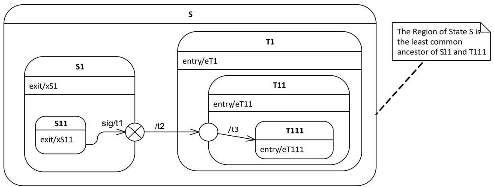

Figure 14.2 Compound transition example（复合转换示例）

### 14.2.4 Notation（表示法）

### 14.2.4.1 StateMachine Diagrams（状态机图）

StateMachine diagrams specify StateMachines. This Clause outlines the graphic elements that may be shown in StateMachine diagrams, and provides cross references where detailed information about the semantics and concrete notation for each element can be found. It also furnishes examples that illustrate how the graphic elements can be assembled into diagrams.

StateMachine 图用于描述 StateMachine。本节概述了 StateMachine 图中可以展示的图形元素，并提供了交叉引用以便查找每个元素的语义和具体表示法的详细信息。本节还提供了示例，说明如何将图形元素组装成图。

A StateMachine diagram is a graph that represents a StateMachine. States and various other types of Vertices in the StateMachine graph are rendered by appropriate State and Pseudostate symbols, while Transitions are generally rendered by directed arcs that connect them, or by control symbols representing the actions of the Behavior on the Transition.

StateMachine 图是一个表示 StateMachine 的图。StateMachine 图中的 State 和各种其他类型的 Vertex 由相应的 State 和 Pseudostate 符号来表示，而 Transition 通常由连接它们的有向弧来表示，或者由表示 Transition 上 Behavior 动作的控制符号来表示。

---

### 14.2.4.2 StateMachine（状态机）

When depicting StateMachine redefinition in a class diagram, the default rectangle notation for Classifier can be used, with the keyword «statemachine» inside the name compartment above or before the name of the StateMachine.

在类图中描述 StateMachine 重定义时，可以使用 Classifier 的默认矩形表示法，在名称栏中 StateMachine 名称的上方或前方使用关键字 «statemachine»。

The association between a StateMachine and its context Classifier or BehavioralFeatures does not have a special graphical representation.

StateMachine 与其上下文 Classifier 或 BehavioralFeature 之间的关联没有特殊的图形表示。

---

### 14.2.4.3 Region（区域）

A composite State or StateMachine with Regions is shown by tiling the graph Region of the State/StateMachine using dashed lines to divide it into Regions (Figure 14.3). Each Region may have an optional name and contains the nested disjoint States and the Transitions between these. The text compartments of the entire State are separated from the orthogonal Regions by a solid line.

具有多个 Region 的组合状态或 StateMachine 通过用虚线将 State/StateMachine 的图形区域划分为多个 Region 来表示（图 14.3）。每个 Region 可以有一个可选的名称，并包含嵌套的不相交的 State 以及这些 State 之间的 Transition。整个 State 的文本区域通过实线与正交 Region 分隔。

A composite State or StateMachine with just one Region is shown by showing a nested state diagram within the graph Region.

仅具有一个 Region 的组合状态或 StateMachine 通过在图形区域中展示嵌套的状态图来表示。

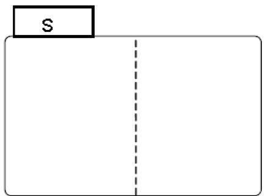

Figure 14.3 Notation for a composite State with Regions（具有 Region 的组合状态的表示法）

---

### 14.2.4.4 State（状态）

State is shown as a rectangle with rounded corners, with the State name shown within (Figure 14.4).

State 显示为圆角矩形，State 名称显示在矩形内（图 14.4）。

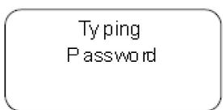
Figure 14.4 State notation（State 的表示法）

Optionally, it may have an attached name tab (Figure 14.5). The name tab is a rectangle, usually resting on the outside of the top side of a State and it contains the name of that State. It is normally used to keep the name of a composite State that has orthogonal Regions, but may be used in other cases as well.

可选地，State 可以附带一个名称标签（图 14.5）。名称标签是一个矩形，通常位于 State 顶部外侧，包含该 State 的名称。它通常用于标注具有正交 Region 的组合状态的名称，但也可以在其他情况下使用。

TypingPassword

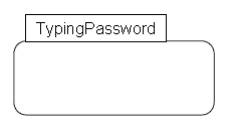

**Figure 14.5 State with a name tab（带有名称选项卡的状态）**

A State may be subdivided into multiple compartments separated from each other by a horizontal line (Figure 14.6).

State 可以被细分为多个区域，各区域之间用水平线分隔（图 14.6）。

TypingPassword

```kotlin
entry/setEchoInvisible()
exit/setEchoNormal()
character/handleCharacter()
help/displayHelp() 
```

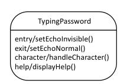

**Figure 14.6 State with compartments（带有分区的状态）**

The compartments of a State are:

State 的区域包括：

- name compartment
- internal Behaviors compartment
- internal Transitions compartment.

- 名称区域
- 内部 Behavior 区域
- 内部 Transition 区域。

A composite State also has a:

组合状态还具有：

\- decomposition compartment.

\- 分解区域。

Each of these compartments is described below.

每个区域在下面分别描述。

\- Name compartment

\- 名称区域

This compartment holds the (optional) name of the State, as a string. States without names are anonymous and are all distinct. It is undesirable to show the same named State twice in the same diagram, as confusion may ensue, unless control icons are used to show a Transition-oriented view of the StateMachine. Name compartments should not be used if a name tab is used and vice versa.

此区域包含 State 的（可选）名称，以字符串形式表示。没有名称的 State 是匿名的，且各不相同。不建议在同一个图中两次显示相同的命名 State，因为这可能会引起混淆，除非使用控制图标来展示 StateMachine 的面向 Transition 的视图。如果使用了名称标签，则不应使用名称区域，反之亦然。

In case of a submachine State, the name of the referenced StateMachine is shown as a string following ':' after the name of the State.

对于子机器状态，被引用的 StateMachine 的名称以字符串形式显示在 State 名称之后的 ':' 后面。

• Internal activities Behaviors compartment

• 内部活动 Behavior 区域

This compartment holds a list of internal Behaviors associated with a State. Each entry has the following format:

此区域包含与 State 关联的内部 Behavior 列表。每个条目的格式如下：

$$
<   \text { behavior - type - label } > [ ^ {\prime} / ^ {\prime} <   \text { behavior - expression } > ]
$$

The <behavior-type-label> identifies the circumstances under which the Behavior specified by the <behavior-expression> will be invoked and can be one of the following:

`<behavior-type-label>` 标识 `<behavior-expression>` 指定的 Behavior 将在何种情况下被调用，可以是以下之一：

entry — This label identifies a Behavior, specified by the corresponding expression, which is performed upon entry to the State (entry Behavior).

entry — 此标签标识由相应表达式指定的 Behavior，在进入 State 时执行（入口 Behavior）。

- exit — This label identifies a Behavior, specified by the corresponding expression, that is performed upon exit from the State (exit Behavior).
☐ do — This label identifies an ongoing Behavior (doActivity Behavior) that is performed as long as the modeled element is in the State or until the computation specified by the expression is completed.

- exit — 此标签标识由相应表达式指定的 Behavior，在退出 State 时执行（出口 Behavior）。
☐ do — 此标签标识一个持续进行的 Behavior（活动 Behavior），只要被建模元素处于该 State 中，或者直到表达式指定的计算完成，该 Behavior 就会一直执行。

The optional <behavior-expression> is an expression in some textual surface language, which may be either a vendor-specific or some standard language (see sub clause 16.1).

可选的 `<behavior-expression>` 是某种文本表面语言中的表达式，可以是厂商特定的语言或某种标准语言（参见第 16.1 节）。

• Internal Transition compartment

• 内部 Transition 区域

This compartment contains a list of internal Transitions, where each item has the following syntax:

此区域包含内部 Transition 的列表，每个条目的语法如下：

$$
\{<   \text { trigger } > \} ^ {*} [ ^ {\prime} [ ^ {\prime} <   \text { guard } > ^ {\prime} ] ^ {\prime} ] [ / <   \text { behavior - expression } > ]
$$

Where <trigger> is the notation for Triggers (see sub clause 13.3.4), <guard> is a Boolean expression for a guard, and the optional <behavior-expression> is the specification of the effect Behavior to be executed if the Event occurrence matches the trigger and guard of the internal Transition. It is an expression written in some textual surface language, which may be either a vendor-specific or some standard language (see sub clause 16.1).

其中 `<trigger>` 是 Trigger 的表示法（参见第 13.3.4 节），`<guard>` 是监护条件的布尔表达式，可选的 `<behavior-expression>` 是在事件(Event)出现与内部 Transition 的触发器和监护条件匹配时执行的效果 Behavior 的规约。它是用某种文本表面语言编写的表达式，可以是厂商特定的语言或某种标准语言（参见第 16.1 节）。

Alternatively, in place of a textual behavior expression, the various Behaviors associated with a State or internal Transition can be expressed using the appropriate graphical representation in a separate diagram (e.g., an activity diagram).

或者，可以不使用文本行为表达式，而是在单独的图中（例如活动图）使用适当的图形表示来表达与 State 或内部 Transition 关联的各种 Behavior。

---

#### 14.2.4.4.1 Composite State（组合状态）

\- decomposition compartment

\- 分解区域

This compartment shows its composition structure in terms of Regions, States, and Transition. In addition to the (optional) name and internal Transition compartments, the State may have an additional compartment that contains a nested diagram. For convenience and appearance, the text compartments may be shrunk horizontally within the graphic Region.

此区域展示其由 Region、State 和 Transition 组成的组合结构。除了（可选的）名称和内部 Transition 区域之外，State 还可以有一个包含嵌套图的附加区域。为了方便和美观，文本区域可以在图形 Region 内水平缩小。

In some cases, it is convenient to hide the decomposition of a composite State. For example, there may be a large number of States nested inside a composite State and they may simply not fit in the graphical space available for the diagram. In that case, the composite State may be represented by a simple State graphic with a special "composite" icon, usually in the lower right-hand corner (see Figure 14.8). This icon, consisting of two horizontally placed and connected States, is an optional visual cue that the State has a decomposition that is not shown in this particular diagram. Instead, the contents of the composite State are shown in a separate diagram.

在某些情况下，隐藏组合状态的分解是方便的。例如，组合状态内可能嵌套了大量 State，它们可能无法放入图中可用的图形空间。在这种情况下，组合状态可以用一个简单的 State 图形表示，并在右下角带有一个特殊的"composite"图标（见图 14.8）。该图标由两个水平放置且相连的 State 组成，是一个可选的视觉提示，表明该 State 具有未在当前图中展示的分解。组合状态的内容将在单独的图中展示。

NOTE. The "hiding" here is purely a matter of graphical convenience and has no semantic significance in terms of access restrictions.

注：此处的"隐藏"纯粹是为了图形上的方便，在访问限制方面没有语义意义。

A composite State may have one or more entry and exit points on its outside border or in close proximity of that border (inside or outside).

组合状态可以在其外部边界上或边界附近（内部或外部）有一个或多个入口点和出口点。

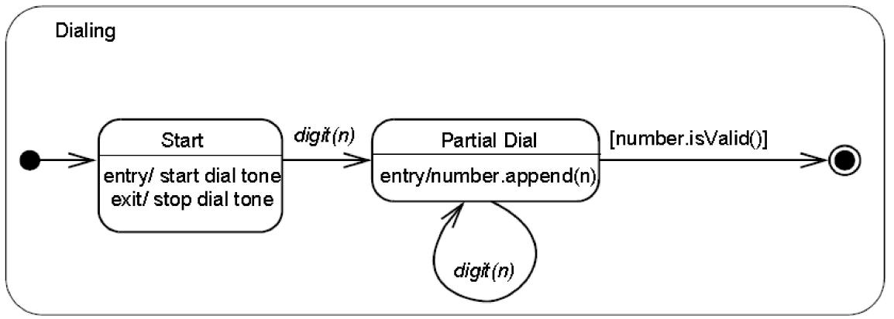

Figure 14.7 Composite State with two States（具有两个 State 的组合状态）

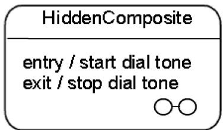

Figure 14.8 Composite State with a hidden decomposition indicator icon（带有隐藏分解指示图标的组合状态）

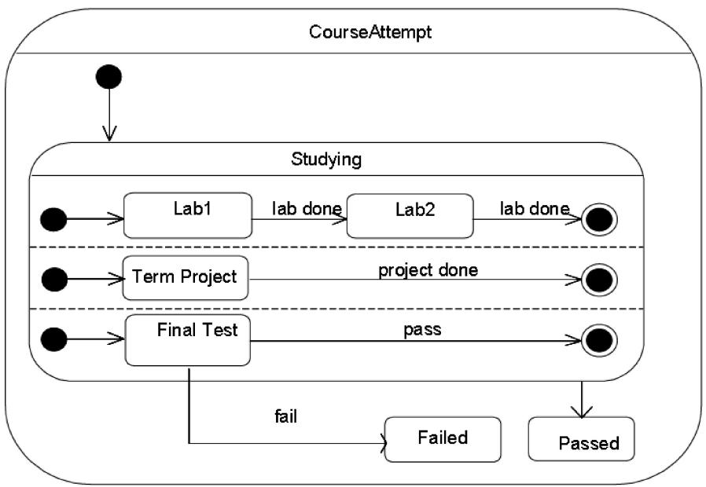

Figure 14.9 Composite State with Regions（具有 Region 的组合状态）

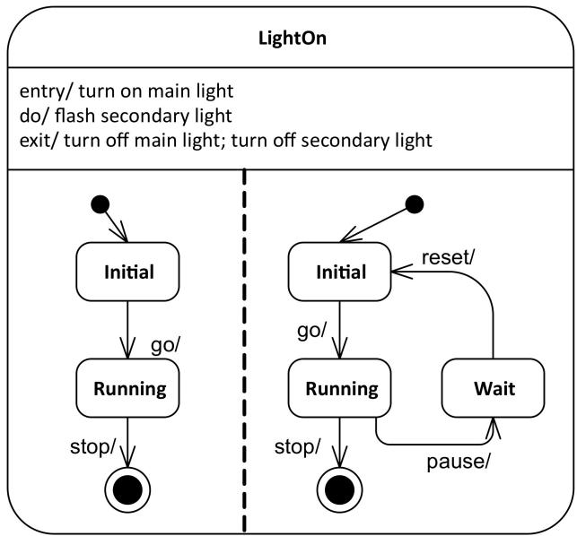

Figure 14.10 Composite State with two Regions and entry, exit, and do Behaviors（具有两个 Region 以及 entry、exit 和 do Behavior 的组合状态）

---

#### 14.2.4.4.2 Submachine State（子机器状态）

The submachine State is depicted as a normal State where the string in the name compartment has the following syntax:

子机器状态被描述为一个普通的 State，其名称区域中的字符串具有以下语法：

```txt
<state-name> ':' <name-of-referenced-StateMachine> 
```

The submachine State symbol may contain the references to one or more entry points and to one or more exit points. The notation for these connection point references comprises entry/exit Pseudostates on the border of the submachine State. The names are the names of the corresponding entry/exit points defined within the referenced StateMachine (see ConnectionPointReference).

子机器状态符号可以包含对一个或多个入口点和一个或多个出口点的引用。这些连接点引用的表示法包括子机器状态边界上的入口/出口 Pseudostate。这些名称是被引用的 StateMachine 中定义的相应入口/出口点的名称（参见 ConnectionPointReference）。

If the submachine StateMachine is entered through its default initial Pseudostate or if it is exited as a result of the completion of the submachine, it is not necessary to use the entry/exit point notation. Similarly, an exit point is not required if the exit occurs through an explicit group Transition that originates from the boundary of the submachine State (implying that it applies to all the substates of the submachine).

如果子机器 StateMachine 通过其默认初始 Pseudostate 进入，或者由于子机器完成而退出，则不需要使用入口/出口点表示法。类似地，如果退出是通过源自子机器状态边界的显式组 Transition（意味着它适用于子机器的所有子状态）发生的，则不需要出口点。

Submachine States invoking the same submachine may occur multiple times in the same state diagram with the entry and exit points being part of different Transitions.

调用同一子机器的子机器状态可以在同一状态图中出现多次，其入口和出口点可以属于不同的 Transition。

The diagram in Figure 14.11 shows a fragment from a StateMachine diagram in which a submachine State (the FailureSubmachine) is referenced. The actual submachine StateMachine is defined in some enclosing or imported namespace.

图 14.11 中的图展示了一个 StateMachine 图的片段，其中引用了一个子机器状态（FailureSubmachine）。实际的子机器 StateMachine 定义在某个封闭的或导入的命名空间中。

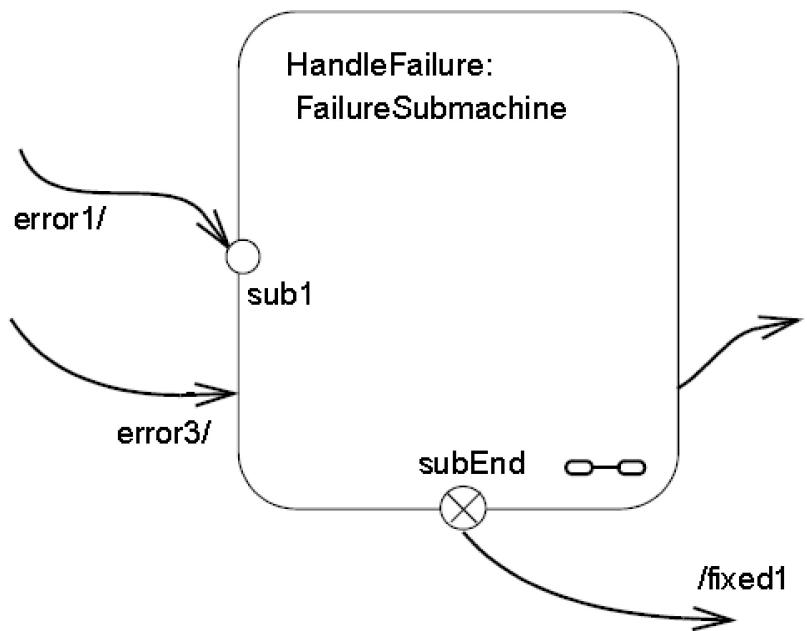

Figure 14.11 Submachine State example（子机器状态示例）

In the above example, the Transition triggered by Event "error1" will terminate on entry point "sub1" of the FailureSubmachine StateMachine. The "error3" Transition implies taking the default Transition of the FailureSubmachine.

在上面的示例中，由事件 "error1" 触发的 Transition 将终止于 FailureSubmachine StateMachine 的入口点 "sub1"。"error3" Transition 意味着采用 FailureSubmachine 的默认 Transition。

The Transition originating from the "subEnd" exit point of the submachine will execute the "fixed1" Behavior in addition to what is executed within the HandleFailure StateMachine. This Transition must have been triggered within the HandleFailure StateMachine. Finally, the Transition originating from the edge of the submachine State is taken as a result of the completion event generated when the FailureSubmachine reaches its FinalState.

源自子机器 "subEnd" 出口点的 Transition 除了执行 HandleFailure StateMachine 内部的内容外，还将执行 "fixed1" Behavior。此 Transition 必须在 HandleFailure StateMachine 内部被触发。最后，源自子机器状态边界的 Transition 是在 FailureSubmachine 到达其终态(FinalState)时生成的完成事件的结果。

NOTE. The same notation would apply to composite States with the exception that there would be no reference to a StateMachine in the State name.

注：同样的表示法也适用于组合状态，不同之处在于 State 名称中不会引用 StateMachine。

Figure 14.12 is an example of a StateMachine defined with two exit points. Entry and exit points may be shown on the frame or within the state graph. Figure 14.12 is an example of a StateMachine defined with an exit point shown within the state graph. Figure 14.13 shows the same StateMachine using a notation shown on the frame of the StateMachine.

图 14.12 是一个定义了两个出口点的 StateMachine 示例。入口点和出口点可以显示在框架上或状态图内。图 14.12 是一个在状态图内显示出口点的 StateMachine 示例。图 14.13 展示了使用 StateMachine 框架上表示法的同一 StateMachine。

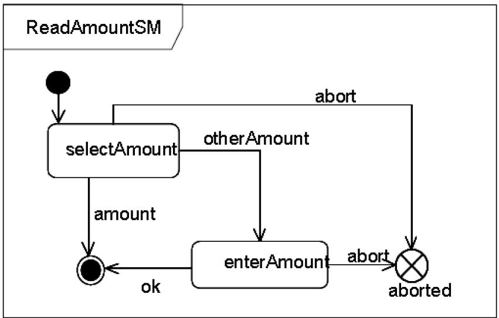

Figure 14.12 StateMachine with an exit point as part of the StateMachine graph（出口点作为 StateMachine 图一部分的 StateMachine）

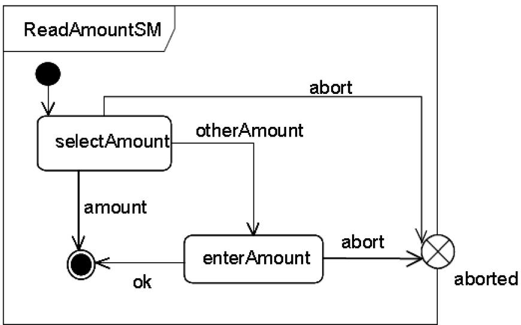

Figure 14.13 StateMachine with an exit point on the border（出口点在边界上的 StateMachine）

In Figure 14.14 the StateMachine shown in Figure 14.13 is referenced in a submachine State, and the presentation option with the exit points on the State symbol is shown.

在图 14.14 中，图 14.13 所示的 StateMachine 在一个子机器状态中被引用，并展示了出口点在 State 符号上的表示选项。

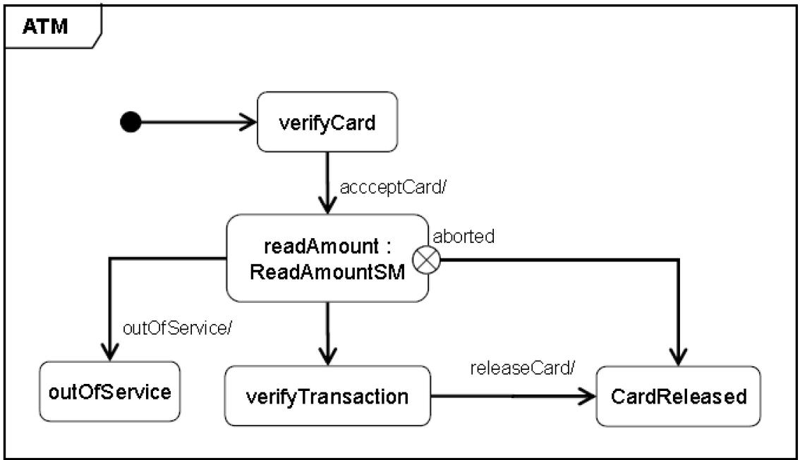

Figure 14.14 Submachine State that uses an exit point（使用出口点的子机器状态）

An example of the notation for entry and exit points for composite States is shown in Figure 14.23.

组合状态的入口点和出口点的表示法示例如图 14.23 所示。

---

#### 14.2.4.4.3 State list notation（状态列表表示法）

State lists provide a graphical shortcut for certain situations that sometimes occur in practice.

状态列表为实践中某些常见情况提供了图形快捷方式。

NOTE. These are purely notational forms with no corresponding abstract syntax representation. They are interchanged with UML DI, see Annex B.4.4.

注：这些纯粹是表示法形式，没有对应的抽象语法表示。它们通过 UML DI 进行交换，参见附录 B.4.4。

Multiple effect-free Transitions with the same Trigger values originating on different States but all either (a) targeting a common junction Vertex with a single outgoing Transition or (b) terminating on the same target State, may be represented by a Single Transition-like arc originating from a State-like graphic element, labeled with a list of the names of the originating States. This arc terminates on the joint target State. Figure 14.15 shows both possibilities and Figure 14.16 shows the equivalent diagram without using statelists.

源自不同 State 但具有相同 Trigger 值的多个无效果 Transition，且所有这些 Transition 要么 (a) 指向具有单个出向 Transition 的公共连接 Vertex，要么 (b) 终止于同一目标 State，可以用一条从类 State 图形元素出发的类 Transition 弧来表示，该弧标注有源 State 名称列表。该弧终止于共同的目标 State。图 14.15 展示了这两种可能性，图 14.16 展示了不使用状态列表的等效图。

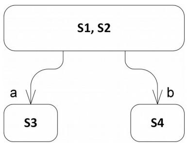

Figure 14.15 State list notation option（状态列表表示法选项）

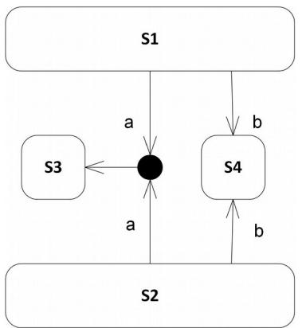

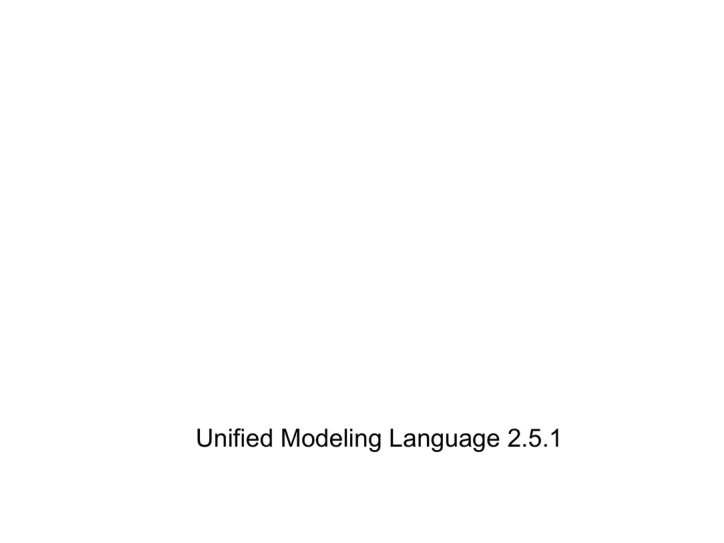

Figure 14.16 Diagram equivalent to Figure 14.15 without using statelists（不使用状态列表的与图 14.15 等效的图）

---

### 14.2.4.5 FinalState（终态）

A FinalState is shown as a circle surrounding a small solid filled circle (see Figure 14.17). The corresponding completion Transition on the enclosing State has as notation an unlabeled Transition.

终态(FinalState) 显示为一个小实心圆外围一个圆圈（见图 14.17）。在封闭 State 上对应的完成 Transition 的表示法为无标签的 Transition。

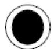
Figure 14.17 FinalState notation（终态的表示法）

Figure 14.7 has an example of a FinalState (the right-most of the States within the composite State).

图 14.7 中有一个终态(FinalState)的示例（组合状态内最右边的 State）。

---

### 14.2.4.6 Pseudostate（伪状态）

An initial Pseudostate is shown as a small solid filled circle (see Figure 14.18). In a Region of a ClassifierBehavior StateMachine, the Transition from an initial Pseudostate may be labeled with the Event type of the occurrence that creates the object; otherwise, it must be unlabeled. If it is unlabeled, it represents any Transition from the enclosing State.

初始(initial) Pseudostate 显示为一个小实心圆（见图 14.18）。在 ClassifierBehavior StateMachine 的 Region 中，从初始 Pseudostate 出发的 Transition 可以标注创建对象的事件类型的标签；否则，它必须是无标签的。如果它是无标签的，则代表来自封闭 State 的任何 Transition。


Figure 14.18 initial Pseudostate（初始 Pseudostate）

A shallowHistory Pseudostate is indicated by a small circle containing an 'H' (see Figure 14.19). It applies to the State Region that directly encloses it.

浅历史(shallowHistory) Pseudostate 由一个包含 'H' 的小圆圈表示（见图 14.19）。它适用于直接包含它的 State Region。

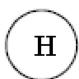
Figure 14.19 shallowHistory Pseudostate（浅历史 Pseudostate）

A deepHistory Pseudostate is indicated by a small circle containing an 'H*' (see Figure 14.20). It applies to the State Region that directly encloses it.

深历史(deepHistory) Pseudostate 由一个包含 'H*' 的小圆圈表示（见图 14.20）。它适用于直接包含它的 State Region。

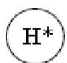
Figure 14.20 deepHistory Pseudostate（深历史 Pseudostate）

An entry point is shown as a small circle on the border of the StateMachine diagram or composite State, with the name associated with it (see Figure 14.21).

入口点(entryPoint) 在 StateMachine 图或组合状态的边界上显示为一个小圆圈，并附有相关联的名称（见图 14.21）。

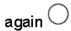
Figure 14.21 entryPoint Pseudostate（入口点 Pseudostate）

Optionally it may be placed both within the StateMachine diagram and outside the border of the StateMachine diagram or composite State.

可选地，它可以同时放置在 StateMachine 图内部以及 StateMachine 图或组合状态边界的外部。

An exit point is shown as a small circle with a cross on the border of the StateMachine diagram or composite State, with the name associated with it (see Figure 14.22).

出口点(exitPoint) 在 StateMachine 图或组合状态的边界上显示为带有叉号的小圆圈，并附有相关联的名称（见图 14.22）。

aborted

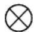
Figure 14.22 exitPoint Pseudostate（出口点 Pseudostate）

Optionally, an exit point symbol may be placed both within the StateMachine diagram or composite State and outside the border of the StateMachine diagram or composite State. Figure 14.23 illustrates the notation for depicting entry and exit points of composite States.

可选地，出口点符号可以同时放置在 StateMachine 图或组合状态内部以及 StateMachine 图或组合状态边界的外部。图 14.23 说明了组合状态的入口点和出口点的表示法。

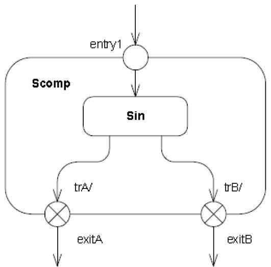

Figure 14.23 entryPoint and exitPoints on a composite State（组合状态上的入口点和出口点）

Alternatively, the "bracket" notation shown in Figure 14.30 and Figure 14.31 can also be used for the transition-oriented notation.

或者，图 14.30 和图 14.31 中所示的"括号"表示法也可以用于面向 Transition 的表示法。

A junction is represented by a small filled circle (see Figure 14.24).

连接(junction) 由一个小实心圆表示（见图 14.24）。

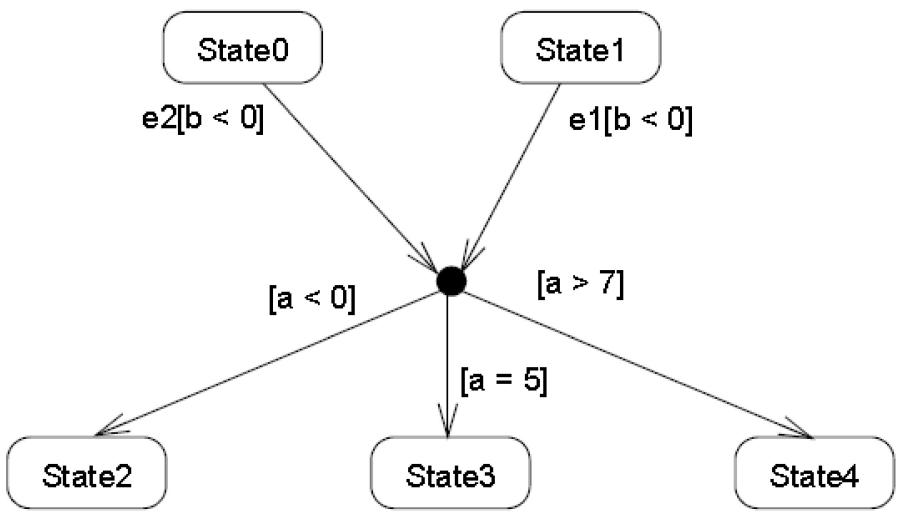

Figure 14.24 junction Pseudostate with incoming and outgoing Transitions（具有入向和出向 Transition 的连接 Pseudostate）

A choice Pseudostate is shown as a diamond-shaped symbol as exemplified shown by the left-hand diagram in Figure 14.25.

选择(choice) Pseudostate 显示为菱形符号，如图 14.25 左侧图所示。

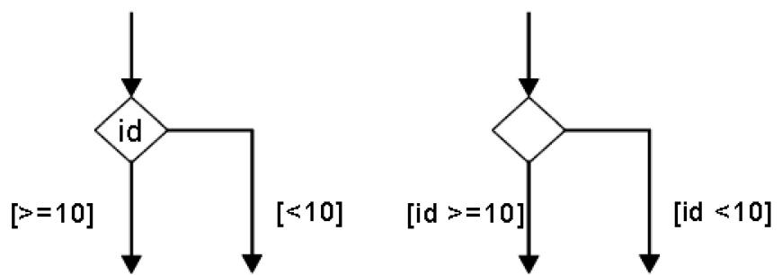

Figure 14.25 choice Pseudostates（选择 Pseudostate）

NOTE. In cases when all guards associated with triggers of Transitions leaving a choice Pseudostate are binary expressions that share a common left operand, then the notation for choice Pseudostate may be simplified. The left operand may be placed inside the diamond-shaped symbol and the rest of the Guard expressions placed on the outgoing Transitions. This is illustrated by the right-hand diagram in Figure 14.25.

注：当与离开选择 Pseudostate 的 Transition 的触发器关联的所有监护条件都是共享公共左操作数的二元表达式时，选择 Pseudostate 的表示法可以简化。左操作数可以放在菱形符号内部，其余的监护条件表达式放在出向 Transition 上。这由图 14.25 右侧的图来说明。

A terminate Pseudostate is shown as a cross, see Figure 14.26.

终止(terminate) Pseudostate 显示为叉号，见图 14.26。

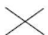
Figure 14.26 terminate Pseudostate（终止 Pseudostate）

The notation for a fork and join is a short heavy bar (Figure 14.27). The bar may have one or more arrows from source States to the bar (when representing a join). The bar may have one or more arrows from the bar to States (when representing a fork). A Transition string may be shown near the bar.

分支(fork) 和汇合(join) 的表示法是一条短粗线（图 14.27）。该线可以有一个或多个从源 State 指向该线的箭头（表示汇合时）。该线可以有一个或多个从该线指向 State 的箭头（表示分支时）。Transition 字符串可以显示在该线附近。

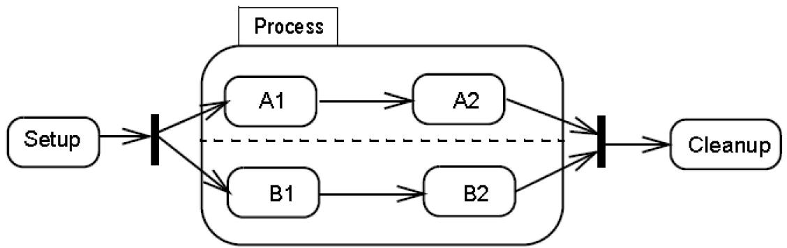

Figure 14.27 fork and join Pseudostates（分支和汇合 Pseudostate）

---

### 14.2.4.7 ConnectionPointReference（连接点引用）

A connection point reference to an entry point has the same notation as an entry Pseudostate. The circle is placed on the border of the State symbol of a submachine State.

对入口点的连接点引用(ConnectionPointReference) 具有与入口 Pseudostate 相同的表示法。圆圈放置在子机器状态的 State 符号边界上。

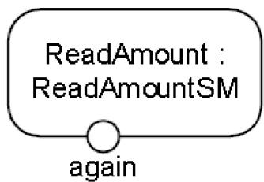

Figure 14.28 Entry point ConnectionPointReference notation（入口点 ConnectionPointReference 的表示法）

A connection point reference to an exit point has the same notation as an exit Pseudostate. The encircled cross is placed on the border of the State symbol of a submachine State.

对出口点的连接点引用具有与出口 Pseudostate 相同的表示法。带叉号的圆圈放置在子机器状态的 State 符号边界上。

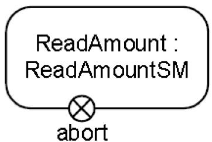

Figure 14.29 Exit point ConnectionPointReference notation（出口点 ConnectionPointReference 的表示法）

Alternatively, a connection point reference to an entry point can also be visualized using a "bracketed space" symbol as shown in Figure 14.30. The text inside the symbol shall contain 'via' followed by the name of the connection point. This notation may only be used if the Transition ending with the connection point is defined using the graphical Transition notation, such as the one shown in Figure 14.32.

或者，对入口点的连接点引用也可以使用"括号空间"符号来可视化，如图 14.30 所示。符号内的文本应包含 'via' 后跟连接点的名称。此表示法仅在以连接点结束的 Transition 使用图形 Transition 表示法定义时才能使用，例如图 14.32 所示的表示法。

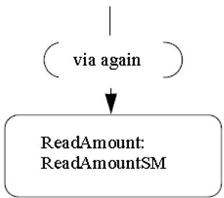

Figure 14.30 Alternative entry point ConnectionPointReference notation（替代的入口点 ConnectionPointReference 表示法）

A connection point reference to an exit point can also be visualized using a "bracketed space" symbol as shown in Figure 14.31. The text inside the symbol shall contain 'via' followed by the name of the connection point. This notation may only be used if the Transition associated with the connection point is defined using the graphical Transition notation such as the one shown in Figure 14.32.

对出口点的连接点引用也可以使用"括号空间"符号来可视化，如图 14.31 所示。符号内的文本应包含 'via' 后跟连接点的名称。此表示法仅在关联的 Transition 使用图形 Transition 表示法（例如图 14.32 所示的表示法）定义时才能使用。

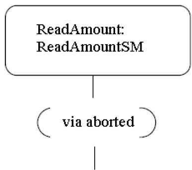

Figure 14.31 Alternative exit point ConnectionPointReference notation（替代的出口点 ConnectionPointReference 表示法）

---

### 14.2.4.8 Transition（转换）

The default textual notation for a Transition is defined by the following BNF expression:

Transition 的默认文本表示法由以下 BNF 表达式定义：

$$
[ <   \text { trigger } > [ ^ {\prime}, ^ {\prime} <   \text { trigger } > ] * [ ^ {\prime} [ ^ {\prime} <   \text { guard } > ^ {\prime} ] ^ {\prime} ] [ ^ {\prime} / ^ {\prime} <   \text { behavior - expression } > ] ]
$$

Where <trigger> is the standard notation for Triggers (see sub clause 13.3.4), <guard> is a Boolean expression for a guard, and the optional <behavior-expression> is an expression specifying the effect Behavior written in some vendor-specific or standard textual surface language (see sub clause 16.1). The trigger may be any of the standard trigger types. SignalEvent triggers and CallEvent triggers are not distinguishable by syntax and must be discriminated by their declaration elsewhere.

其中 `<trigger>` 是 Trigger 的标准表示法（参见第 13.3.4 节），`<guard>` 是监护条件的布尔表达式，可选的 `<behavior-expression>` 是指定效果 Behavior 的表达式，使用某种厂商特定或标准的文本表面语言编写（参见第 16.1 节）。触发器可以是任何标准触发器类型。SignalEvent 触发器和 CallEvent 触发器在语法上无法区分，必须通过它们在其他地方的声明来辨别。

As an alternative, in cases where the effect Behavior can be described as a control-flow based sequence of Actions, there is a graphical representation for Transitions and compound transitions which is similar to the notation used for Activities.

作为替代方案，当效果 Behavior 可以描述为基于控制流的动作序列时，存在一种用于 Transition 和复合转换的图形表示法，类似于用于 Activity 的表示法。

NOTE. Although this alternative notation contains graphical elements reminiscent of the notation used for Activities, it is a distinct form applicable only to StateMachines, and its elements map to appropriate StateMachine concepts.

注：虽然这种替代表示法包含类似于 Activity 所用表示法的图形元素，但它是一种仅适用于 StateMachine 的独立形式，其元素映射到相应的 StateMachine 概念。

This notation is in the form of a directed graph, which consists of one or more graphical symbols interconnected by directed arcs that represent control flow (see Figure 14.32). In all cases except for the Transition originating from the initial Pseudostate, the starting symbol, which has the form of the standard simple State notation, represents the source State of the Transition. If this Transition has a Signal-based Trigger, then the source state symbol is connected by an arc pointing to a special Signal receipt symbol described below. If there are multiple Triggers for the Transition, they are all listed in the same symbol as explained below.

此表示法采用有向图的形式，由一个或多个通过有向弧互连的图形符号组成，这些有向弧表示控制流（见图 14.32）。在除了从初始 Pseudostate 出发的 Transition 之外的所有情况下，起始符号（具有标准简单 State 表示法的形式）代表 Transition 的源 State。如果此 Transition 具有基于信号(Signal)的 Trigger，则源 State 符号通过指向下方描述的特殊信号接收符号的弧连接。如果 Transition 有多个 Trigger，它们都列在同一个符号中，如下所述。

If the Transition originates from the initial Pseudostate, the starting symbol is the initial symbol, which is the same as used for the initial Pseudostate: a filled black circle. In that case, there is no Signal receipt symbol immediately following the starting symbol.

如果 Transition 源自初始 Pseudostate，则起始符号是初始符号，与用于初始 Pseudostate 的符号相同：一个实心黑色圆圈。在这种情况下，起始符号之后没有紧随的信号接收符号。

Except for end symbols that terminate the paths, any of the following symbols can appear in the chain as appropriate:

除了终止路径的结束符号外，以下任何符号都可以根据需要出现在链中：

- an action symbol
- a choice point symbol
• a Signal send symbol
- a merge symbol

- 动作符号
- 选择点符号
• 信号发送符号
- 合并符号

The terminating symbol in these directed graphs is always either a State-like symbol representing the target State of the transition or a final state symbol (which is the same as the symbol for a FinalState).

这些有向图中的终止符号始终是代表转换目标 State 的类 State 符号或终态符号（与终态(FinalState) 的符号相同）。

---

#### 14.2.4.8.1 Action symbols（动作符号）

Each action symbol is represented by a rectangle with an optional textual specification of the action. It maps either to anOpaqueAction or to a SequenceNode containing one or more Actions executed in sequence (see sub clause 16.11.3) and which are part of the Activity specifying the effect Behavior of the appropriate Transition in the compound transition.

每个动作符号由一个矩形表示，带有可选的动作文本规约。它映射到一个 OpaqueAction 或一个包含一个或多个按顺序执行的 Action 的 SequenceNode（参见第 16.11.3 节），这些是指定复合转换中相应 Transition 的效果 Behavior 的 Activity 的一部分。

---

#### 14.2.4.8.2 Signal receipt symbol（信号接收符号）

The Signal receipt symbol is shown as a five-pointed polygon that looks like a rectangle with a triangular notch in one of its sides (either one). It maps to the trigger of the Transition and does not map to an Action of the Activity that specifies the effect Behavior. The names of the Signals of the Trigger as well as any guard are contained within the symbol as follows:

信号接收符号显示为五边形，看起来像一个在一侧有三角形凹口的矩形（任一侧）。它映射到 Transition 的触发器，不映射到指定效果 Behavior 的 Activity 的 Action。Trigger 的信号名称以及任何监护条件包含在符号内，格式如下：

$$
<   t r i g g e r > [ ^ {\prime}, ^ {\prime} <   t r i g g e r > ] ^ {*} [ ^ {\prime} [ ^ {\prime} <   g u a r d > ^ {\prime} ] ^ {\prime} ]
$$

Where $\langle trigger \rangle$ is specified as described in sub clause 13.3.4 with the restriction that only Signal and change Event types are allowed. The trigger symbol is always first in the path of symbols and a compound transition can only have at most one such symbol.

其中 `<trigger>` 按照第 13.3.4 节的描述指定，限制只允许信号(Signal)和变更事件(Event)类型。触发器符号始终是符号路径中的第一个，一个复合转换最多只能有一个这样的符号。

---

#### 14.2.4.8.3 Signal send symbol（信号发送符号）

This represents the special action of sending a signal and maps directly to a SendSignalAction that is part of the Activity that describes the effect Behavior of the corresponding Transition. The notation corresponds to the notation for the SendSignalAction (see sub clause 16.3.4).

这代表发送信号的特殊动作，直接映射到 SendSignalAction，该动作是描述相应 Transition 效果 Behavior 的 Activity 的一部分。其表示法对应于 SendSignalAction 的表示法（参见第 16.3.4 节）。

---

#### 14.2.4.8.4 Choice point symbol（选择点符号）

This symbol maps directly to a choice Pseudostate and uses the same notation.

此符号直接映射到选择 Pseudostate，并使用相同的表示法。

NOTE. It is not part of any Activity.

注：它不属于任何 Activity。

---

#### 14.2.4.8.5 Merge symbol（合并符号）

A merge symbol is used to join multiple control-flow arcs and maps directly to a junction Pseudostate and uses the same notation. It is not part of any Activity.

合并符号用于连接多个控制流弧，直接映射到连接 Pseudostate，并使用相同的表示法。它不属于任何 Activity。

Figure 14.32 shows a compound transition consisting of four connected Transitions: one from the Idle State to the choice symbol, one for each of the branches of the choice through the junction symbol, and one from the junction Pseudostate to the Busy State.

图 14.32 展示了一个由四个相连的 Transition 组成的复合转换：一个从 Idle State 到选择符号，一个通过连接符号的每个选择分支，以及一个从连接 Pseudostate 到 Busy State。

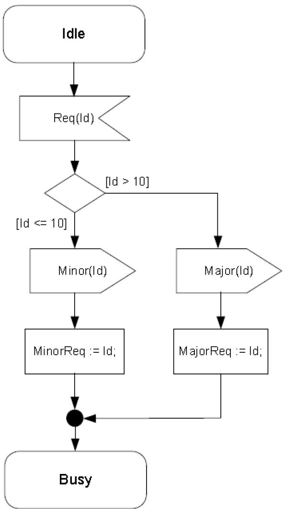

Figure 14.32 Symbols for Signal reception, Sending, and Actions on a Transition（Transition 上的信号接收、发送和动作符号）

---

#### 14.2.4.8.6 Deferred triggers（延迟触发器）

A deferrable trigger is shown by listing it within the State followed by a slash and the label "defer". An example of this notation is shown in Figure 14.33. In this example, handling of the "request" event occurrence is deferred in States "Initializing" and "Primed". However, it will be handled once the "Operational" State is reached.

可延迟触发器通过在 State 内列出它，后跟斜杠和标签 "defer" 来显示。此表示法的示例如图 14.33 所示。在此示例中，"request" 事件出现时的处理在 State "Initializing" 和 "Primed" 中被延迟。但是，一旦到达 "Operational" State，它就会被处理。

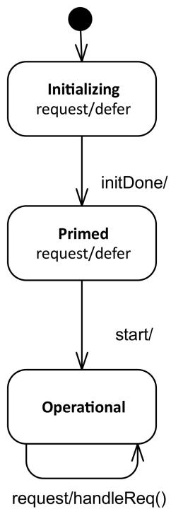

Figure 14.33 Deferred Trigger notation（延迟 Trigger 的表示法）

---

### 14.2.4.9 TransitionKind（转换种类）

• Transitions of the kind internal are not shown explicitly in diagrams.

- Transitions of the kind local can originate from the border of the containing composite State, or one of its entry points, or from a Vertex within the composite State. (Alternatively, a Transition of kind local can be shown as a Transition leaving a State symbol containing the text "*.") The Transition is then considered to belong to the enclosing composite State.) Transitions of this kind can only terminate on the border of the composite State, or one of its exit points, or on a Vertex within the composite State. All of the Transitions in Figure 14.34 are local.
- Transitions of kind external can target any Vertex contained within or external to the source Vertex. The part of the external Transition closest to the source must be drawn outside of the source Vertex border. In the case of an external self Transition where the source is a State or exit point on the State, it may target the State itself or an entry point on the State and it will be drawn completely outside of the State border. All of the Transitions in Figure 14.35 are external.

• 内部转换(internal transition) 类型的 Transition 在图中不显式显示。

- 局部转换(local transition) 类型的 Transition 可以源自包含它的组合状态的边界，或其入口点之一，或组合状态内的某个 Vertex。（或者，局部转换类型的 Transition 可以显示为离开包含文本 "*." 的 State 符号的 Transition。此时该 Transition 被认为属于封闭的组合状态。）此类型的 Transition 只能终止于组合状态的边界、其出口点之一，或组合状态内的某个 Vertex。图 14.34 中的所有 Transition 都是局部转换。
- 外部转换(external transition) 类型的 Transition 可以指向源 Vertex 内部或外部的任何 Vertex。外部转换最靠近源的部分必须绘制在源 Vertex 边界的外部。在外部自转换（源为 State 或 State 上的出口点）的情况下，它可以指向 State 本身或 State 上的入口点，并且将完全绘制在 State 边界外部。图 14.35 中的所有 Transition 都是外部转换。

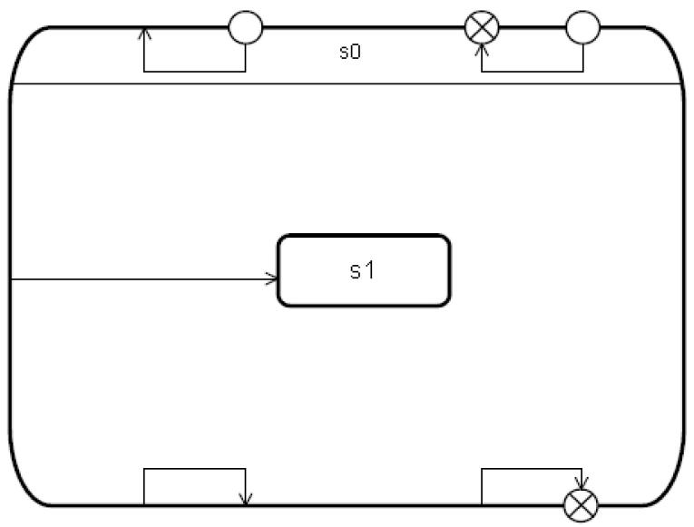

Figure 14.34 Local Transitions（局部转换）

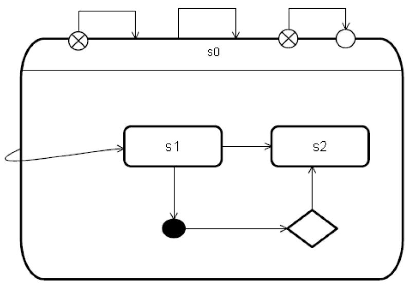

Figure 14.35 External Transitions（外部转换）

### 14.2.5 Examples（示例）

Figure 14.36 is an example StateMachine diagram for the StateMachine for simple telephone. In addition to an initial Pseudostate, the StateMachine has an entry point called "activeEntry". Also, in addition to the FinalState, it has an exit point called "aborted."

图 14.36 是一个简单电话的 StateMachine（状态机）图示例。除了一个初始 Pseudostate（伪状态）之外，该状态机还有一个名为 "activeEntry" 的入口点。此外，除了 FinalState（终态）之外，它还有一个名为 "aborted" 的出口点。


Figure 14.36（图 14.36） StateMachine diagram representing a telephone

StateMachine diagram representing a telephone（表示电话的状态机图）

---

An example of submachine usage is shown in Figure 14.12 and Figure 14.13.

子机器状态的使用示例见图 14.12 和图 14.13。
