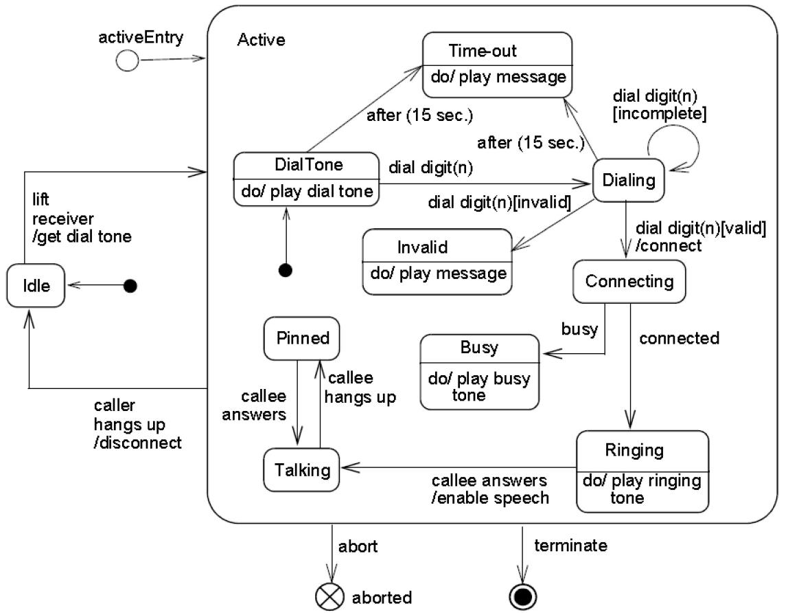

### 14.2.5 Examples（示例）

Figure 14.36 is an example StateMachine diagram for the StateMachine for simple telephone. In addition to an initial Pseudostate, the StateMachine has an entry point called "activeEntry". Also, in addition to the FinalState, it has an exit point called "aborted."

图 14.36 是一个简单电话的 StateMachine（状态机）图示例。除了一个初始 Pseudostate（伪状态）之外，该状态机还有一个名为 "activeEntry" 的入口点。此外，除了 FinalState（终态）之外，它还有一个名为 "aborted" 的出口点。

Figure 14.36（图 14.36） StateMachine diagram representing a telephone

StateMachine diagram representing a telephone（表示电话的状态机图）

---

An example of submachine usage is shown in Figure 14.12 and Figure 14.13.

子机器状态的使用示例见图 14.12 和图 14.13。
