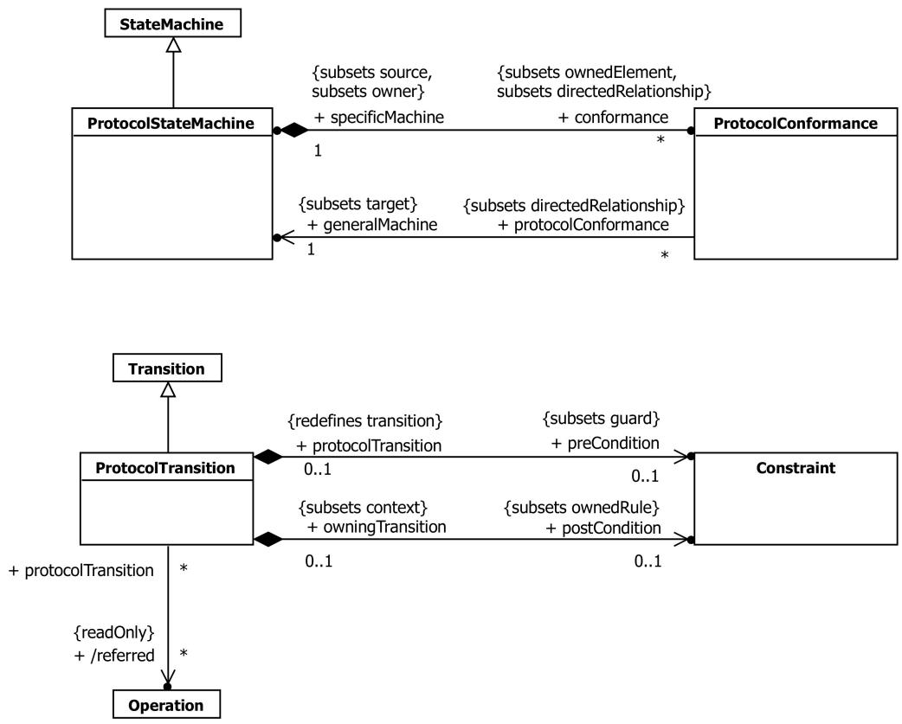
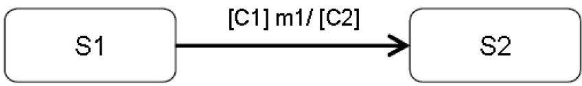
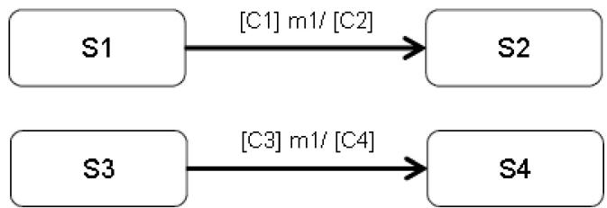
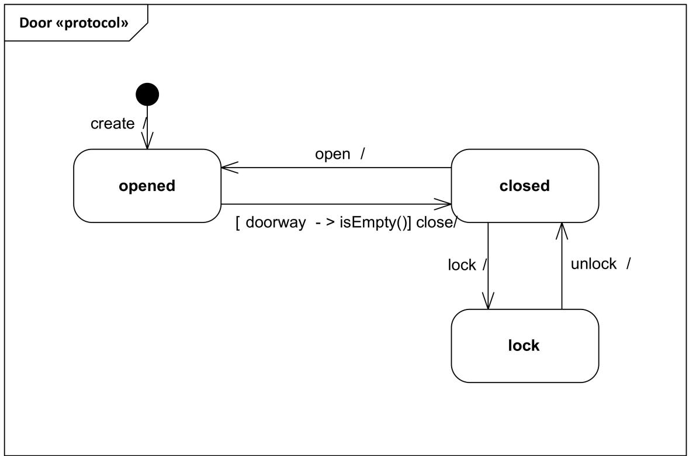
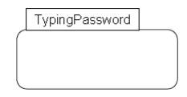
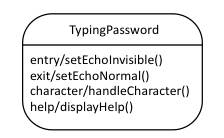

## 14.4 ProtocolStateMachines（协议状态机）

---

### 14.4.1 Summary（概述）

ProtocolStateMachines are used to express usage protocols. ProtocolStateMachines express the legal sequences of Event occurrences to which the Behaviors of an associated BehavioredClassifier must conform. The StateMachine notation is a convenient way to define the order of invocations of the behavioral features of a Classifier. ProtocolStateMachines can be associated with Classifiers, Interfaces, and Ports.

协议状态机(ProtocolStateMachine)用于表达使用协议。协议状态机表达了关联行为分类器的行为必须遵循的合法事件发生序列。状态机表示法是定义分类器行为特征调用顺序的便捷方式。协议状态机可以与分类器、接口和端口关联。

---

### 14.4.2 Abstract Syntax（抽象语法）



Figure 14.41 ProtocolStateMachines（协议状态机）

---

### 14.4.3 Semantics（语义）

#### 14.4.3.1 ProtocolStateMachine（协议状态机）

A ProtocolStateMachine is always defined in the context of a Classifier. It specifies which BehavioralFeatures of that Classifier can be invoked in a given protocol state and under what conditions, thereby specifying allowed invocation sequences. In this manner, a specification of the lifecycle of an instance of the Classifier is defined from an external perspective.

协议状态机总是在分类器的上下文中定义。它指定了该分类器的哪些行为特征可以在给定的协议状态下以及在什么条件下被调用，从而指定了允许的调用序列。通过这种方式，从外部视角定义了分类器实例生命周期的规范。

ProtocolStateMachines help define the order in which BehavioralFeatures of a Classifier are invoked by specifying:

协议状态机通过指定以下内容帮助定义分类器行为特征的调用顺序：

- the behavioral context (i.e., which states and pre-conditions) in which they can be validly invoked,

- 它们可以被有效调用的行为上下文（即哪些状态和前置条件），

• the valid orderings of invocations,

• 有效的调用顺序，

• the expected outcomes (post-conditions) of invocations.

• 调用的预期结果（后置条件）。

ProtocolStateMachine present an external view of the owning Classifier as perceived by its collaborators. This extends beyond what can be captured via pre- and post-conditions on individual BehavioralFeatures, as ProtocolStateMachines also specify the valid orderings of invocations of the different features. This is achieved by a state machine specification in which the transition triggers are feature invocations and the guards of the transitions (ProtocolTransitions) specify the pre-condition that must apply for the invocation to be valid. The states (ProtocolStates) of this state machine, being a consequence of past invocation sequences, capture the state of the protocol and are also a form of pre-condition.

协议状态机呈现了所属分类器的外部视图，如其协作者所感知的那样。这超出了通过单个行为特征的前置条件和后置条件所能捕获的范围，因为协议状态机还指定了不同特征调用的有效顺序。这是通过状态机规范实现的，其中转换触发器是特征调用，转换（协议转换）的监护条件指定了调用有效所必须满足的前置条件。此状态机的状态（协议状态）是过去调用序列的结果，捕获了协议的状态，也是一种前置条件的形式。

NOTE. Because ProtocolStateMachines provide a "black box" view of the behavior of a Classifier, their States may not necessarily correspond to the States of internal behavioral StateMachines.

注：因为协议状态机提供了分类器行为的"黑盒"视图，其状态不一定与内部行为状态机的状态对应。

ProtocolStateMachine interpretation can vary from:

协议状态机的解释可以有以下不同：

1 Declarative ProtocolStateMachines, which specify the legal Transitions for BehavioralFeature invocations. The effects of a BehavioralFeature invocation is not specified. This type of specification only provides a contract for the user of the context Classifier.

1 声明式协议状态机，指定行为特征调用的合法转换。行为特征调用的效果未指定。此类型的规范仅为上下文分类器的用户提供契约。

2 Executable (run time) ProtocolStateMachines, which specify all Event occurrences that an object may receive and handle, together with the Transitions that these trigger. In this case, the legal Transitions for BehavioralFeature invocations must match exactly the triggered Transitions or a run-time exception occurs. The invocation results in the execution of the method associated with the invoked BehavioralFeatures.

2 可执行（运行时）协议状态机，指定对象可能接收和处理的所有事件发生，以及这些事件触发的转换。在这种情况下，行为特征调用的合法转换必须精确匹配被触发的转换，否则会发生运行时异常。调用导致与被调用行为特征关联的方法的执行。

The specifications for both interpretations is the same, the only difference being the direct dynamic implication that the latter interpretation provides.

两种解释的规范是相同的，唯一的区别在于后一种解释提供的直接动态含义。

The more sophisticated forms of modeling encountered in behavioral StateMachines such as compound Transitions, submachine StateMachines, composite States, and concurrent orthogonal Regions, can also be used for ProtocolStateMachines. For example, concurrent Regions make it possible to express protocols where an instance can have several active States simultaneously. Submachine StateMachines and compound transitions can be used for factorizing complex ProtocolStateMachines.

在行为状态机中遇到的更复杂的建模形式，如复合转换、子机器状态机、组合状态和并发正交区域，也可以用于协议状态机。例如，并发区域可以表达实例可以同时具有多个活跃状态的协议。子机器状态机和复合转换可用于分解复杂的协议状态机。

A Classifier may have several ProtocolStateMachines. This can be used, for example, when a Classifier has multiple parents, each having its own ProtocolStateMachine, and the protocols are orthogonal. An alternative to this is to simply have one ProtocolStateMachine, with distinct StateMachines in concurrent Regions.

一个分类器可以有多个协议状态机。例如，当分类器有多个父类，每个父类有自己的协议状态机，且协议是正交的时候可以使用。替代方案是简单地拥有一个协议状态机，在并发区域中有不同的状态机。

##### State in ProtocolStateMachines（协议状态机中的状态）

The States of ProtocolStateMachines are exposed to the users of their context Classifiers. A protocol State represents an exposed stable situation of its context Classifier: When an instance of the Classifier classifier is not processing any BehavioralFeature invocation, users of this instance can always know its state configuration.

协议状态机的状态对其上下文分类器的用户是暴露的。协议状态表示其上下文分类器的暴露的稳定情况：当分类器实例不处理任何行为特征调用时，该实例的用户始终可以知道其状态配置。

The States of a ProtocolStateMachine cannot have defined entry, exit, or doActivity Behaviors.

协议状态机的状态不能定义入口、出口或活动行为。

---

#### 14.4.3.2 ProtocolTransition（协议转换）

A ProtocolTransition specifies a legal Transition for an invocation of a BehavioralFeature of the context Classifier. ProtocolTransitions have the following features:

协议转换(ProtocolTransition)指定了上下文分类器行为特征调用的合法转换。协议转换具有以下特征：

- a pre-condition (preCondition), which specializes the guard attribute of Transition,

- 前置条件(preCondition)，特化了转换的监护条件属性，

- a trigger,

- 触发器，

• a post-condition (postCondition).

• 后置条件(postCondition)。

The protocol Transition specifies that (a) the associated (referred) feature can be invoked on an instance of the context Classifier, if it is in the origin State and the guard condition holds, and that (b) upon completion of the Transition, the instance will be in the target State in which the post-condition will hold.

协议转换指定：(a) 如果上下文分类器的实例处于源状态且监护条件成立，则可以调用关联的（引用的）特征；(b) 转换完成后，实例将处于后置条件成立的目标状态。

ProtocolTransitions do not have an associated effect Behavior. The consequence of a ProtocolTransition executed as a result of a BehavioralFeature invocation is implicit: it is the execution of the method corresponding to the invoked BehavioralFeature. In case of other types of Triggers, the consequences are unspecified except that a Transition will lead to another State under a specific post-condition, regardless of any Behaviors associated with this Transition.

协议转换没有关联的效果行为。作为行为特征调用结果执行的协议转换的后果是隐式的：它是与被调用行为特征对应的方法的执行。对于其他类型的触发器，后果未指定，只是转换将在特定后置条件下导致另一个状态，无论与该转换关联的任何行为如何。

##### 14.4.3.2.1 Unexpected trigger reception（意外的触发器接收）

The interpretation of the reception of an Event occurrence that does not match a valid trigger for the current State, state invariant, or pre-condition is not defined (e.g., it can be ignored, rejected, or deferred; an exception can be raised; or the application can stop on an error). It corresponds semantically to a pre-condition violation, for which no predefined Behavior is defined in UML.

对于不匹配当前状态、状态不变式或前置条件的有效触发器的事件发生的接收，其解释未定义（例如，它可以被忽略、拒绝或延迟；可以引发异常；或者应用程序可以在错误时停止）。这在语义上对应于前置条件违反，UML 中没有为此定义预定义行为。

##### 14.4.3.2.2 Unexpected Behavior（意外行为）

The interpretation of an unexpected Behavior, that is an unexpected result of a Transition (wrong FinalState or FinalState invariant, or post-condition) is also not defined. However, this should be interpreted as an error of the implementation of the ProtocolStateMachine.

对于意外行为（即转换的意外结果：错误的终态或终态不变式，或后置条件）的解释也未定义。但是，这应被解释为协议状态机实现的错误。

##### 14.4.3.2.3 Equivalences to pre- and post-conditions of operations（与操作的前置和后置条件的等价关系）

A protocol Transition can be semantically interpreted in terms of pre- and post-conditions on the associated operation. For example, the Transition in Figure 14.42 can be interpreted in the following way:

协议转换可以在语义上用关联操作的前置和后置条件来解释。例如，图 14.42 中的转换可以按以下方式解释：

1 The operation "m1" can be called on an instance when it is in the ProtocolState "S1" under the condition "C1."

1 当实例在条件"C1"下处于协议状态"S1"时，可以在该实例上调用操作"m1"。

2 When "m1" is called in the ProtocolState "S1" under the condition "C1," then the ProtocolState "S2" must be reached under the condition "C2."

2 当在条件"C1"下在协议状态"S1"中调用"m1"时，则必须在条件"C2"下达到协议状态"S2"。



Figure 14.42 An example of a ProtocolTransition associated with the operation "m1"（与操作"m1"关联的协议转换示例）

##### Operations referred by several Transitions（被多个转换引用的操作）



Figure 14.43 Example of several ProtocolTransitions associated with the same operation (m1)（与同一操作(m1)关联的多个协议转换示例）

In a ProtocolStateMachine, several Transitions can refer to the same operation as illustrated in Figure 14.43. In that case, all pre-and post-conditions will be combined in the operation pre-condition as shown below.

在协议状态机中，多个转换可以引用同一操作，如图 14.43 所示。在这种情况下，所有前置条件和后置条件将在操作前置条件中组合，如下所示。

```txt
Operation m1()
Pre:    in state S1 and condition C1
    or
    in state S3 and condition C3
Post:    if the initial condition was "in state S1 and condition C1"
    then in S2 and C2
    else
    if the initial condition was "in state S3 and condition C3"
    then in S4 and C4
```

A ProtocolStateMachine specifies all the legal ProtocolTransition for each BehavioralFeature referred by its Transitions.

协议状态机为其转换引用的每个行为特征指定所有合法的协议转换。

##### Unreferred Operations（未被引用的操作）

If a BehavioralFeature is not referred by any ProtocolTransition, then the operation can be called for any State of the ProtocolStateMachine, and will not change the current State or pre- and post-conditions.

如果行为特征没有被任何协议转换引用，则该操作可以在协议状态机的任何状态下被调用，并且不会改变当前状态或前置和后置条件。

##### 14.4.3.2.4 Using other types of Events in ProtocolStateMachines（在协议状态机中使用其他类型的事件）

Apart from invocations of BehavioralFeatures, other Events may be used for expressing the behavior of ProtocolStateMachines. A Trigger that is not a BehavioralFeature invocation can be specified for a protocol Transition. In that case, this specification is a requirement for the environment external to the ProtocolStateMachine. That is, it is legal to send an Event occurrence of this type to an instance of the context Classifier only under the conditions specified by the ProtocolStateMachine. The precise semantic interpretation of this is not defined.

除了行为特征的调用之外，其他事件也可以用于表达协议状态机的行为。可以为协议转换指定不是行为特征调用的触发器。在这种情况下，此规范是对协议状态机外部环境的要求。即，仅在协议状态机指定的条件下，向上下文分类器实例发送此类型的事件发生才是合法的。对此的精确语义解释未定义。

---

#### 14.4.3.3 ProtocolConformance（协议一致性）

ProtocolStateMachines can be refined into more specific ProtocolStateMachines. Protocol conformance declares that the specific ProtocolStateMachine specifies a protocol that conforms to that specified by the general ProtocolStateMachine.

协议状态机可以被细化为更具体的协议状态机。协议一致性(Protocol Conformance)声明特定的协议状态机指定了与通用协议状态机所指定的协议相一致的协议。

A ProtocolStateMachine is owned by a Classifier. The Classifiers owning a general StateMachine and an associated specific StateMachine are generally also connected by a Generalization or a Realization.

协议状态机由分类器拥有。拥有通用状态机和关联特定状态机的分类器通常也通过泛化或实现连接。

Protocol conformance represents a declaration that every rule and constraint specified for the general ProtocolStateMachine (state invariants, pre- and post-conditions for the operations referred by the ProtocolStateMachine) apply to the specific ProtocolStateMachine.

协议一致性表示一种声明，即为通用协议状态机指定的每条规则和约束（状态不变式、协议状态机引用操作的前置和后置条件）都适用于特定协议状态机。

---

### 14.4.4 Notation（表示法）

#### 14.4.4.1 ProtocolStateMachine（协议状态机）

The notation for ProtocolStateMachine is very similar to the one for behavioral StateMachines. The keyword «protocol» placed close to the name of the StateMachine differentiates graphically ProtocolStateMachine diagrams.

协议状态机的表示法与行为状态机的表示法非常相似。放置在状态机名称附近的 «protocol» 关键字在图形上区分协议状态机图。



Figure 14.44 ProtocolStateMachine example（协议状态机示例）

The textual expression of an invariant associated with a State in a ProtocolStateMachine is represented by placing it after or under the name of the State, enclosed in square brackets (Figure 14.45).

与协议状态机中状态关联的不变式的文本表达式通过将其放置在状态名称之后或下方，并用方括号括起来来表示（图 14.45）。

**TypingPassword [invariant expr]**



Figure 14.45 Notation for a State with an invariant（带有不变式的状态的表示法）

#### 14.4.4.2 ProtocolTransition（协议转换）

The usual StateMachine notation applies. The difference is that no effect Behaviors are specified for ProtocolTransitions, and that post-conditions can exist. Post-conditions have the same syntax as guard conditions, but appear at the end of the Transition syntax.

通常的状态机表示法适用。区别在于协议转换不指定效果行为，且可以存在后置条件。后置条件具有与监护条件相同的语法，但出现在转换语法的末尾。

[precondition] event / [postcondition]



Figure 14.46 ProtocolTransition notation（协议转换表示法）
